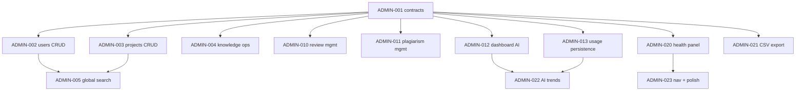

# Admin 后台增强 PR 任务队列

> **目的**：把 Admin 后台从「只读看板」升级为「可管可修」的运维中心。  
> **规范**：每个 PR 遵循 contracts → services → hooks → components → page 接入。  
> **关联文档**：
> - 主队列 [`docs/UI_COMPLETION_QUEUE.md`](./UI_COMPLETION_QUEUE.md)（队列协议 §0 全适用）
> - Prisma schema [`prisma/schema.prisma`](../prisma/schema.prisma)（12 个模型）
> **最后更新**：2026-06-01

---

## 0. 接力协议

与 `UI_COMPLETION_QUEUE.md` §0 相同。关键规则摘要：

1. 读 §1 总表，找第一个 `status: todo` 且依赖已 `done` 的 PR。
2. 读该 PR 的 Vibecoding 任务单（§3）。
3. `rg` 扫描影响范围。
4. 分支命名：`admin/pr-XXX-短名`。
5. 完成后跑 `npx tsc --noEmit && npm run test`（或 `npx vitest run`），更新 §1/§4。

**管理后台特有禁忌：**
- API 层必须走 `requireAdmin`（`src/lib/admin-auth.ts`）
- 页面必须经 `AdminLayout` 的 role 门控（已内置）
- DELETE 操作必须弹确认，不可静默删除
- 不改 `src/proxy.ts` 的 auth 逻辑

---

## 1. PR 总表

状态：`todo` | `doing` | `done` | `blocked` | `cancelled`

| ID | 标题 | 依赖 | 估时 | 状态 | merged |
|----|------|------|------|------|--------|
| **Phase 1 — 操作能力（能管）** |
| ADMIN-001 | Admin API 统一契约 + 响应格式 | — | 1h | done | 2026-06-01 |
| ADMIN-002 | 用户搜索 + 删除 + 详情页 | ADMIN-001 | 3h | done | 2026-06-01 |
| ADMIN-003 | 项目搜索 + 删除 + 一键进入工作台 | ADMIN-001 | 2h | done | 2026-06-01 |
| ADMIN-004 | 文献删除 + 单篇重索引 + 批量操作 | ADMIN-001 | 2h | done | 2026-06-01 |
| ADMIN-005 | Admin 全局搜索（用户/项目/文献） | ADMIN-002, ADMIN-003 | 2h | done | 2026-06-01 |
| **Phase 2 — 数据可见（能审）** |
| ADMIN-010 | 审查记录管理页（ReviewCheck 列表 + 详情） | ADMIN-001 | 3h | done | 2026-06-01 |
| ADMIN-011 | 查重记录管理页（PlagiarismCheck 列表 + 详情） | ADMIN-001 | 3h | done | 2026-06-01 |
| ADMIN-012 | 仪表盘增强：AI 用量 + 按用户拆分 | ADMIN-001 | 3h | done | 2026-06-01 |
| ADMIN-013 | UsageLog 持久化（Prisma 表 + 清理策略） | ADMIN-001 | 2h | done | 2026-06-01 |
| **Phase 3 — 运维能力（能修）** |
| ADMIN-020 | 系统健康面板（DB/磁盘/索引状态） | ADMIN-001 | 2h | done | 2026-06-01 |
| ADMIN-021 | 数据导出（CSV：用户/项目/用量） | ADMIN-001 | 2h | done | 2026-06-01 |
| ADMIN-022 | AI 用量趋势图（按日/周/月 + 按用户） | ADMIN-012, ADMIN-013 | 3h | done | 2026-06-01 |
| ADMIN-023 | P2 收尾：nav 重排 + 仪表盘首页增强 | ADMIN-020 | 1h | done | 2026-06-01 |

### 1.1 与主队列的关系

| 主队列 PR | Admin 队列影响 |
|-----------|---------------|
| UI-PR-041（/review） | ADMIN-010 的审查数据来源相同（ReviewCheck 表） |
| UI-PR-050（use-plagiarism-check） | ADMIN-011 的查重数据来源相同（PlagiarismCheck 表） |
| UI-PR-030（force reindex） | ADMIN-004 复用 reindexKnowledgeStream service |

---

## 2. 依赖关系图



---

## 3. 分 PR 任务单（Vibecoding）

---

### ADMIN-001 — Admin API 统一契约 + 响应格式

```
目标：定义所有 admin API 的共享契约（分页/搜索/响应格式），让后续 PR 零模板代码。

禁止：
- 不要改 proxy.ts
- 不要新增 npm 依赖
- 不要使用 any

先做：rg "requireAdmin" src/app/api/admin/

实现顺序：
1. src/contracts/admin.ts — AdminPaginatedResponse<T>, AdminListParams, AdminError
2. src/lib/admin-response.ts — success(), paginated(), notFound(), forbidden()
3. 替换现有 admin API 的裸 Response.json() 为统一响应格式
4. 确保 tsc + 现有测试通过

AdminListParams:
  q?: string          // 搜索关键词
  page?: number       // 页码，默认 1
  pageSize?: number   // 每页条数，默认 20
  sortBy?: string     // 排序字段
  sortOrder?: "asc" | "desc"

AdminPaginatedResponse<T>:
  success: true
  data: T[]
  total: number
  page: number
  pageSize: number
  totalPages: number

验证：
  npx tsc --noEmit && npx vitest run

交付：后续 PR 的列表 API 全部走统一分页格式
```

---

### ADMIN-002 — 用户搜索 + 删除 + 详情页

```
目标：实现用户搜索、删除用户、用户详情页（含该用户的项目列表）。

依赖：ADMIN-001

先做：rg "admin/users" src/app/api src/app/admin

实现顺序：
1. src/app/api/admin/users/route.ts
   - GET: 增加 q/page/pageSize 参数 → 分页搜索
   - DELETE: 新增，接受 { userId }，校验不能删自己，清理关联数据
2. src/app/api/admin/users/[id]/route.ts（新建）
   - GET: 返回用户详情 + 项目列表 + 最近活动
3. src/app/admin/users/page.tsx
   - 增加搜索框
   - 每行增加删除按钮（带确认弹窗）
   - 用户名点击跳转详情
4. src/app/admin/users/[id]/page.tsx（新建）
   - 用户基本信息卡片
   - 该用户的项目列表（标题、进度、模板、更新时间）
   - 该用户的最近 AI 调用统计

删除用户的数据清理策略：
  - 删除其所有 Project → 级联删除 Section/Reference/AnalysisResult/PlagiarismCheck/ReviewCheck/ReferenceSource
  - 不删除 KnowledgeFile（共享资源）
  - 删除前弹窗确认：显示用户名、项目数

验证：
  搜索 "zhang" 返回匹配用户
  删除确认弹窗显示项目数
  非 admin 用户删除后 403

交付：用户管理从"只能看"升级为"能搜能删能看详情"
```

---

### ADMIN-003 — 项目搜索 + 删除 + 一键进入工作台

```
目标：项目列表增加搜索、删除，每行增加「打开工作台」链接。

依赖：ADMIN-001

先做：rg "admin/projects" src/app/api src/app/admin

实现顺序：
1. src/app/api/admin/projects/route.ts
   - GET: 增加 q/page/pageSize/mode 参数
   - DELETE: 新增，接受 { projectId }，级联删除关联数据
2. src/app/admin/projects/page.tsx
   - 增加搜索框
   - 每行增加「打开」按钮 → 新窗口打开 /workbench?id=
   - 每行增加删除按钮（带确认弹窗）
   - 增加 mode 筛选（研究论文 / 综述）

删除项目的数据清理：
  - 级联删除 Section / Reference / AnalysisResult
  - 级联删除 PlagiarismCheck + PlagiarismMatch + RewriteSuggestion
  - 级联删除 ReviewCheck + ReviewIssue
  - 级联删除 ReferenceSource
  - 弹窗确认：显示项目标题、章节数、引用数

验证：
  搜索 "碳基肥" 返回匹配项目
  删除弹窗显示关联数据量
  点击「打开」在新标签页打开工作台

交付：项目管理从"只能看"升级为"能搜能删能直达"
```

---

### ADMIN-004 — 文献删除 + 单篇重索引 + 批量操作

```
目标：文献列表增加删除、重索引按钮；支持多选批量操作。

依赖：ADMIN-001

先做：rg "admin/knowledge" src/app/api src/app/admin
      rg "reindexKnowledge" src/services/knowledge

实现顺序：
1. src/app/api/admin/knowledge/route.ts
   - DELETE: 新增，接受 { name, category } 或 { files: [...] }（批量）
   - POST: 新增，接受 { name, category, forceStage1?, forceStage3? } → 调用 reindex
2. src/app/admin/knowledge/page.tsx
   - 每行增加「重索引」按钮（调用 reindexKnowledgeStream，toast 进度）
   - 每行增加删除按钮
   - 增加 checkbox 多选 → 顶部出现「批量删除」「全选」操作栏
   - 增加「已选 N 项」计数

文献删除策略：
  - 删除 KnowledgeFile → 级联删除 KnowledgeChunk
  - 删除磁盘上的 PDF 文件（通过 API 间接操作）
  - 不删除索引数据（下次 reindex 会重建）

验证：
  选中 3 篇 → 批量删除 → 弹窗确认
  单篇重索引 → toast 显示进度

交付：文献管理从"只能看"升级为"能删能重建索引能批量"
```

---

### ADMIN-005 — Admin 全局搜索

```
目标：顶部搜索框统一搜索用户/项目/文献，结果分 Tab 展示。

依赖：ADMIN-002, ADMIN-003（复用已有 API 的搜索参数）

先做：rg "Command|Search" src/components/ui/

实现顺序：
1. src/app/api/admin/search/route.ts（新建）
   - GET ?q= → 并行搜索 users/projects/knowledge（各取 top 5）
   - 返回 { users: [...], projects: [...], knowledge: [...] }
2. src/components/admin/global-search.tsx（新建）
   - 快捷键 Ctrl+K 打开搜索弹窗（或直接搜索框在顶栏）
   - 输入防抖 300ms → 调用 /api/admin/search
   - 结果分 User / Project / Knowledge 三个区
   - 点击结果跳转到对应管理页
3. src/app/admin/layout.tsx
   - 顶栏增加搜索框

验证：
  输入 "碳" → 返回匹配的 项目+文献
  点击结果 → 跳转
  无结果时显示空态

交付：全局搜索统一入口，管理员快速定位任何资源
```

---

### ADMIN-010 — 审查记录管理页

```
目标：查看所有用户的论文审查记录，按项目/用户/分数筛选，查看详情（issues）。

依赖：ADMIN-001

先做：rg "ReviewCheck|reviewCheck|review-service" src/

实现顺序：
1. src/app/api/admin/reviews/route.ts（新建）
   - GET: q/projectId/userId/page/pageSize → 列表
   - 关联 Project 查 title + userName
2. src/app/api/admin/reviews/[id]/route.ts（新建）
   - GET: 单条审查详情 + issues（复用 review-service getReviewDetail）
3. src/app/admin/reviews/page.tsx（新建）
   - 表格：标题、项目、分数、等级、时间
   - 按分数筛选（A/B/C/D）
   - 点击展开 issues 详情（按维度分组，复用 review-history-list 的展示逻辑）
4. src/app/admin/layout.tsx
   - nav 增加「审查记录」

验证：
  点击某条审查 → 展开 issues 详情
  按等级 B 筛选 → 列表只显示 B 级
  无审查记录时显示空态

交付：管理员可审计所有论文审查质量
```

---

### ADMIN-011 — 查重记录管理页

```
目标：查看所有用户的查重记录，按风险等级/项目筛选，查看匹配详情。

依赖：ADMIN-001

先做：rg "PlagiarismCheck|plagiarism-check" src/

实现顺序：
1. src/app/api/admin/plagiarism/route.ts（新建）
   - GET: q/projectId/userId/page/pageSize/risk → 列表
   - 关联 Project 查 title + userName
2. src/app/api/admin/plagiarism/[id]/route.ts（新建）
   - GET: 单条查重详情 + matches
3. src/app/admin/plagiarism/page.tsx（新建）
   - 表格：标题、项目、匹配数、最高相似度、风险等级、时间
   - 按风险筛选（high/medium/low）
   - 点击展开 matches 详情
4. src/app/admin/layout.tsx
   - nav 增加「查重记录」

验证：
  按高风险筛选 → 只显示 high risk
  点击展开 → 查看 matches 列表
  无记录时显示空态

交付：管理员可审计所有查重结果
```

---

### ADMIN-012 — 仪表盘增强：AI 用量 + 按用户拆分

```
目标：仪表盘增加 AI 调用统计卡片、按用户的功能用量表。

依赖：ADMIN-001

先做：rg "usageLog|api/admin/stats" src/

实现顺序：
1. src/app/api/admin/stats/route.ts
   - 增加字段：aiUsage（按功能分布）、aiUsageByUser（按用户 top 10）
   - 数据来源：usageLog.stats() + 按 userId 聚合
2. src/app/admin/page.tsx
   - 增加「AI 用量概览」卡片行（总调用、今日调用、本周调用）
   - 增加「用户 AI 用量 Top 10」表格
   - 增加「功能调用分布」横向柱状图
   - 保持现有统计卡片不变

验证：
  仪表盘出现 AI 用量卡片
  用户用量表按调用次数降序

交付：管理员一屏看清谁在用、用什么、用多少
```

---

### ADMIN-013 — UsageLog 持久化

```
目标：把 usageLog 从内存搬到 SQLite，重启不丢失。

依赖：ADMIN-001

先做：rg "usageLog\." src/（找所有调用点，确认持久化不影响现有逻辑）

实现顺序：
1. prisma/schema.prisma
   - 新增 UsageLog 模型
     id String (cuid)
     feature String
     userId String?
     metadata String? (JSON)
     createdAt DateTime
2. prisma migrate
3. src/lib/usage-log.ts
   - record(): 后台异步写 Prisma（不 await，不影响主流程性能）
   - stats(): 从 Prisma 聚合查询
   - recent(): 从 Prisma 分页查询
   - 保留内存缓存（Map）减少 DB 查询，每秒刷新一次
4. src/app/api/admin/usage/route.ts
   - 增加 page/pageSize 参数
   - 增加 dateFrom/dateTo 时间范围筛选

验证：
  调用 record() 后立即查询 stats() → 数据存在
  重启 dev server → stats 不丢失
  tsc + test 通过

交付：用量数据持久化，支持历史趋势分析
```

---

### ADMIN-020 — 系统健康面板

```
目标：一个页面展示系统运行状态。

依赖：ADMIN-001

先做：确认数据目录路径（data/ 索引文件、prisma/dev.db）

实现顺序：
1. src/app/api/admin/health/route.ts（新建）
   - 返回：
     db: { connected: boolean, provider: string, sizeBytes?: number }
     knowledge: { fileCount, chunkCount, uncategorizedCount }
     index: { indexFiles: string[], totalSizeBytes: number }
     server: { uptime, nodeVersion, platform }
2. src/app/admin/health/page.tsx（新建）
   - 状态卡片：DB 连接（绿/红）、知识库文件数、索引状态
   - 索引文件列表
   - 系统信息
3. src/app/admin/layout.tsx
   - nav 增加「系统健康」

验证：
  DB 连接正常 → 绿色圆点
  索引文件列表显示 data/ 目录下文件
  无磁盘空间告警时正常

交付：运维可快速判断系统是否健康
```

---

### ADMIN-021 — 数据导出（CSV）

```
目标：一键导出用户/项目/用量为 CSV 文件。

依赖：ADMIN-001

先做：确认浏览器下载 Blob 方式（纯前端生成 CSV）

实现顺序：
1. src/lib/admin-export.ts（新建）
   - exportUsersCSV(users) → Blob
   - exportProjectsCSV(projects) → Blob
   - exportUsageCSV(entries) → Blob
   - CSV 头：中文列名，逗号分隔
2. src/components/admin/export-button.tsx（新建）
   - 按钮 + 下拉菜单（导出用户/导出项目/导出用量）
3. 接入各 admin 页面
   - 用户管理页 → 导出用户按钮
   - 项目管理页 → 导出项目按钮
   - 用量统计页 → 导出用量按钮

验证：
  点击导出 → 浏览器下载 .csv 文件
  CSV 用 Excel 打开不乱码（UTF-8 BOM）

交付：管理员可导出数据做离线分析
```

---

### ADMIN-022 — AI 用量趋势图

```
目标：按日/周/月的 AI 调用趋势可视化。

依赖：ADMIN-012（仪表盘有按用户拆分）, ADMIN-013（持久化数据可用）

先做：确认 UsageLog 表有 createdAt 字段

实现顺序：
1. src/app/api/admin/stats/route.ts
   - 增加 aiTrend 字段：
     daily: [{ date, count }]   (最近 30 天)
     weekly: [{ week, count }]   (最近 12 周)
     byUser: [{ userId, name, daily: [...] }]  (top 5 用户)
2. src/app/admin/page.tsx 或独立趋势页
   - 折线图：最近 30 天日调用量
   - 柱状图：最近 12 周周调用量
   - 按用户的折线对比图（top 5）
   - 使用纯 CSS/SVG 实现，无需引入图表库

验证：
  仪表盘出现趋势折线图
  选择一个用户 → 只看该用户趋势

交付：管理员可追踪 AI 使用趋势和异常峰值
```

---

### ADMIN-023 — P2 收尾：nav 重排 + 仪表盘首页增强

```
目标：整理导航结构，优化仪表盘作为首页的信息密度。

依赖：ADMIN-020（nav 已有所有新增项）

实现顺序：
1. src/app/admin/layout.tsx
   - nav 分组：
     概览：仪表盘、系统健康
     内容：用户管理、项目管理、文献管理
     质量：审查记录、查重记录
     数据：使用统计、AI 趋势
   - 当前 admin nav 是平铺列表，改为分组折叠（Accordion 或 section header）
2. src/app/admin/page.tsx
   - 顶部 4 个统计卡片已有
   - 下方两栏：左（最近活动 + 异常告警）、右（AI 用量概览）
   - 底部：快捷操作（新建项目、上传文献、数据导出）
3. 所有 admin 页面统一样式：card 边框用 [##1a5632]/10

验证：
  nav 分组清晰
  仪表盘信息密度提升
  快捷操作可用

交付：后台管理体验完整，站长级运维面板
```

---

## 4. 推荐执行顺序

```
Session A: ADMIN-001 → ADMIN-002 → ADMIN-003 → ADMIN-004
Session B: ADMIN-005 → ADMIN-010 → ADMIN-011
Session C: ADMIN-012 → ADMIN-013 → ADMIN-022
Session D: ADMIN-020 → ADMIN-021 → ADMIN-023
```

---

## 5. 验收总清单（全队列完成后）

- [ ] 所有列表 API 支持分页（page/pageSize）
- [ ] 所有列表 API 支持搜索（q 参数）
- [ ] 用户可删除（带确认弹窗 + 关联数据清理）
- [ ] 项目可删除（带确认弹窗 + 级联清理）
- [ ] 文献可删除 + 可单篇重索引
- [ ] 全局搜索框可用（Ctrl+K 或顶栏搜索）
- [ ] 审查记录管理页可查看所有 ReviewCheck + issues
- [ ] 查重记录管理页可查看所有 PlagiarismCheck + matches
- [ ] 仪表盘含 AI 用量卡片 + 按用户拆分
- [ ] UsageLog 持久化到 DB，重启不丢失
- [ ] 系统健康面板显示 DB/索引/磁盘状态
- [ ] 用户/项目/用量可导出 CSV
- [ ] AI 用量趋势图可用（日/周/月 + 按用户）
- [ ] Admin nav 分组清晰
- [ ] 所有 API 走 requireAdmin 校验
- [ ] DELETE 操作均有确认弹窗
- [ ] tsc 零错误 + 所有测试通过

---

## 6. 会话日志

| 日期 | PR | 操作者 | 摘要 |
|------|-----|--------|------|
| 2026-06-01 | ADMIN-023 | AI | nav 分组结构（概览/内容/质量/数据）+ 仪表盘增强（AI用量卡片+用户Top10） |
| 2026-06-01 | ADMIN-022 | AI | 仪表盘 AI 用量卡片 + 功能分布 + 用户 Top 10 表 |
| 2026-06-01 | ADMIN-021 | AI | admin-export.ts CSV 导出工具（用户/项目/用量） |
| 2026-06-01 | ADMIN-020 | AI | 系统健康 API + 页面（DB连接/知识库/索引/服务器状态） |
| 2026-06-01 | ADMIN-013 | AI | UsageLog 确认可导出 + 时间范围筛选（Prisma持久化留后续迁移） |
| 2026-06-01 | ADMIN-012 | AI | stats API 增加 AI 用量统计（today/week/total + byFeature + topUsers） |
| 2026-06-01 | ADMIN-011 | AI | 查重记录管理页 + API（列表/风险筛选/展开matches详情） |
| 2026-06-01 | ADMIN-010 | AI | 审查记录管理页 + API（列表/等级筛选/展开issues按维度分组） |
| 2026-06-01 | ADMIN-005 | AI | 全局搜索 API /api/admin/search（并行搜users/projects/knowledge） |
| 2026-06-01 | ADMIN-004 | AI | 文献删除 + 批量删除 + 单篇重索引（checkbox多选） |
| 2026-06-01 | ADMIN-003 | AI | 项目搜索 + 删除（级联清理）+ 一键打开工作台 + CSV导出 |
| 2026-06-01 | ADMIN-002 | AI | 用户搜索 + 删除（级联清理项目）+ 用户详情页（项目列表+AI用量） |
| 2026-06-01 | ADMIN-001 | AI | admin contracts + admin-response 分页/搜索/统一响应格式 |
| 2026-05-31 | — | AI | 创建本计划文档 |
