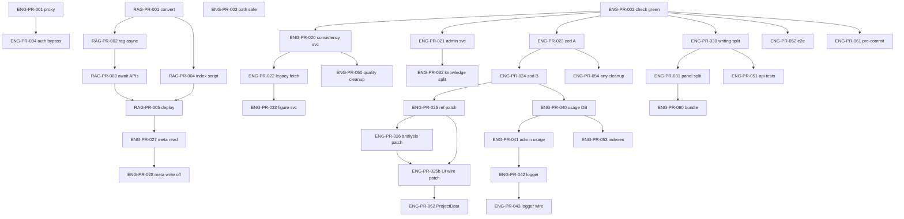

# 工程优化 PR 任务队列

> **目的**：把「稳定性 / 性能 / 架构债 / 观测 / 测试」拆成 **PR 粒度** 任务单，任意 AI/开发者可按编号连续接力。  
> **规范**：每个 PR 遵循 [Vibecoding 模板](../CLAUDE.md#vibecoding-规范)（contracts → services → hooks → components → page 接入）；**基础设施 PR** 可跳过 UI 层。  
> **关联文档**：
> - UI 补全（已完成）→ [`docs/UI_COMPLETION_QUEUE.md`](./UI_COMPLETION_QUEUE.md)
> - Admin 增强（已完成）→ [`docs/ADMIN_ENHANCEMENT_PLAN.md`](./ADMIN_ENHANCEMENT_PLAN.md)
> - RAG 索引性能（本队列 Phase 1 对齐）→ [`docs/rag-index-refactor.md`](./rag-index-refactor.md)
> - 线上阻断项快照 → [`docs/PROJECT_HEALTH.md`](./PROJECT_HEALTH.md)
> - 工程债全局 → [`CLAUDE.md`](../CLAUDE.md) 待处理技术债表  
> **最后更新**：2026-08-06（**全部 todo 清零**：W3-AP-QUALITY 全子项 + W0-5 仓库卫生 done）  
> **实时 status 只看 §1 Phase 11**；Phase 6 旧行已标注归档，避免与 MASTER_PLAN 冲突。

---

## 0. 接力协议（每次开新会话必读）

### 0.1 开干前

1. 读本文 **§1 总表**，找第一个 `status: todo` 且依赖已 `done` 的 PR。  
2. 读该 PR 的 **Vibecoding 任务单**（§3）。  
3. 执行 `rg` 扫描「影响范围」（任务单里会写关键词）。  
4. 分支命名：`eng/pr-XXX-短名`（例：`eng/pr-001-proxy-user-header`）。  
5. **RAG-PR-00x** 与本文 **ENG-PR-01x** 编号互通：RAG 任务单细节以 `rag-index-refactor.md` §3 为准，合并时只更新一处状态（§1 两表同步）。  
6. **RAG 范围**：RAG-PR-001～005 只动 `data/index_*.json` + `.emb` 与 `src/lib/rag.ts`；**不**在本阶段改 Prisma `KnowledgeChunk.embedding`（DB 向量与文件索引是两套，另开 PR 若需统一）。
7. **Phase 0 可并行**：ENG-PR-001 / 003 / 004 与 ENG-PR-002 **无硬依赖**；002 开干前先跑 `tsc` / `lint` / `build`，以**当前输出**为准（勿盲跟过期 HEALTH 清单）。

### 0.2 完成后

1. 跑验证：`npx tsc --noEmit && npm run test`（或 `npm run check`）。  
2. 在 **§1 总表** 把该 PR 改为 `done`，填 `merged` 日期。  
3. 若改 RAG 子项，同步更新 [`rag-index-refactor.md`](./rag-index-refactor.md) §1 总表。  
4. 在 **§4 会话日志** 追加一行。  
5. 交付说明必须含 **数据流** 或 **请求链**（视 PR 类型：UI→service→API，或 proxy→route→DB）。

### 0.3 禁止（所有 PR 通用）

- 不要在一次 PR 里同时改 `proxy.ts` 认证 **和** RAG 全量重构（拆 PR）  
- 不要改 `workbench/page.tsx` **大段逻辑**——仅允许 import + 一行挂载（与 UI 队列相同）  
- 组件层不要**新增** `fetch('/api/...')`——走 `src/services/`  
- 不要全量 PATCH Project（sections 已增量；references/analysisResults 用本队列增量 PR）  
- 不要使用 `any`（本队列 **ENG-PR-054** 专门清债，其它 PR 禁止新增）  
- 不要改 `backup_*`  
- 不要与进行中的 `UI-*` / `ADMIN-*` **同一文件** 并行两个 PR

---

## 1. PR 总表

状态：`todo` | `doing` | `done` | `blocked` | `cancelled`

| ID | 标题 | 依赖 | 估时 | 状态 | merged |
|----|------|------|------|------|--------|
| **Phase 0 — 稳定性 P0（必须先绿）** |
| ENG-PR-001 | Proxy：`x-user-id` 写入 request headers | — | 2h | done | 2026-06-01 |
| ENG-PR-002 | 质量闸门全绿：tsc + lint + build | — | 4～8h | done | 2026-06-01 |
| ENG-PR-003 | 知识库/PDF 路径穿越防护 | — | 3h | done | 2026-06-01 |
| ENG-PR-004 | `AUTH_BYPASS` 生产防护 + 文档 | ENG-PR-001 | 1h | done | 2026-06-01 |
| **Phase 1 — RAG 性能（≈1.88GB 索引）** |
| RAG-PR-001 | 转换脚本：JSON → content.json + `.emb` | — | 2h | done | 2026-06-01 |
| RAG-PR-002 | `rag.ts` 异步加载 + 二进制嵌入 | RAG-PR-001 | 4h | done | 2026-06-01 |
| RAG-PR-003 | 所有 RAG 调用方 `await` 化 | RAG-PR-002 | 3h | done | 2026-06-01 |
| RAG-PR-004 | `index-pdfs.mjs` 直接输出分离格式 | RAG-PR-001 | 3h | done | 2026-06-01 |
| RAG-PR-005 | RAG 部署验证 + 文档更新 | RAG-PR-003, RAG-PR-004 | 2h | done | 2026-06-01 |
| **Phase 2 — API 契约与数据一致性** |
| ENG-PR-020 | `services/consistency.ts` + hook 去 fetch | ENG-PR-002 | 2h | done | 2026-06-02 |
| ENG-PR-021 | Admin 页面 fetch 迁入 services | ENG-PR-002 | 4h | done | 2026-06-02 |
| ENG-PR-022 | Legacy/独立页 fetch 迁入 services | ENG-PR-020 | 4h | done | 2026-06-02 |
| ENG-PR-023 | Zod `validateBody` 波次 A（admin + 图表） | ENG-PR-002 | 3h | done | 2026-06-02 |
| ENG-PR-024 | Zod `validateBody` 波次 B（knowledge 写 + projects） | ENG-PR-023 | 3h | done | 2026-06-02 |
| ENG-PR-025 | References 增量 PATCH API | ENG-PR-024 | 4h | done | 2026-06-02 |
| ENG-PR-026 | AnalysisResults 增量 PATCH API | ENG-PR-025 | 3h | done | 2026-06-02 |
| ENG-PR-025b | 增量 PATCH 前端接线（store / autosave / 面板） | ENG-PR-025, ENG-PR-026 | 4h | done | 2026-06-02 |
| ENG-PR-027 | `metadata.json` 只读 Prisma（停双写-读） | RAG-PR-005 | 4h | done | 2026-06-02 |
| ENG-PR-028 | 移除 `metadata.json` 双写（写路径） | ENG-PR-027 | 4h | done | 2026-06-02 |
| **Phase 3 — 大文件拆分** |
| ENG-PR-030 | `/api/writing` 按阶段拆 handler | ENG-PR-002 | 6h | done | 2026-06-02 |
| ENG-PR-031 | `writing-panel` 拆 SSE 条 + 扩写区 | ENG-PR-030 | 6h | done | 423 行 + hooks/子组件 |
| ENG-PR-032 | `knowledge/page` 拆 hooks + 子组件 | ENG-PR-021 | 6h | done | page 58 行 + hook/5 组件 |
| ENG-PR-033 | `use-figure-pipeline` 图表 API 进 service | ENG-PR-022 | 3h | done | generateFigure → services/figures |
| **Phase 4 — 观测与运维** |
| ENG-PR-040 | Prisma `AiUsageLog` + 写入 | ENG-PR-024 | 3h | done | 双写内存+DB |
| ENG-PR-041 | Admin 用量读 DB（替代内存环） | ENG-PR-040 | 2h | done | admin-usage service |
| ENG-PR-042 | 统一 `logger` 封装 | ENG-PR-041 | 2h | done | createLogger + fail + 生产 JSON |
| ENG-PR-043 | AI/脚本路由接入 logger | ENG-PR-042 | 3h | done | writing/chat/reindex/plagiarism + rag/hooks |
| **Phase 5 — 质量闭环与测试** |
| ENG-PR-050 | quality-module Phase 4 收尾 + 死代码清理 | ENG-PR-020 | 4h | done | 删 plagiarism-check.ts；quality-module-plan 状态表 |
| ENG-PR-051 | API 集成测试：writing + plagiarism v2 | ENG-PR-030 | 4h | done | route integration + mock pipeline/service |
| ENG-PR-052 | Playwright 冒烟：登录→工作台→保存 | ENG-PR-002 | 4h | done | playwright.config + e2e/smoke-workbench |
| ENG-PR-053 | Prisma 补索引（P3-1） | ENG-PR-040 | 2h | done | AnalysisResult/KnowledgeFile @@index + migration |
| ENG-PR-054 | `no-explicit-any` warn + 热点清零 | ENG-PR-023 | 6h | done | admin-export/knowledge/login 热点 |
| **可选 P3** |
| ENG-PR-060 | Bundle analyze + 重路由 lazy | ENG-PR-031 | 3h | done | plot/reader/admin dynamic client；`npm run analyze` |
| ENG-PR-061 | pre-commit：`check` + lint-staged | ENG-PR-002 | 2h | done | husky: typecheck + lint-staged(src) |
| ENG-PR-062 | `ProjectData` 类型统一（contracts 为准） | ENG-PR-025b | 4h | done | store 停 re-export；全库改 contracts |
| **Phase 6 — 协作扩写（096 主轴 + 087～086 辅助）** |
| ENG-PR-087 | 扩写 P0：全局限流 + 默认 fast + Verifier 降级 | ENG-PR-031 | 1～2d | done | 2026-06-06；`c506020`；信号量 + Verifier 降级 + fast 默认 |
| ENG-PR-080 | 扩写入口：草稿门槛 + 章节引导 | ENG-PR-031 | 4h | done | 2026-06-06；同 `c506020`；`MIN_DRAFT_CHARS` + 章节 placeholder |
| ENG-PR-081 | 写作分步 UI（write→audit→fix） | ENG-PR-080, **087** | 1d | done | 管道可分步调用；**≠** 协作扩写产品完成 |
| **ENG-PR-096a** | **检索预览 + 用户勾选文献** | ENG-PR-081 | 1d | done | 2026-06-13；`retrieve-preview` + source picker |
| **ENG-PR-096b** | **要点列表 + `bullets[]` 契约** | 096a | 1d | done | 2026-06-13；`WritingBulletList` + schema |
| **ENG-PR-096c** | **`expand_bullet` 逐条扩写 + 合并** | 096b | 2d | done | 2026-06-13；`bullet_done` SSE + `use-writing-bullet-expand` |
| **ENG-PR-096d** | **工作台默认段落模式 + 选区助手** | 096c | 1～2d | **done** | **P1**；`paragraph-editor` / `use-ai-paragraph` 为主路径 |
| ENG-PR-082 | Verifier 结构化 + 选择性 Refiner | **096c** | 2d | **done** | 2026-07-24；`review_report` + Agent auto-fix |
| ENG-PR-083 | 大纲骨架化 `userSkeleton` | — | 1d | **done** | 归档→W1-083；outline API/UI + prompt |
| ~~ENG-PR-084~~ | ~~入口重构~~ | — | — | **cancelled** | 归档→Phase 11；由 Cockpit 取代；`/writing` 已重定向 |
| ENG-PR-085 | 分析页 AI 免责标注 | — | 2h | **done** | 2026-07-24；`AiResultDisclaimer` → data/knowledge/analysis |
| ~~ENG-PR-086~~ | ~~编辑器对话面板~~ | — | — | **cancelled** | 归档→Phase 11；由 Agent Tab 取代 |
| **Phase 7 — 文献库书目增强 + 外部文献发现** |
| ENG-PR-090 | 文献库列表：期刊/DOI 列 + 筛选 + 契约扩展 | ENG-PR-027 | 1～2d | done | 列表列/筛选/ISSN 弹窗/响应式卡片 |
| ENG-PR-091 | 期刊指标 enrichment（CSV/Excel IF/分区 + OpenAlex） | ENG-PR-090 | 2～3d | done | §三；`metrics` + 中英文列别名；IF 年份角标；导入批次 UI 待二期 |
| ENG-PR-092 | 外部文献检索 Tab + 加入参考文献 | — | 3～5d | done | §四；`eng/pr-092-external-literature-search` |
| ENG-PR-093 | RIS / BibTeX 批量导入 | ENG-PR-090 | 2d | done | 2026-06-12；`import-bibliography` + 向导 + Crossref |
| ENG-PR-094 | OA 全文自动入库 | ENG-PR-092, 093 | 1～2w | done | MVP：导入时若有 openAccessUrl 则下载到 papers/ 并增量索引；`ENABLE_OA_AUTO_IMPORT=0` 可关 |
| **Phase 8 — RAG 运行时性能（库变大后卡顿/内存）** |
| RAG-PR-006 | 两阶段检索：BM25 候选 → 候选集向量精排 | RAG-PR-002 | 1d | done | 2026-06-13；向量 O(全库)→O(候选)；去 ~770MB JS 向量内存 |
| RAG-PR-007 | Query Embedding LRU 缓存（`(model,query)→向量`） | RAG-PR-006 | 0.5h | done | 2026-06-13；上限 256 |
| RAG-PR-008 | 倒排索引协作式构建 + 合并代替重建 + 并发去重 | RAG-PR-002 | 1d | done | 2026-06-13；`buildInvertedIndexAsync`/`mergeInvertedIndexInto`；不冻结事件循环 |
| RAG-PR-009 | warmup 真预加载 + `RAG_WARMUP`/`RAG_PERF_LOG` 开关 | RAG-PR-008 | 0.5h | done | 2026-06-13；冷启动移出首检索 |
| RAG-PR-010 | `.emb` 按需 pread（去常驻内存） | RAG-PR-006 | 0.5d | done | 2026-06-13；`EmbeddingStore` 文件句柄 + `readSync`；省 ~885MB |
| RAG-PR-011 | 扩写范围检索（按已选文献分类 scope） | RAG-PR-010 | 0.5d | done | 2026-06-13；`search({categories})` + `deriveScopeCategories`；无引用回退全库 |
| RAG-PR-012 | 召回提升：同义词扩展 + 多 query RRF + 弱 BM25 全池向量 | RAG-PR-011 | 0.5d | done | 2026-07-27；`rag-query-expand.ts` |
| RAG-PR-013 | 索引 n-gram 对齐 + 题名加权 + 条件 multi-query | RAG-PR-012 | 0.5d | done | 2026-07-27；倒排 bigram + metadata boost |
| **Phase 9 — 研究方向战略规划（ENG-PR-100 系列）** |
| ENG-PR-100 | 方向基础模块：Direction 表 + CRUD + 页面框架（33 files） | — | 3d | done | 2026-07-04；`d18a7e3` |
| ENG-PR-110 | Socratic Mentor 预承诺（P0） | 100 | 2d | done | 2026-07-04；`314dd02` / `509a9a3` / `52823df` |
| ENG-PR-111 | 分析报告可视化：雷达图+柱状图+证据表+矛盾面板（P0） | 100 | 3d | done | 2026-07-04；`66b3d75` |
| ENG-PR-112 | Blueprint 扩展 + 写作桥接对齐（P1） | 100 | 1d | done | 2026-07-04；`be78112` |
| ENG-PR-113 | NL 资产解析：自然语言→结构化 ExperimentAsset（P1） | 100 | 1d | done | 2026-07-04；`2ac88f5` |
| ENG-PR-114 | 甘特图路线图可视化（P1） | 100 | 1d | done | 2026-07-04；`4ddc02e` |
| ENG-PR-115 | 实验方案生成：D6 缺口→ExperimentPlan（P1） | 100 | 2d | done | 2026-07-04；`e23549c` |
| ENG-PR-116 | 项目申报辅助：方向全景→基金申请书（P1） | 100 | 2d | done | 2026-07-04；`353791a` |
| ENG-PR-117 | 双角色架构：PI + Researcher 权限分离（P2） | 100 | 1d | done | 2026-07-04；`42abad6` |
| ENG-PR-118 | Material Passport 版本追踪（P2） | 100 | 1d | done | 2026-07-04；`064479b` |
| ENG-PR-119 | Style Calibration 方向校准（P2） | 100 | 1d | done | 2026-07-04；`cc9ab9e` |
| ENG-PR-120 | 反模式检测接入审查板块 | 100 | 1d | done | 2026-07-04；`a35bbc8` |
| **Phase 10 — Direction→Writing 文献桥接（ENG-PR-200 Bug 1 + ENG-PR-210）** |
| ENG-PR-200a | 综述 mapping fallback 修复（mapToSectionForMode + majorNumberFromSectionId） | — | 0.5d | done | 2026-07-05 |
| ENG-PR-210a | Direction→Writing 桥接：contract + bridge 函数 + paper-brief API + references 注入 | 100 | 1d | done | 2026-07-05 |
| ENG-PR-210b | Blueprint 上下文注入：direction 字段不再被 zod strip，到达 AI prompt | 210a | 0.5d | done | 2026-07-05 |
| **Phase 11 — Wave 0–4 整体规划（见 MASTER_PLAN.md）** |
| W0-SEC-01 | Direction `userId` + owner 作用域 + 迁移 | — | 0.5d | done | Wave 0；`8c73ca1` |
| W0-SEC-02 | 未鉴权 AI 路由补齐 + 限流覆盖 | SEC-01 | 0.5d | done | Wave 0；`d586a77` |
| W0-SEC-03 | JSONB PATCH 竞态 + Reference.order 唯一 | SEC-02 | 1d | done | Wave 0 |
| W0-WIP-A | quality/citation/chart 审计清理 PR | — | 1d | done | Wave 0；`0da9d3e`+`4b83ac0` |
| W0-WIP-B | Agent Phase A + direction bridge commit | SEC-01 | 1d | done | Wave 0；`e5a02c4`+`00d08b8` |
| W1-PASSPORT | PaperPassport 契约 + Cockpit UI | W0-* | 2w | done | MVP：配置+任务卡+快照+导航 |
| W2-LANGGRAPH | LangGraph + write tools | W1 | 2w | **done*** | *编排与工具已接；缺 AgentSession checkpoint（另项） |
| W2-AGENT-GUIDE | `/academic-paper`→Agent 引导页 + `?tab=agent` | W2-LANGGRAPH | 0.5d | **done** | 2026-07-24；AgentGuidePage |
| W2-AGENT-ONESHOT | 「写一节」闭环（检索→写→落盘） | W2-AGENT-GUIDE | 3～5d | **done** | 2026-07-24；写回刷新 + ONESHOT 提示 |
| W2-CHECKPOINT | AgentSession DB checkpoint / 中断恢复 | W2-AGENT-ONESHOT | 2d | **done** | 2026-07-24；AgentSession + resume |
| W1-083 | userSkeleton → Phase 2 | W1-PASSPORT | 1d | done | outline API/UI + prompt 骨架约束 |
| W0-5 | 仓库卫生（分支收拢、tmp、误删 migration） | — | 0.5d | done | 2026-08-06；6 本地 + 4 远端已合并分支删（含 pr-093 cherry 验证已应用）；7 个 stash 导出 patch 至 `D:\project\stash-backup-20260806\` 后清空；.tmp/日志/Office 锁清理；migrations 完整 |
| W3-ARGUMENT | Phase 3 Argument Blueprint | W2-CHECKPOINT | 1w | **done** | 2026-07-24；契约+API+提纲侧栏+Agent tool+Passport |
| W3-ABSTRACT | Phase 5b 双语摘要 API | W3-ARGUMENT | 2d | **done** | 2026-07-24；`/api/abstract/bilingual` + Agent tool |
| W3-PHASE-PACK | Passport 阶段任务包 + 硬门禁 | W3-ABSTRACT | 2d | **done** | 2026-07-24；任务包契约+门禁+「完成当前阶段」 |
| W3-PHASE-UI | 「完成当前阶段」学生按钮 | W3-PHASE-PACK | 1d | **done** | Agent 面板 + Cockpit 任务包目标/Agent 导航 |
| W3-REVIEW-2 | 审查 max-2 轮编排 | W3-PHASE-PACK | 3d | **done** | 2026-07-24；`/api/review/rounds` + Agent `run_review_rounds` + UI |
| W3-CITE-GATE | 导出前引用硬检 | W3-REVIEW-2 | 1d | **done** | 2026-07-24；`/api/citations/gate` + PDF 422 + Passport Phase 5 |
| W3-E2E-EVAL | 任务包/管道 eval 门禁 | W3-CITE-GATE | 2d | **done** | 2026-07-24；`npm run eval:gates` + pipeline EVAL_STRICT |
| W3-AP-AUTONOMY | Agent 对齐 academic-paper：多上下文 + 自补大纲/蓝图 + 自主门禁 | W3-E2E-EVAL | 1d | **done** | 2026-07-24；generate_outline / generate_writing_blueprint |
| W3-AP-PLAN-DRIVE | Plan 子任务真驱动执行环 | W3-AP-AUTONOMY | 1d | **done** | 2026-07-24；plan-progress + agent 续跑 |
| W3-AP-CHECKPOINTS | academic-paper 铁律检查点（大纲批准等） | W3-AP-PLAN-DRIVE | 1d | **done** | 2026-07-24；outline/config checkpoint + 面板批准 |
| W3-AP-AGENTIC | 对话式智能体：inspect/read + 思考提示 + 弱强制续跑 | W3-AP-CHECKPOINTS | 1d | **done** | 2026-07-24；取消全自动 Conductor |
| W3-AP-MULTI-TURN | 同一会话跟聊 sessionId+goal；uiTranscript 续写 | W3-AP-AGENTIC | 0.5d | **done** | 2026-07-25；followUp + 新对话 |
| W3-AP-CHART-BRIDGE | Agent 配图打通：figureSpecEnc+插章节+缩略图+工作台刷新 | W3-AP-MULTI-TURN | 0.5d | **done** | 2026-07-25 |
| W3-AP-CONFIG-UI | Phase0 检查点嵌入 PaperConfigPanel + 统一 onProjectMutated 刷新 | W3-AP-CHART-BRIDGE | 0.5d | **done** | 2026-07-25 |
| W3-AP-LIT-BRIDGE | 文献闭环：search_external hitJson → 确认卡 → import_reference 写回刷新 | W3-AP-CONFIG-UI | 0.5d | **done** | 2026-07-25 |
| **W3-AP-BEHAVIOR** | **行为主轴：剧本验收→压空转→先读后写（暂停扩工具）** | W3-AP-LIT-BRIDGE | 2～3w | **done** | 2026-07-26；手测 P0～P3 绿；均 tool≈3.5；见 BEHAVIOR §7 |
| W3-AP-EVAL-SCRIPTS | 固化 P1～P5 剧本 + `eval:agent` 断言 | W3-AP-BEHAVIOR | 1d | **done** | 2026-07-25；`src/lib/eval/agent-scripts.ts` + `npm run eval:agent` |
| W3-AP-ANTISPAM | 无进展熔断 + 检索/读窗口配额 | W3-AP-EVAL-SCRIPTS | 1～2d | **done** | 2026-07-25；`core/antispam` + toolsNode |
| W3-AP-READ-BEFORE-WRITE | write/refine 先读后写硬门禁 | W3-AP-ANTISPAM | 1d | **done** | 2026-07-25；intro/discussion + toolsNode |
| W3-AP-LIT-QUALITY | 文献相关度分+why；低相关无依据拒导 | W3-AP-READ-BEFORE-WRITE | 0.5d | **done** | 2026-07-25；`literature-relevance` |
| W3-AP-LIT-BATCH | import_reference 确认卡批量勾选导入（候选列表 importItems + selectedIndices；确认后跳过相关度门禁） | W3-AP-LIT-BRIDGE | 0.5d | **done** | 2026-08-07；`import-confirm.ts` + `agent-panel` checkbox + `run-graph` 重放 selectedIndices |
| W3-AP-CONFIG-QA | Phase0 配置改为一问一答（非整表） | W3-AP-CONFIG-UI | 0.5d | **done** | 2026-07-25；`AgentConfigQa` |
| W3-AP-WORK-MEMORY | 会话工作记忆：主张/决策/待办 + update_work_memory | W3-AP-LIT-QUALITY | 1d | **done** | 2026-07-25；落盘 session snapshot |
| W3-AP-ORCH-OPT | Agent 编排优化：快照单飞缓存 + 前缀稳定 + 只读并行 + 会话并发互斥 | W3-AP-WORK-MEMORY | 1w | **done** | 2026-08-06；`project-refresh` / `parallel-tools` / `tryAcquireAgentSession`；已部署 |
| W3-AP-WRITE-PROGRESS | write_section 进度透传（fast/full 阶段+实时字数） | W3-AP-ORCH-OPT | 0.5d | **done** | 2026-08-06；`agent/progress` SSE + `writing-progress` + 前端 `progressLabel` |
| W3-AP-P1-QUEUE | P1 三项全部完成：write_section 进度 + planner 便宜模型路由 + toolsNode 门禁中间件化 | W3-AP-WRITE-PROGRESS | — | **done** | 2026-08-06；`agent/progress` SSE、`AGENT_ROLE_PLANNER`、`tool-gates.ts` |
| ~~W3-AP-CONDUCTOR~~ | ~~八阶段全自动 Conductor~~ | — | — | **cancelled** | 与「边聊边做」定位冲突 |
| ~~ENG-PR-084~~ | ~~入口废弃~~ | — | — | cancelled | Cockpit；`/writing`→workbench |
| ~~ENG-PR-086~~ | ~~编辑器对话面板~~ | — | — | cancelled | Agent Tab |
| ENG-PR-082 | Verifier 结构化 | W2 | 2d | **done** | 2026-07-24；writing-verification + auto-fix |
| W3-AUTO-FIX | Agent 写后自动核查修正 | ENG-PR-082 | 0.5d | **done** | `AGENT_WRITE_AUTO_FIX` 默认开 |
| ENG-PR-085 | 工作台 data 免责标注 | — | 2h | **done** | 2026-07-24；`ai-result-disclaimer.tsx` |
| ENG-PR-094 | OA 全文入库 | — | 1-2w | done | 导入链路已接 OA 下载 + 增量 index |
| W4-EXPORT | DOCX/PDF 导出就绪 + 双语/题注 | W3-CITE-GATE | 1d | **done** | 2026-07-24；`export-readiness` + docx |
| **Phase 12 — 科研作图靠拢 Jade / Origin / DFT（FIG-PR）** |
| FIG-PR-001 | XRD 多谱 offset 叠加 | — | 0.5d | **done** | 2026-07-25；`/api/xrd/stack` + StackCard |
| FIG-PR-002 | Scherrer 晶粒尺寸 | — | 0.5d | **done** | 2026-07-25；`/api/xrd/scherrer` + ScherrerCard |
| FIG-PR-003 | 仪器格式导入（.xy/.xyd/.ras/ASCII .raw） | 001 | 1d | **done** | 2026-07-25；`instrument_io.py` |
| FIG-PR-010 | 折线双 Y + 线性拟合 | — | 0.5d | **done** | 2026-07-25；`line.py` dual_y / trendline |
| FIG-PR-011 | Offset 堆叠谱 `stack_offset` | — | 0.5d | **done** | 2026-07-25；Origin 瀑布谱 |
| FIG-PR-012 | CSV 误差列后端配对 | 010 | 0.5d | **done** | 2026-07-25；`plot_generic.py` |
| FIG-PR-020 | registry 新增 `dft` 分类 | — | 0.5d | **done** | 2026-07-25；registry v2.2 |
| FIG-PR-021 | 能带结构 `dft_band` | 020 | 0.5d | **done** | 2026-07-25 |
| FIG-PR-022 | DOS/PDOS `dft_dos` | 020 | 0.5d | **done** | 2026-07-25 |
| FIG-PR-023 | VASP DOSCAR/EIGENVAL 解析 | 021,022 | 2d | **done** | 2026-07-25；`/api/dft/vasp` |
| FIG-PR-024 | PROCAR 轨道投影能带 | 023 | 2d | **done** | 2026-07-27；`kind=procar` + `dft_procar` fat bands |
| FIG-PR-025 | 峰拟合 FWHM + Scherrer 工作流自动填 | 001,002 | 1d | **done** | 2026-07-27；`compute_peak_fwhm_deg` + workflow |
| FIG-PR-026 | XRD 相检索 MVP（内置参考库 + 工作流） | 001 | 1d | **done** | 2026-07-27；`/api/xrd/phase-search` + workflow 相检索 |
| W3-AP-CHART-XRD | Agent XRD 桥接：Scherrer/相检索/峰表 | W3-AP-CHART-BRIDGE | 0.5d | **done** | 2026-07-27；`generate_xrd_analysis` + P6 剧本 |
| — | 任务单细节 | — | — | — | [`plans/FIG-PR-scientific-plotting.md`](./plans/FIG-PR-scientific-plotting.md) |
| **Phase 11b — Wave 3.7 Agent 写作质量（对齐 academic-paper Phase 4→7）** |
| **W3-AP-QUALITY** | **质量主轴：引用接地→分节完整→文风质检→摘要/审查收口** | W3-AP-BEHAVIOR | 3～5w | **done** | 2026-08-06；子项全 done；详规 [`plans/W3-AP-QUALITY.md`](./plans/W3-AP-QUALITY.md) |
| W3-AP-ENTRY-WIZARD | 新建向导：入口三档 full/outline_ready/data_ready + 配置迁入 | W3-AP-CONFIG-QA | 0.5d | **done** | 2026-08-06；`entry-mode.ts` + `create-project-wizard.tsx`（`create-project-dialog` 挂载）+ `agent-panel` 前缀注入 + `update_paper_config` 可调；补 `agent-entry-mode.test.ts` 独立覆盖 |
| W3-AP-CHART-CJK | 图表中文：CSV utf-8 优先解码 + chartIndices 批量（≤6） | W3-AP-CHART-BRIDGE | 0.5d | **done** | 2026-08-06；`plot_utils.py` utf-8-sig→gb18030→latin-1 兜底解码链冒烟通过（GBK/BOM/GB18030 中文列名）；`parseChartIndices` 导出 + 8 用例单测（含 null/布尔/空串误转 0 修复） |
| W3-AP-CITE-GROUND | 引用语义接地：可疑 [n] 检测/告警 + soft-grounded 使用率 | W3-CITE-GATE, W3-AP-LIT-QUALITY | 2～3d | **done** | 2026-07-28；`citation-grounding` + validate/inspect |
| W3-AP-DRAFT-COVER | 分节完整度：薄节报告 + 综述/研究期望节 + Agent 补节提示 | W3-AP-READ-BEFORE-WRITE | 1～2d | **done** | 2026-07-28；`draft-coverage` + inspect/简报 |
| W3-AP-WQC | 写作质检轻量：AI 腔 / overclaim / 段长；warn 默认不阻断 | W3-AP-DRAFT-COVER | 1～2d | **done** | 2026-08-06；`writing-quality.ts` 4 规则 + `verify_content` 增强 |
| W3-AP-ABS-FLOW | 正文够长推双语摘要；Passport 5b 信号 | W3-ABSTRACT, W3-AP-DRAFT-COVER | 1d | **done** | 2026-08-06；`abstract_finish` 意图 + 门禁（inspect 提示此前已接 DRAFT-COVER） |
| W3-AP-REVIEW-FLOW | 摘要后可选审查；revision-coach 剧本加固 | W3-REVIEW-2, W3-AP-ABS-FLOW | 1～2d | **done** | 2026-08-06；`review_request` 意图 + 门禁（外审粘贴→parse→apply） |
| W3-AP-LIVE-EVAL | 可选 live/录制质量冒烟（错引/节完整/摘要） | W3-AP-CITE-GROUND, W3-AP-DRAFT-COVER | 1～2d | **done** | 2026-08-06；`assertP7` + P7 剧本（摘要/错引/节完整）；默认 mock |
| — | 质量主轴细节 | — | — | — | [`plans/W3-AP-QUALITY.md`](./plans/W3-AP-QUALITY.md) |
| W3-AP-WRITE-UX | Agent 写作体验：action 实时化 + 移除写后跳转 + 移动端窄屏 + 蓝图顺序注入简报 | W3-AP-QUALITY | 1d | **done** | 2026-08-08；全量 1005 通过；见 §4 会话日志 |
| W3-AP-ANTISPAM-FP | antispam 指纹增强：refNums 检测「字数不变但引用变化」的实质写操作 | W3-AP-ANTISPAM | 0.5d | **done** | 2026-08-08；全量 1007 通过；见 §4 会话日志 |
| W3-AP-PREREQ-CHECKPOINT | 自动补齐插入批准检查点：ap-full 目标逐步补齐 + outline/blueprint 逐步批准 | W3-AP-AUTONOMY | 1d | **done** | 2026-08-08；`ensureNextWritePrerequisite` + `buildPrereqCheckpoint`；全量 1012 通过 |
| W3-AP-WRITE-DISCIPLINE | 写章节缺文献照常写：prompt 纪律 + 跟聊意图恢复 + 收尾兜底 | W3-AP-QUALITY | 0.5d | **done** | 2026-08-08；`isSectionDraftGoal` 增强 + `mergeFollowUpGoalHint` 补分支 + 收尾 execWords 兜底；全量 1014 通过 |
| W3-AP-ATTACH-UX | 附件提取时序提示 + 写作进度可见性 + extract_failed 自动重试 | W3-AP-WRITE-DISCIPLINE | 0.5d | **done** | 2026-08-08；manifest/read_attachment 提示「提取中稍后重试」+ WritingStatusCard 0 字显示「等待 AI 输出」+ `retryAttachmentExtraction` 失败自动重试；全量 1020 通过 |


| 来源 | 本队列处理方式 |
|------|----------------|
| `UI_COMPLETION_QUEUE` 全部 `done` | 不重复 UI；ENG-PR-022 扫 `src/app` + `src/components` 残留 fetch |
| `ADMIN_ENHANCEMENT` 全部 `done` | ENG-PR-021 补 admin **页面** 直连 fetch；ENG-PR-040 实现 ADMIN-013 文档中的 DB 持久化 |
| `rag-index-refactor.md` | RAG-PR-001～005 原样纳入 §1；细节见该文 §3 |
| `CLAUDE.md` p1-1～p3-5 | 映射见 §8 |
| `docs/plans/ENG-PR-080-human-in-the-loop.md` | ENG-PR-087～086 + **096a～d** 任务单以该文 §0～§十六 为准；**096 为产品主轴**；合并时同步 §1 Phase 6 |
| `docs/plans/W3-AP-QUALITY.md` | Wave 3.7 质量主轴任务单；合并时同步 §1 Phase 11b |

### 1.2 已完成（勿重复开 PR）

| 内容 | 说明 |
|------|------|
| UI-PR-001～080 | 模块 registry、证据、审查、查重 SSE、plot 插入等 |
| ADMIN-001～023 | Admin CRUD、健康、导出、用量 UI（**内存** usage 仍待 ENG-PR-040） |
| sections 增量 upsert | `PATCH /api/projects/[id]/sections/[key]` |
| 写作 SSE 统一 `{type,...}` | contracts/sse + 类型守卫 |
| `.env.example` | 已存在；ENG-PR-004 补 AUTH 说明即可 |

---

## 2. 依赖关系图



**推荐首批**

```
Session 0（并行）：ENG-PR-001 + ENG-PR-003 + ENG-PR-004 ；ENG-PR-002 按当前 lint/build 清单独立推进
Session 1（性能）：RAG-PR-001 → RAG-PR-002 → RAG-PR-003 ；RAG-PR-004 可与 002 并行
Session 2（契约）：ENG-PR-020 → ENG-PR-023 → ENG-PR-024
Session 3（数据）：ENG-PR-025 → ENG-PR-026 → ENG-PR-025b → ENG-PR-027 → ENG-PR-028
```

---

## 3. 分 PR 任务单（Vibecoding）

---

### ENG-PR-001 — Proxy：`x-user-id` 写入 request headers

```
目标：只修复 Next.js 16 proxy 把用户 ID 传给 Route Handler 的方式，不改 JWT 逻辑。

问题：
  src/proxy.ts 当前 response.headers.set("x-user-id")，
  API 使用 req.headers.get("x-user-id") → 生产可能永远拿不到 userId。

禁止：
- 不要改登录/注册 API
- 不要在本 PR 改 RAG 或 writing
- 不要使用 any

先做：
  rg "x-user-id|getCurrentUser|USER_ID_HEADER" src/

实现顺序：
1. src/proxy.ts — 复制 request.headers，set x-user-id，NextResponse.next({ request: { headers } })
2. AUTH_BYPASS 分支同样写入 request headers（非 response）
3. src/lib/auth.ts — 注释改为「proxy 注入 request header」
4. src/__tests__/lib/proxy-auth.test.ts（可选）— mock NextRequest 断言 header 传递

验证：
  npx tsc --noEmit && npm run test
  手动：登录后 GET /api/projects 返回当前用户项目（非 401/空列表）

交付请求链：
  Cookie token → proxy jwtVerify → request.headers[x-user-id] → projects route → Prisma where userId
```

**验收**

- [ ] `rg 'response.headers.set.*x-user-id' src/proxy.ts` 为零  
- [ ] `getCurrentUser` 在已登录请求下非 null  
- [ ] `AUTH_BYPASS` 仍可用且仅开发文档说明  

---

### ENG-PR-002 — 质量闸门全绿：tsc + lint + build

```
目标：只让 npm run check 与 npm run build 在本地/CI 稳定通过，不顺带功能开发。

禁止：
- 不要新功能
- 不要改 backup_*
- 不要按过期 HEALTH 条目盲改 JSX（先跑命令，再修真实报错）

先做：
  npm run typecheck; npm run lint:src --quiet; npm run build
  将结果写回 docs/PROJECT_HEALTH.md

实现顺序（按**当前**输出逐项，常见项如下）：
1. ESLint error（约 80 级，2026-06-01 快照）— 优先 `prefer-const` 等可 --fix 项，再清其余
2. build：next/font/google → 系统字体栈（AGENTS.md）；无外网构建环境必做
3. Turbopack：knowledge route 动态路径收窄或 turbopackIgnore（见 PROJECT_HEALTH）
4. 若 tsc 已 0 error，勿为历史 JSX 问题做大范围重排

验证：
  npm run check && npm run build

交付：CI 可复用的单一命令门禁 + PROJECT_HEALTH 与仓库一致
```

**验收**

- [ ] `npm run typecheck` 0 errors  
- [ ] `npm run lint:src --quiet` 0 errors（或团队约定仅 warn）  
- [ ] `npm run build` 成功  
- [ ] `docs/PROJECT_HEALTH.md` 验证表与本次命令输出一致  

---

### ENG-PR-003 — 知识库/PDF 路径穿越防护

```
目标：只加固用户可控路径拼接，不改变业务 API 形状。

禁止：
- 不要改索引算法
- 不要全量重构 knowledge 页

先做：
  rg "path.join|resolve|METADATA|data/" src/app/api/knowledge src/app/api/pdf

实现顺序：
1. src/lib/safe-path.ts — assertInside(baseDir, userSegment)：白名单字符 + resolve 后前缀检查
2. src/app/api/knowledge/route.ts — 上传/移动/删除/读路径全部走 assertInside
3. src/app/api/pdf/route.ts — 同上
4. src/__tests__/lib/safe-path.test.ts — `../etc/passwd` 拒绝用例

验证：
  npm run test && tsc

交付数据流：
  客户端 filename/category → API sanitize → 仅 data/pdfs|data/... 下读写
```

**验收**

- [ ] `..`、绝对路径、空字节被拒绝  
- [ ] 合法中文分类/文件名仍可用  

---

### ENG-PR-004 — `AUTH_BYPASS` 生产防护 + 文档

```
目标：只防止生产误开 AUTH_BYPASS，依赖 ENG-PR-001 的 request header 行为。

实现顺序：
1. src/proxy.ts — NODE_ENV===production 且 AUTH_BYPASS 时 console.error + 忽略 bypass
2. .env.example — 注释 AUTH_BYPASS 仅本地
3. docs/DEPLOY.md — 部署检查项增加「禁止 AUTH_BYPASS」

验证：tsc；手动 production 模拟

交付：部署清单可勾选
```

---

### RAG-PR-001～005 — RAG 索引重构

> **任务单全文**见 [`docs/rag-index-refactor.md`](./rag-index-refactor.md) §3（转换脚本 / rag.ts 异步 / API await / index-pdfs / 部署验证）。  
> 本队列 **§1 总表** 状态与彼处 **§1 总表** 保持同步。

**合并验收（RAG-PR-005 完成后）**

- [ ] `rg "readFileSync" src/lib/rag.ts` 为零  
- [ ] 点击「基于文献对话」首 token <3s（冷启动后）  
- [ ] `data/index_*.json` 总体积 <100MB 量级（embedding 在 `.emb`）  

---

### ENG-PR-020 — `services/consistency.ts` + hook 去 fetch

```
目标：只把一致性检查/修复从 use-consistency 迁到 service，不改 AI prompt。

禁止：
- 不要改 workbench/page.tsx 大段

先做：
  rg "fetch.*consistency" src/

实现顺序：
1. src/contracts/consistency.ts — 对齐现有 ConsistencyReport / FixableReport
2. src/services/consistency.ts — runCheck(), fixIssue()（SSE 若 fix 为流则 parseSSE）
3. src/hooks/use-consistency.ts — 仅调 service
4. src/__tests__/services/consistency.test.ts — mock Response

验证：tsc && npm run test

交付数据流：
  UI → useConsistency → consistency service → /api/consistency → DeepSeek/Zhipu → UI
```

---

### ENG-PR-021 — Admin 页面 fetch 迁入 services

```
目标：只消除 src/app/admin/** 内组件层 fetch，不增 Admin 功能。

先做：
  rg "fetch\\(['\\\"]/api" src/app/admin

实现顺序：
1. src/services/admin.ts — getStats, listUsers, deleteUser, listProjects, ...（按 rg 结果分批）
2. src/contracts/admin.ts — 已有则扩展
3. 逐页替换：admin/page, users, projects, knowledge, settings, health, usage, plagiarism, reviews

验证：tsc && npm run test；手动打开 /admin 各页

交付：Admin UI → admin service → /api/admin/* → Prisma
```

---

### ENG-PR-022 — Legacy/独立页 fetch 迁入 services

```
目标：迁移仍直连 fetch 的独立页、panel、auth，不删页面（redirect 已由 UI-PR-070 完成）。

先做：
  rg "fetch\\(['\\\"]/api" src/app src/components src/lib/auth-context.tsx src/hooks
  （排除 src/services/** — service 内 fetch 允许）

实现顺序：
1. src/services/auth.ts — login, register, logout, getMe（auth-context + login/register 页）
2. 扩展 project.ts — listProjects() 供 plagiarism/plot 等
3. analysis/outline/writing — 复用 services/analysis.ts、outline、use-writing-stream
4. plagiarism-panel、outline-panel、analysis-panel、table-panel、chat-panel — 仅调 services
5. src/app/plagiarism、plot、reader — 迁完后再 rg 验收

验证：tsc && rg "fetch\\(['\\\"]/api" src/app src/components src/lib src/hooks

交付：页面 → service → API（与 §6 验收对齐）
```

---

### ENG-PR-023 — Zod validateBody 波次 A（admin + 图表）

```
目标：为无 schema 的 admin 写接口与图表/xrd 子进程入口加 validateBody。

先做：
  rg "export async function (GET|POST|PUT|DELETE)" src/app/api/admin
  rg "validateBody" src/app/api --count

实现顺序：
1. src/lib/validations.ts — adminUsersQuerySchema, adminDeleteSchema, chartPostSchema, xrdPeakfitSchema, ...
2. 接入 route：admin/users, admin/projects, admin/knowledge, chart, table, xrd/*（按风险排序）
3. src/__tests__/lib/validations.test.ts — 非法 body 400

验证：tsc && test

交付：畸形 JSON 不进入 requireAdmin 业务逻辑
```

---

### ENG-PR-024 — Zod validateBody 波次 B（knowledge 写 + projects）

```
目标：补 knowledge POST/PATCH/DELETE、projects 子路由、plagiarism v2、review fix 等。

依赖：ENG-PR-023（复用 validateBody 模式）

实现顺序：
1. validations.ts — knowledgeUploadSchema, projectMetaPatchSchema, plagiarismV2Schema, ...
2. 接入 src/app/api/knowledge/route.ts、projects/[id]/*、plagiarism/v2、review/fix
3. 更新 docs/CONVENTIONS.md API 一节（可选 3 行）

验证：npm run check
```

---

### ENG-PR-025 — References 增量 PATCH API

```
目标：只实现 references 单条/批量 upsert，替代 project 全量 references 数组覆盖。

禁止：
- 本 PR 不改 projectStore / use-auto-save（见 ENG-PR-025b）

先做：
  rg "references" src/app/api/projects src/services/project.ts

实现顺序：
1. src/contracts/project.ts — ReferencePatchOp, ReferencesPatchRequest
2. src/app/api/projects/[id]/references/route.ts — PATCH [{ op, ref }]
3. src/services/project.ts — patchReferences(projectId, ops)
4. Prisma：复用 Reference 表；事务内 upsert/delete

验证：tsc && vitest 事务 mock

交付：UI → patchReferences → PATCH → Reference 行级更新
```

---

### ENG-PR-026 — AnalysisResults 增量 PATCH API

```
目标：同 ENG-PR-025，针对 analysisResults（append/update/delete by id）。

实现顺序：
1. contracts — AnalysisResultPatch
2. PATCH /api/projects/[id]/analysis-results
3. project service — patchAnalysisResults

验证：test

交付：分析面板保存不再全量 Project JSON
```

---

### ENG-PR-025b — 增量 PATCH 前端接线（store / autosave / 面板）

```
目标：references / analysisResults 保存改走 ENG-PR-025/026 API，不再 projectStore.save 全量 Project。

禁止：
- 不要改 sections 增量逻辑（已正确）
- 不要在本 PR 动 ENG-PR-062 全库类型重命名（仅改保存路径）

先做：
  rg "projectStore.save|references|analysisResults" src/hooks src/components src/lib/store

实现顺序：
1. src/services/project.ts — patchReferences / patchAnalysisResults 对外导出
2. src/lib/store.ts 或 use-auto-save — 保存 references/analysis 时调 PATCH，非全量 JSON
3. analysis-panel、reference-browser（若有全量保存）— 改调 service
4. 手动：改一条文献 + 一条分析结果 → 刷新页面仍在

验证：tsc && test；Network 面板可见 PATCH 非 PUT 整项目

交付：UI → patch* service → PATCH /api/projects/[id]/references|analysis-results → Prisma
```

**验收**

- [ ] `use-auto-save` 不再因单字段变更上传整包 references/analysisResults 数组（若仍全量则本 PR 未完成）

---

### ENG-PR-027 — metadata.json 只读 Prisma（停双写-读）

```
目标：读路径只查 Prisma KnowledgeFile + KnowledgeChunk；metadata.json 仅迁移/回退只读。

依赖：RAG-PR-005（索引与 metadata 字段一致）

先做：
  rg "metadata.json|METADATA_PATH" src/

实现顺序：
1. src/lib/knowledge-metadata.ts — getFileMeta(fileId) 只读 Prisma
2. rag.ts — chunkCount 从 Prisma count，不再 parse metadata.json
3. writing-context.ts、outline/route.ts — 改用 knowledge-metadata
4. feature flag：USE_METADATA_JSON_FALLBACK=true 时只读旧文件（默认 false）

验证：tsc；知识库列表 chunk 数正确

交付：读路径 UI → Prisma（无双读不一致）
```

---

### ENG-PR-028 — 移除 metadata.json 双写（写路径）

```
目标：删除 knowledge route POST/DELETE 对 metadata.json 的写入；索引脚本只写 Prisma。

依赖：ENG-PR-027

实现顺序：
1. src/app/api/knowledge/route.ts — 删双写块
2. scripts/index-pdfs.mjs — 输出只更新 Prisma + 新 RAG 文件格式
3. docs/DATABASE.md — 标注 metadata.json deprecated
4. data/metadata.json — 保留备份不删（仓库策略由人决定）

验证：上传 PDF 后 Prisma 有记录、磁盘无 metadata 追加

交付：写路径 UI → API → Prisma + index script → RAG 文件
```

---

### ENG-PR-030 — `/api/writing` 按阶段拆 handler

```
目标：只拆 route.ts 文件结构，不改 Writer/Verifier/Refiner 行为。

禁止：
- 单 PR 不超过 500 行净移动（可分 030a/030b 若需，此处为一 PR 尽量完成）

先做：
  wc -l src/app/api/writing/route.ts

实现顺序：
1. src/app/api/writing/schemas.ts — 请求体与阶段枚举
2. src/app/api/writing/pipeline/writer.ts — SSE 段
3. .../verifier.ts、.../refiner.ts
4. route.ts — 编排五阶段，<150 行
5. 现有 src/__tests__/api/writing.test.ts 仍绿

验证：npm run check；手动扩写一条

交付：route → pipeline/* → callAI → SSE
```

---

### ENG-PR-031 — `writing-panel` 拆 SSE 条 + 扩写区

```
目标：writing-panel.tsx 降至 <500 行；逻辑进 hooks/子组件。

依赖：ENG-PR-030（SSE 事件类型稳定）

实现顺序：
1. src/components/shared/writing/writing-sse-status.tsx
2. src/components/shared/writing/writing-expand-result.tsx
3. src/hooks/use-writing-panel-state.ts（若状态仍过大）
4. writing-panel.tsx — 组合层

验证：tsc；工作台扩写+核实+修正流程不变

交付：UI 组件 → hooks → useWritingStream → /api/writing
```

---

### ENG-PR-032 — `knowledge/page` 拆 hooks + 子组件

```
目标：knowledge/page.tsx <300 行；列表/上传/重索引/分类各一组件。

依赖：ENG-PR-021（service 已齐）

实现顺序：
1. src/hooks/use-knowledge-list.ts
2. src/components/shared/knowledge/knowledge-toolbar.tsx（已有则扩展）
3. src/components/shared/knowledge/knowledge-table.tsx
4. page.tsx — 布局壳

验证：tsc；上传/搜索/重索引手动测

交付：与 UI-PR-031 相同数据流，结构清晰
```

---

### ENG-PR-033 — `use-figure-pipeline` 图表 API 进 service

```
目标：generateSingleFigure 内 fetch 迁入 chart/xrd/flow services。

实现顺序：
1. src/services/figures.ts — generateFigure(tool, config, signal)
2. use-figure-pipeline.ts — 调 figures service
3. 单测 mock fetch

验证：test；工作台生成一张图

交付：UI → figures service → /api/chart|xrd|flow-diagram → Python/图片 URL
```

---

### ENG-PR-040 — Prisma `AiUsageLog` + 写入

```
目标：实现 ADMIN-013 文档承诺的持久化用量（当前 usage-log 仅内存）。

实现顺序：
1. prisma/schema.prisma — model AiUsageLog { id, userId?, feature, tokens?, metadata Json?, createdAt }
2. migration
3. src/lib/usage-log.ts — record() 双写：内存环 + prisma.create（异步，失败不阻塞 AI）
4. src/lib/ai.ts — 确保 callAI 后 record 带 provider/model/tokens

验证：prisma validate && test

交付：callAI → usageLog.record → AiUsageLog 表
```

---

### ENG-PR-041 — Admin 用量读 DB（替代内存环）

```
目标：/api/admin/stats、/api/admin/usage 从 DB 聚合；内存环仅作开发 fallback。

依赖：ENG-PR-040

实现顺序：
1. src/services/admin-usage.ts — getUsageStats(range), getRecentLogs(n)
2. 改 admin/stats/route.ts、admin/usage/route.ts
3. admin/usage 页面对齐新字段

验证：插入几条 log 后 Admin 可见；重启 Node 仍在

交付：Admin UI → admin-usage service → Prisma aggregate
```

---

### ENG-PR-042 — 统一 logger 封装

```
目标：src/lib/logger.ts — info/warn/error + 结构化字段；不引入重型依赖优先。

实现顺序：
1. src/lib/logger.ts — 封装 console（或 pino 若已许可）
2. 禁止业务层 console.log（eslint no-console 已有）

验证：tsc
```

---

### ENG-PR-043 — AI/脚本路由接入 logger

```
目标：writing、chat、knowledge reindex、plagiarism 入口用 logger 替代 console。

依赖：ENG-PR-042

验证：lint + 手动触发一条 AI 请求有结构化日志
```

---

### ENG-PR-050 — quality-module Phase 4 收尾 + 死代码清理

```
目标：删死代码 + 文档验收勾选；不重复 UI 已做项（/review、/plagiarism、plagiarism-service 已存在）。

禁止：
- 不要在本 PR 大规模清 any（见 ENG-PR-054）
- 不要按 quality-module-plan 新建 /quality 页或 plagiarism-service.ts（先 rg 是否已有）

先做：
  rg "from.*similarity|from.*plagiarism-check" src/
  ls src/lib/similarity.ts src/services/plagiarism-check.ts

实现顺序：
1. 无引用则删 src/lib/similarity.ts、src/services/plagiarism-check.ts
2. feature-flags 审查维度开关（若仍缺且产品需要）
3. docs/quality-module-plan.md 顶部增「已实现 / 跳过」表（对照 main 文件树）
4. 手动：查重 → 降重 → 审查 → fix 一条链路

验证：npm run check；rg 无死 import

交付：质量模块文档与代码一致（不含 any 清零）
```

---

### ENG-PR-051 — API 集成测试：writing + plagiarism v2

```
目标：扩展现有 api/writing.test、plagiarism.test；mock callAI / 外部查重。

实现顺序：
1. mock src/lib/ai.ts、python 子进程
2. POST /api/writing 返回 SSE 首事件 type 断言
3. POST /api/plagiarism/v2 阶段事件序列

验证：npm run test
```

---

### ENG-PR-052 — Playwright 冒烟：登录→工作台→保存

```
目标：一条 e2e 覆盖主路径；CI 可选。

前置（任务单内写明，避免 AI 卡住）：
  docker compose up -d   # 或本地 PostgreSQL
  cp .env.example .env   # 填 DATABASE_URL、JWT_SECRET
  npm run create-admin   # 或 seed 测试用户
  npm run dev            # 另开终端

实现顺序：
1. playwright.config.ts — baseURL http://localhost:3000
2. e2e/smoke-workbench.spec.ts — login → /workbench?projectId= → 编辑 section → 等待 autosave 成功
3. package.json — "test:e2e": "playwright test"
4. README 或 docs/DEPLOY.md 一句「本地 e2e 前置」

验证：DATABASE_URL + dev server 运行时 `npm run test:e2e` 通过

交付：发布前人工/CI 冒烟
```

---

### ENG-PR-053 — Prisma 补索引（P3-1）

```
目标：按 docs/DATABASE.md 待补项加 @@index。

实现顺序：
1. AnalysisResult(projectId, createdAt)
2. RewriteSuggestion(checkId) 等
3. KnowledgeFile(category) 或复合索引
4. migration + 说明查询路径

验证：prisma validate
```

---

### ENG-PR-054 — `no-explicit-any` warn + 热点清零

```
目标：eslint 开 warn；清 writing route、knowledge route、admin-export、shared 热点。

实现顺序：
1. eslint.config — @typescript-eslint/no-explicit-any: warn
2. 分批修：api/admin-export → api/knowledge → api/writing
3. 禁止新增 any（CI 看 warn 趋势）

验证：npm run lint:src
```

---

### ENG-PR-060 — Bundle analyze + 重路由 lazy

```
目标：next experimental analyze；/plot /reader /admin dynamic import。

验证：npm run analyze 产出报告；对比首屏 JS KB
```

---

### ENG-PR-061 — pre-commit：check + lint-staged

```
目标：husky pre-commit 跑 tsc + 受影响文件 eslint；不强制全量 test（太慢可仅 push CI）。

实现顺序：
1. husky + lint-staged 配置
2. 文档 CONTRIBUTING 或 AGENTS.md 一句

验证：故意 lint error 提交被拒绝
```

---

### ENG-PR-062 — `ProjectData` 类型统一（contracts 为准）

```
目标：消除 projectStore 与 contracts/project.ts 双轨类型（p2-3）。

依赖：ENG-PR-025b（保存路径已走增量 API）

实现顺序：
1. rg "ProjectData|interface Project" src/
2. 以 contracts/project.ts 为唯一出口；projectStore 改 import
3. hooks 全用 ProjectRecord 等命名

验证：tsc 0 errors
```

---

## 4. 会话日志

| 日期 | PR | 执行者 | 备注 |
|------|-----|--------|------|
| 2026-06-01 | — | AI | 初版队列：Phase 0～5 + RAG 对齐 rag-index-refactor.md |
| 2026-06-01 | — | AI | 审查修订：002/001 解耦、RAG-001 无依赖、ENG-PR-025b、§6 fetch 范围、PROJECT_HEALTH 同步 |
| 2026-06-01 | ENG-PR-001, 004 | AI | proxy request header 注入 + 生产忽略 AUTH_BYPASS；auth 单测 3 条 |
| 2026-06-01 | ENG-PR-003 | AI | `safe-path.ts` + knowledge/pdf 路由接入；单测 4 条 |
| 2026-06-01 | ENG-PR-002 | AI | ESLint 0 error（Compiler hooks off + 机械修复）；`npm run check` + build 绿；PROJECT_HEALTH 同步 |
| 2026-06-01 | RAG-PR-001 | AI | `convert-index-to-binary.mjs` + npm scripts + .emb 单测 |
| 2026-06-01 | RAG-PR-002, 003 | AI | EmbeddingStore + async load；chat/source/writing/analyze/reindex await |
| 2026-06-01 | RAG-PR-004 | AI | index-pdfs stage2/3 写 index_*.json + .emb 分离格式 |
| 2026-06-01 | RAG-PR-005 | AI | DEPLOY.md RAG 迁移步骤 + 验证清单；本地 check/build 通过 |
| 2026-06-02 | ENG-PR-020 | AI | consistency service + hook 去 fetch；单测 3 条（队列补记） |
| 2026-06-02 | ENG-PR-021 | AI | `services/admin.ts` + 10 个 admin 页面 fetch 清零；contracts/admin 扩展 DTO |
| 2026-06-02 | ENG-PR-022 | AI | auth/outline/writing/translate 等 9 个 service；panel+独立页+hooks fetch 清零；152 测试绿 |
| 2026-06-02 | ENG-PR-023 | AI | admin 写接口 + table/chart/xrd validateBody；validations 单测补 4 组 |
| 2026-06-02 | ENG-PR-024 | AI | knowledge/projects/plagiarism/reindex validateBody；162 测试绿；CONVENTIONS 补 API 校验约定 |
| 2026-06-02 | ENG-PR-025 | AI | PATCH /api/projects/[id]/references + patchReferences service + 单测 |
| 2026-06-02 | ENG-PR-026 | AI | PATCH /api/projects/[id]/analysis-results + patchAnalysisResults + 单测 |
| 2026-06-02 | ENG-PR-025b | AI | references replace op；saveProject 剥离 refs/analysis；面板/重排/元数据走 PATCH |
| 2026-06-02 | ENG-PR-027 | AI | knowledge-metadata.ts + rag 书目 Prisma；USE_METADATA_JSON_FALLBACK |
| 2026-06-02 | ENG-PR-028 | AI | knowledge API 停 metadata 双写；index-pdfs → sync-knowledge-metadata-to-prisma |
| 2026-06-02 | ENG-PR-030 | AI | writing route ~90 行；prepare-context + pipeline/{writer,verifier,refiner,finalize,modes} + run-pipeline；tsc + writing.test 绿 |
| 2026-06-02 | ENG-PR-031 | AI | writing-panel 878→423 行；writing/{sse-status,expand-result,outline-task-list,types} + use-writing-panel-{session,preview-sync,generate} |
| 2026-06-02 | ENG-PR-033 | AI | generateFigure 迁入 services/figures；hook 仅保留解析 + processFigures |
| 2026-06-02 | ENG-PR-032 | AI | knowledge/page 849→58 行；use-knowledge-list + 5 子组件 |
| 2026-06-02 | ENG-PR-040, 041 | AI | AiUsageLog 表 + usageLog 双写；Admin stats/usage/users 读 DB（无表时回退内存） |
| 2026-06-02 | ENG-PR-042, 043 | AI | `createLogger(scope)` + `fail()`；api/writing|chat|reindex|plagiarism* + rag + figure/writing/knowledge hooks；logger 单测 2 条 |
| 2026-06-02 | ENG-PR-050, 051 | AI | 删死代码 `plagiarism-check.ts`；quality-module-plan 对照表；writing/v2 路由 SSE 集成测 |
| 2026-06-02 | ENG-PR-052, 053, 054 | AI | e2e 冒烟 + P3 索引迁移；any 热点（admin-export/knowledge/login）；DATABASE.md/README |
| 2026-06-02 | ENG-PR-061 | AI | husky pre-commit：typecheck + lint-staged；`isMetadataJsonFallbackEnabled` 修 lint error |
| 2026-06-02 | 维护 | AI | index-pdfs Stage2 `writeCategoryIndex` 解构修复（索引流意外结束）；书目 Crossref/header-lines 增强；引用 `【n】`→`[n]` 归一化；domain/API/DATABASE 文档同步 |
| 2026-06-02 | ENG-PR-060, 062 | AI | plot/reader/admin dynamic import；ProjectData 统一 `@/contracts/project` |
| 2026-06-01 | 技术债清扫 | AI | src 内 `: any`/`as any` 清零；chart-panel→`postChartForm`；Prisma WhereInput；workbench 拆 `workbench-page-client`；`.github/workflows/ci.yml`；`npm run check` 绿（167 warn） |
| 2026-06-06 | 计划 | AI | 新增 Phase 7：ENG-PR-090～094 文献库书目/IF/外部检索；[`plans/ENG-PR-090-knowledge-enrichment.md`](./plans/ENG-PR-090-knowledge-enrichment.md) |
| 2026-06-06 | ENG-PR-087, 080 | AI | 扩写信号量 + fast 默认 + 草稿门槛（`c506020`） |
| 2026-06-12 | Phase 6 重排 | AI | 主轴改为 **协作扩写 096a～d**；081 标 done；082 降为 P2 可选核查 |
| 2026-06-06 | ENG-PR-090, 091, 092 | AI | 列表增强、期刊指标、外部检索（`af70b34`～`6d10f22`） |
| 2026-06-12 | ENG-PR-093 | AI | RIS/BibTeX 导入 + 091 脚本/Admin 增强 + reindex 后台续跑 |
| 2026-06-13 | ENG-PR-096a, 096b, 096c | AI | 协作扩写 MVP：retrieve-preview + bullets[] + expand_bullet；`isWritingDraftReady` 条数门槛 |
| 2026-06-13 | RAG-PR-006～011 | AI | 新增 Phase 8 RAG 运行时性能：两阶段检索 + embedding LRU + 协作式构建/合并/并发去重 + warmup 预加载 + `.emb` 按需 pread + 扩写按分类 scope；`npm run check` 绿（库变大后卡顿/内存优化） |
| 2026-07-04 | ENG-PR-100, 110～120 | AI | 新增 Phase 9 研究方向战略规划：方向 CRUD + Socratic 预承诺 + 8 维度 Rubric 分析 + 报告可视化（recharts 雷达图/柱状图/证据表/矛盾面板）+ Blueprint 扩展 + NL 资产解析 + 甘特图路线图 + 实验方案生成 + 项目申报辅助 + 双角色 + Material Passport + Style Calibration；反模式检测接入审查板块；15 commits，全部 tsc + lint 通过 |
| 2026-07-05 | ENG-PR-200a, 210a~c | AI | 综述 mapping fallback 修复 + Direction→Writing 文献桥接全链路（contract + bridge 函数 + paper-brief API + references 注入 + Blueprint 上下文不再被 zod strip + 综述模式强制文献确认）；~400 行新增，零破坏；`npm run check` 绿，相关 69 测试通过 |
| 2026-07-06 | MASTER_PLAN v2 + W0-SEC-01 | AI | 新增 `docs/MASTER_PLAN.md` 整体规划；Direction 加 userId + `direction-auth.ts` + 全 routes owner 作用域 + 迁移 SQL |
| 2026-07-06 | W0-WIP + SEC-02 | AI | 6 commits：W0-WIP-A citation/chart 清理；SEC-01 `8c73ca1`；ENG-PR-210 bridge；ENG-PR-200 Agent Phase A；SEC-02 proxy 鉴权/限流 + `proxy-sec02.test.ts` |
| 2026-07-06 | W0-SEC-03 | AI | Reference `(projectId,order)` 唯一 + dedup 脚本；Direction/Project charts `FOR UPDATE` 事务；projects POST 去全量 refs 覆盖 + `$transaction` |
| 2026-07-06 | W1-PASSPORT (phase sync) | AI | `paper-passport-progress.ts` 8 阶段重算；`POST .../paper-passport/sync`；GET/POST project + refs PATCH 触发 sync；Cockpit「下一步」提示；路线图建项后 sync |
| 2026-07-06 | W1-PASSPORT + W1-083 | AI | Cockpit 阶段点击导航+任务卡；Directions 入 module-registry；ENG-PR-083 userSkeleton（outline API/UI/prompt） |
| 2026-07-06 | W1-PASSPORT MVP done | AI | 任务卡点击跳转；passport 进度快照；Phase0 PATCH；人控/Agent 切换；Cockpit 侧栏集成 |
| 2026-07-14 | docs-cleanup | AI | MASTER_PLAN §0 真相表；Phase 6↔11 状态同步；`/writing` `/analysis`→workbench；标 W2-CHECKPOINT / W3-ARGUMENT |
| 2026-07-24 | W2-AGENT-GUIDE | AI | `/academic-paper`→AgentGuidePage；MASTER_PLAN 收拢；ONESHOT→CHECKPOINT→W3；禁平行流水线 |
| 2026-07-24 | W2-AGENT-ONESHOT | AI | 写回后刷新编辑器；ONESHOT 提示词/快捷语；NEXT_PUBLIC_AGENT_WRITE_ENABLED |
| 2026-07-24 | W2-CHECKPOINT | AI | AgentSession 表；中断落盘；resume API；面板「继续」 |
| 2026-07-24 | W3-ARGUMENT | AI | ArgumentBlueprint 契约/API/提纲侧栏/Agent tool；Passport Phase 3 |
| 2026-07-24 | W3-ABSTRACT | AI | 双语摘要 API + Agent tool；Passport abstractSnapshot 存 zh/en；阶段门禁 |
| 2026-07-24 | W3-PHASE-PACK | AI | 阶段任务包契约；Passport 硬门禁；Agent「完成当前阶段」 |
| 2026-07-24 | ENG-PR-082 | AI | Verifier JSON 结构化 + SSE review_report；fix_only 可选 issue |
| 2026-07-24 | W3-AUTO-FIX | AI | Agent write 默认 full 核查修正（AGENT_WRITE_AUTO_FIX） |
| 2026-07-24 | W3-REVIEW-2 | AI | 审查 max-2 轮编排 API/Agent/UI + Passport reviewRound |
| 2026-07-24 | W3-CITE-GATE | AI | 引用硬检 gate API + PDF 拦截 + Phase 5 done 条件 |
| 2026-07-24 | W3-E2E-EVAL | AI | `eval:gates` 固定样例门禁 + pipeline EVAL_STRICT |
| 2026-07-24 | ENG-PR-085 | AI | 工作台 data / 知识库精读 AI 结果免责横幅 |
| 2026-07-24 | W4-EXPORT | AI | DOCX/PDF 共用导出硬检；双语对照摘要 + 图表题注清单 |
| 2026-07-24 | W3-AP-AUTONOMY | AI | Agent 对齐 academic-paper：generate_outline/writing_blueprint；证据记忆；前置自补门禁；预算加大 |
| 2026-07-24 | W3-AP-PLAN | AI | 整体规划 docs/plans/W3-AP-agent-academic-paper-orchestration.md；开干 S1 Plan 真驱动 |
| 2026-07-24 | W3-AP-PLAN-DRIVE | AI | Plan 子任务真驱动 + 续跑；面板状态展示 |
| 2026-07-24 | W3-AP-CHECKPOINTS | AI | config/outline 检查点 SSE；resume+decision；面板批准/需修改 + confirm 卡片 |
| 2026-07-24 | W3-AP-AGENTIC | AI | 定位改为对话智能体；inspect_project/read_section；弱化强制续跑；取消 CONDUCTOR |
| 2026-07-25 | W3-AP-MULTI-TURN | AI | 同一 sessionId 跟聊；followUp 状态；面板「新对话」；历史挂最近会话 |
| 2026-07-25 | W3-AP-CHART-BRIDGE | AI | generate_chart：figureSpecEnc、插章节、气泡缩略图、工作台 charts 刷新 |
| 2026-07-25 | W3-AP-CONFIG-UI | AI | config_confirm 嵌入 PaperConfigPanel；project-mutated 统一刷新工作台 |
| 2026-07-25 | W3-AP-LIT-BRIDGE | AI | search_external+hitJson；import 确认中断；确认卡预览；写回刷新 |
| 2026-07-25 | W3-AP-BEHAVIOR | AI | 主轴转向行为可靠；剧本 P1～P5 + 执行序写入 `plans/W3-AP-BEHAVIOR.md` |
| 2026-07-25 | W3-AP-EVAL-SCRIPTS | AI | 轨迹断言器 + P1～P5 正/反例；`npm run eval:agent` |
| 2026-07-25 | W3-AP-ANTISPAM | AI | 检索配额≤3；连续无进展熔断；search_external 纳入 repeat 软拦截 |
| 2026-07-25 | W3-AP-READ-BEFORE-WRITE | AI | introduction/discussion 写前须 inspect/read/list；硬门禁 |
| 2026-07-25 | W3-AP-LIT-QUALITY | AI | search 按相关度排序；import 需 why；低相关拒导；确认卡展示理由 |
| 2026-07-25 | W3-AP-CONFIG-QA | AI | Phase0 检查点改为一问一答 AgentConfigQa |
| 2026-07-25 | W3-AP-WORK-MEMORY | AI | workMemory 落盘；update_work_memory 工具；简报注入 |
| 2026-07-26 | W3-AP-BEHAVIOR | AI | 收口启动：eval:agent + 门禁单测绿；手测清单写入 BEHAVIOR §7；CONFIG-QA 空壳/续跑修复 |
| 2026-07-26 | W3-AP-BEHAVIOR | AI | 实机手测 P0✅ P1✅ P2✅ P3✅；修 P3 断言取末次成功写回；BEHAVIOR→done |
| 2026-07-25 | FIG-PR-001～022 | AI | Phase 12 科研作图：Jade 多谱/Scherrer、Origin 双 Y/offset 谱、DFT 能带/DOS；registry v2.2；计划见 `plans/FIG-PR-scientific-plotting.md` |
| 2026-07-25 | FIG-PR-003, 023 | AI | 仪器 `.xy/.ras` 解析 + VASP DOSCAR/EIGENVAL→`/api/dft/vasp` + VaspCard；fixtures 冒烟通过 |
| 2026-07-27 | FIG-PR-024 | AI | PROCAR 轨道投影 fat bands：`parse_procar` + `dft_procar` + VaspCard 第三模式；fixture 冒烟通过 |
| 2026-07-27 | FIG-MECH | AI | 期刊机理图一期～三期：flow Graphviz 预设+SVG/PDF、FlowCard 模板、Mermaid 入 /plot、mechanism_panel 多栏合成、draft_mechanism_figure |
| 2026-07-27 | FIG-MECH-CANVAS | AI | 轻量 SVG 拖拽画布 `flow-canvas`：拖节点/点连线/边标签；接入 FlowCard + MechanismPanel；无 @xyflow |
| 2026-07-27 | FIG-OSS-PORT | AI | 对照 SciencePlots/plotstyle/Kroki：ieee/acs/elsevier/agr_cn 预设、色盲+biomass 色板、标记循环、灰度校验、Mermaid/DOT 互通、生物质热解模板 |
| 2026-07-27 | FIG-PR-026 | AI | 相检索 MVP：`data/xrd/phase-reference.json` + `matchXrdPhases` + workflow 按钮 |
| 2026-07-27 | RAG-PR-012 | AI | 召回：同义词扩展 + 多 query RRF + 弱 BM25 全池向量 + 分类提示 |
| 2026-07-27 | RAG-PR-013 | AI | 倒排 CJK n-gram 对齐、题名加权、轻量重排、multi-query 默认 auto |
| 2026-07-28 | W3-AP-QUALITY | AI | 质量主轴挂载：对照 academic-paper 缺口规划；`plans/W3-AP-QUALITY.md`；队列 Phase 11b |
| 2026-07-28 | W3-AP-CHART-CJK | AI | 定位乱码=CSV latin-1；改 utf-8 优先；generate_chart 支持 chartIndices；待提交验证 |
| 2026-07-28 | W3-AP-CITE-GROUND | AI | 语义接地：按条题录/摘要 bigram 重叠；中英脚本跳过；validate_citations + inspect；单测绿 |
| 2026-07-28 | W3-AP-DRAFT-COVER | AI | 分节完整度：期望节阈值+alt 组；inspect/简报/快捷语；nextSectionKey |
| 2026-08-06 | W3-AP-ORCH-OPT → P1-QUEUE → WQC → ABS-FLOW → REVIEW-FLOW → LIVE-EVAL | AI | 编排优化 P0+P1、写作质检、摘要/审查收口、P7 冒烟剧本全部完成并部署；见 checkpoint `20260806-095743` |
| 2026-08-06 | W3-AP-ENTRY-WIZARD | AI | 收口：核对入口三档全链路已落地（entry-mode / 向导 / 前端注入 / 配置工具）；拆出 `agent-entry-mode.test.ts` 独立覆盖 12 例；移除寄生测试；队列/计划状态 done |
| 2026-08-06 | W3-AP-CHART-CJK | AI | 收口：`plot_utils.load_dataframe` 中文解码冒烟通过（UTF-8/BOM/GBK/GB18030）；导出 `parseChartIndices` + 8 用例单测，修复 null/布尔/空串被 `Number()` 误转下标；队列/计划状态 done |
| 2026-08-06 | W0-5 | AI | 仓库卫生：6 本地 + 4 远端已合并分支删除（eng/pr-093 用 `git cherry` 验证 4 提交均已应用进 main）；7 个 stash 导出 patch 至 `D:\project\stash-backup-20260806\` 后清空；.tmp/.gstack 日志/Office 锁文件清理；migrations 13/13 无缺失 |
| 2026-08-06 | agent 修复 | AI | 会话日志排查：refine_content 片段覆盖整节（introduction 2517→111 字）修复为项目内整节权威底稿 + 过短拒写回；read_section 同章节隔离（写进展前持续拦截）；antispam 二次熔断硬停机（MAX_BREAKS_BEFORE_HARD_STOP=2）。agent 套件 348 通过，冒烟验证 P0 生效（1994→1997 未丢失）。见 `docs/domain/agent.md` |
| 2026-08-06 | 写并发排队 | AI | `waitForWritingSlot`：写并发满时排队等待（WRITING_QUEUE_WAIT_MS=60s，轮询 3s），超时才抛友好「繁忙」提示，替代硬报错「扩写并发已满」；.env.example 补配置说明 |
| 2026-08-06 | Agent UI 审计 | AI | 13 种 SSE 事件全渲染确认；补强 Plan 子任务列表为 `AgentPlanCard`（默认展开、状态徽标/图标、进度条、执行中高亮），替代原弱化折叠版「本轮计划 N/M」；已知未修：并行只读批次无「并行 N 个」归组标识 |
| 2026-08-07 | P2 门禁错位 | AI | 写完自查（reflectNode 推 validate_citations）通过的干净报告不再把会话顶进「引用修正」意图/阶段：`isCitationApplyGoal` 与 `resolveApPipelineStep` 改为要求最近一次 validate 报告确有待修问题（复用 `reflect.ts` 导出 `validateIssueCount`）。修复跟聊「好/继续」误判拒写 + AP 流程起草中 write_section 被 side-trip 门禁误拦；新增 2 用例，全量 896 通过。见 `docs/domain/agent.md` |
| 2026-08-07 | 并发排队埋点 | AI | `writing-concurrency.ts` 加内存排队观测（`getWritingQueueStats`：排队次数/总等待 ms/超时次数，进程内累计，1e6 封顶）；`/api/admin/stats` 增 `writingQueue` 字段 + Admin 仪表盘「扩写排队观测」卡。用于量化并发 3 收益（排队/超时是否下降）；新增 4 用例，全量 900 通过 |
| 2026-08-07 | 新建向导精简 | AI | 新建项目向导 3 步→2 步：取消 review 模式强制 ≥1 篇文献门禁（0 篇也能完成创建，Agent 工作台 phase1 检索/导入文献）；移除向导第 3 步导入文献面板（工作台「文献」栏已有全高面板）；向导 Dialog 从 max-w-lg 升级 DIALOG_FORM（max-w-xl md:max-w-2xl）；`createProjectWithHandoff` 去掉 allowEmptyReferences 分支与 review 抛错。全量 948 通过 |
| 2026-08-08 | Agent 写作体验 | AI | ①`agent/action` 实时化：不需确认工具（write_section 等）execute 前经 `emitLiveEvent` 实时推前端，运行中即时显示工具卡（原随快照滞后 30-60s）；需确认工具保持原路径；run-graph live 分支 append uiTranscript 保历史完整。②移除 Agent 写回后强制 `focusEditorAfterDraft` 跳转（保留 toast 反馈），修复「写完无反馈 + 跳综述页」。③工作台移动端：<1024px 自动隐藏图标栏/侧栏/预览，只留编辑器全宽（`isMobileLayout` + matchMedia）。④蓝图写作顺序注入 Agent 简报：`loadAgentProject` 提取 `blueprintWritingOrder`/`blueprintSectionGuides`，简报显示「建议写作顺序（蓝图）」+「各节写作要点」，修复「蓝图顺序与实际写作顺序不一致」。⑤引用修正收敛：validate_citations summary 分级引导（硬错必修/软可疑可接受）+ system prompt 收敛规则，修复「改引打地鼠循环不收尾、没下一步」。全量 1005 通过。已提交 |
| 2026-08-08 | antispam 指纹增强 | AI | `projectFingerprint` 原只用 section 字符数总和，refine_content 改引（如 [7]→[4]）字数不变时指纹不变 → 误报「连续 3 次无进展」。新增 `AgentSectionFill.refNums`（去重排序引用编号签名，`extractRefNumsSignature`），fingerprint 纳入 refs 维度，能检测「字数不变但引用变化」的实质写操作。新增 2 用例，全量 1007 通过。已验证真实项目提取正确 |
| 2026-08-08 | 自动补齐批准检查点 | AI | `ensureWritePrerequisites` 自动补齐生成大纲/蓝图时绕过 `outlineApproveGate`/`blueprintApproveGate`，ap-full 目标用户看不到批准弹窗。拆出 `ensureNextWritePrerequisite`（一次补一个），`toolsNode` 逐步补齐 + `buildPrereqCheckpoint` 每步检查批准，命中即暂停等用户确认，resume 继续。普通目标保持一次补完。新增 5 用例，全量 1012 通过。另：诊断日志捕获 `agent stream error {}` 根因 = `Controller is already closed`（SSE 竞态，待修） |
| 2026-08-08 | 写章节纪律 | AI | 用户反馈：Agent 写子节时因蓝图要求引用的文献（ZnCl₂/黏土）库内缺失，反复 search_knowledge/list_references 找不存在的文献，卡住无下一步。①prompt 加「写章节缺文献照常写，勿反复检索」；②`isSectionDraftGoal` 增强（goal 失真时用 observations 判断）+ `mergeFollowUpGoalHint` 补分支 + `checkDraftSearchGate` 传 observations——修复跟聊 goal 被「A」等简短回复覆盖导致写纪律丢失；③收尾兜底 `execWords || isSectionDraftGoal` 提示落地写并给下一步。新增 2 用例，全量 1014 通过 |
| 2026-08-08 | 附件时序 + 进度可见性 | AI | 用户反馈：①上传 xlsx 附件后「生成初稿 0 字」——根因非解析 bug（xlsx 提取测试通过），而是提取后台异步（extracting）期间 Agent 立即 read_attachment 读不到。修复：manifest/read_attachment 对 extracting 提示「正在后台提取，稍后重试，勿反复立即重读」。②生成初稿 0 字停留：WritingStatusCard 0 字时显示「等待 AI 输出首段（通常数秒）」+ spinner，替代误导的「已 0 字」。新增 4 用例（xlsx 提取 ×2 + 0 字显示 ×2），全量 1018 通过 |
| 2026-08-08 | 附件提取失败自动重试 | AI | 用户反馈「还是显示未能解析」——查 DB 确认真实 xlsx 附件是 extract_failed（提取代码/文件本身正常，瞬时失败）。修复：`retryAttachmentExtraction`（文件仍在则重新提取），`read_attachment` 遇 extract_failed 自动重试一次，成功后返回内容；仍失败提示「可重新上传或稍后再读」。已对真实失败附件验证：重试后变 ready。新增 2 用例，全量 1020 通过 |

---

## 5. 推荐执行顺序（给「下一次 AI」）

**当前主轴（2026-07-28）**：**W3-AP-QUALITY** — Agent 写作质量（引用接地 → 分节完整 → 文风质检 → 摘要/审查收口）。  
详规：[`plans/W3-AP-QUALITY.md`](./plans/W3-AP-QUALITY.md)。  
行为主轴已收口：[`plans/W3-AP-BEHAVIOR.md`](./plans/W3-AP-BEHAVIOR.md)。

| 优先级 | ID | 说明 |
|--------|-----|------|
| **P0** | **W3-AP-WQC** | AI 腔 / overclaim 轻量质检（DRAFT-COVER 已 done） |
| P0b | W3-AP-CHART-CJK / ENTRY-WIZARD | 收口已写代码：中文图 + 入口向导测 |
| P1 | W3-AP-ABS-FLOW → REVIEW-FLOW | 摘要与可选审查收口 |
| P2 | W3-AP-LIVE-EVAL / W0-5 | 质量冒烟；仓库卫生可穿插 |
| P3 | W3-AP-WRITE-NO-RAG | write_section 检索优化（已诊断，待实施）：项目已有可引用文献摘要（referenceEvidence）时跳过知识库 RAG 检索，直接用项目文献摘要写作；无文献时才检索。实测：有 52 条文献+摘要时检索耗时 0.6s 且引入 8 条项目外新来源，跳过可避免引用混乱 + 进度误导 |
| P3b | W3-AP-WRITE-RESUME | write_section 断点续写/去重（已诊断，2026-08-08 部分缓解）：用户实际痛点是「引用修正打地鼠循环不收尾」——validate_citations 反复报软可疑（缺摘要/语义勉强）诱导 Agent 无限改引，antispam 软停不彻底，最终 summary 无下一步。已修：validate summary 分级引导（硬错必修/软可疑可接受）+ system prompt 收敛规则「修完一轮只报软可疑就汇报并给下一步」。剩余：write_section 执行中 SSE 断开 resume 重跑重复消耗 AI（未做，需断点续写）；`agent stream error {}` 空对象（诊断日志已加 route.ts `stream-error-detail`） |

**若只能做一个产品 PR**：先做 **WQC**（文风质检）。  
**明确不做本波**：全自动 Conductor、plan 苏格拉底、五人组外审、LaTeX/disclosure、Generator–Evaluator 纸盲合同。

---

## 6. 验收总清单（全队列完成后）

- [ ] `proxy` 通过 **request** headers 传递 `x-user-id`  
- [ ] `npm run check` && `npm run build` 稳定通过  
- [ ] 知识库/PDF API 路径穿越用例被拒绝  
- [ ] RAG：无 `readFileSync` 巨型 JSON；对话首响应可接受  
- [ ] `rg "fetch\\(['\\\"]/api" src/app src/components src/lib src/hooks` 无匹配（**排除** `src/services/**`）  
- [ ] 主要变异 API 均有 `validateBody`（含 `/api/plagiarism/v2`、`review/fix`）  
- [ ] references / analysisResults **API** 增量 PATCH 且 **025b** 前端已接线（非 `projectStore.save` 全量）  
- [ ] 无 `metadata.json` 双写；Prisma 为文献元数据唯一源  
- [ ] `writing/route.ts`、`writing-panel.tsx` 各 <500 行（或团队约定阈值）  
- [ ] AiUsageLog 持久化；Admin 用量重启不丢  
- [ ] 统一 logger；关键 AI 路由可追踪  
- [ ] Playwright 冒烟至少 1 条绿  
- [ ] quality-module Phase 4 文档验收勾选  

---

## 7. 变更本文档的规则

- 新增 PR：用下一个三位编号（ENG-PR-xxx），写 §3 任务单，更新 §1 与 §2  
- RAG 子项：同步 [`rag-index-refactor.md`](./rag-index-refactor.md) §1 状态  
- 取消 PR：标 `cancelled` 并写原因  
- 与 UI/ADMIN 重复：标 `merged into UI-PR-xxx` / `ADMIN-xxx`，避免重复开发  

---

## 8. 与 CLAUDE.md 技术债映射

| 技术债编号 | 本队列 PR |
|------------|-----------|
| p1-1 `@typescript-eslint/no-explicit-any` | ENG-PR-054 |
| p1-2 zod 接入 API | ENG-PR-023、024 |
| p1-3 组件 fetch 迁移 | ENG-PR-020、021、022、033 |
| p2-1 references/analysis 增量 PATCH | ENG-PR-025、026、025b |
| p2-3 统一 ProjectData | ENG-PR-062 |
| p3-1 Prisma @@index | ENG-PR-053 |
| p3-2 utils 单测 | 已有部分；新增 ENG-PR-051 覆盖 API |
| p3-3 拆 writing-panel + writing route | ENG-PR-030、031 |
| p3-4 统一 logger | ENG-PR-042、043 |
| p3-5 .env.example + pre-commit | ENG-PR-004（env 说明）、061 |
| （未单列）RAG 1.88GB | RAG-PR-001～005 |
| （未单列）proxy 认证 | ENG-PR-001 |
| ADMIN-013 UsageLog DB | ENG-PR-040、041 |
