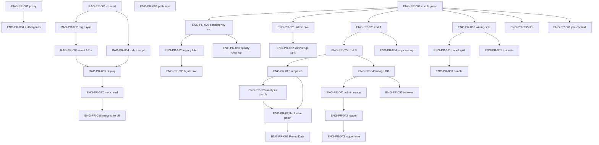

# 工程优化 PR 任务队列

> **目的**：把「稳定性 / 性能 / 架构债 / 观测 / 测试」拆成 **PR 粒度** 任务单，任意 AI/开发者可按编号连续接力。  
> **规范**：每个 PR 遵循 [Vibecoding 模板](../CLAUDE.md#vibecoding-规范)（contracts → services → hooks → components → page 接入）；**基础设施 PR** 可跳过 UI 层。  
> **关联文档**：
> - UI 补全（已完成）→ [`docs/UI_COMPLETION_QUEUE.md`](./UI_COMPLETION_QUEUE.md)
> - Admin 增强（已完成）→ [`docs/ADMIN_ENHANCEMENT_PLAN.md`](./ADMIN_ENHANCEMENT_PLAN.md)
> - RAG 索引性能（本队列 Phase 1 对齐）→ [`docs/rag-index-refactor.md`](./rag-index-refactor.md)
> - 线上阻断项快照 → [`docs/PROJECT_HEALTH.md`](./PROJECT_HEALTH.md)
> - 工程债全局 → [`CLAUDE.md`](../CLAUDE.md) 待处理技术债表  
> **最后更新**：2026-06-01（审查修订：依赖、验收、ENG-PR-025b、与 PROJECT_HEALTH 对齐）

---

## 0. 接力协议（每次开新会话必读）

### 0.1 开干前

1. 读本文 **§1 总表**，找第一个 `status: todo` 且依赖已 `done` 的 PR。  
2. 读该 PR 的 **Vibecoding 任务单**（§3）。  
3. 执行 `rg` 扫描「影响范围」（任务单里会写关键词）。  
4. 分支命名：`eng/pr-XXX-短名`（例：`eng/pr-001-proxy-user-header`）。  
5. **RAG-PR-00x** 与本文 **ENG-PR-01x** 编号互通：RAG 任务单细节以 `rag-index-refactor.md` §3 为准，合并时只更新一处状态（§1 两表同步）。  
6. **RAG 范围**：RAG-PR-001～005 只动 `data/index_*.json` + `.emb` 与 `src/lib/rag.ts`；**不**在本阶段改 Prisma `KnowledgeChunk.embedding`（DB 向量与文件索引是两套，另开 PR 若需统一）。
7. **Phase 0 可并行**：ENG-PR-001 / 003 / 004 与 ENG-PR-002 **无硬依赖**；002 开干前先跑 `tsc` / `lint` / `build`，以**当前输出**为准（勿盲跟过期 HEALTH 清单）。

### 0.2 完成后

1. 跑验证：`npx tsc --noEmit && npm run test`（或 `npm run check`）。  
2. 在 **§1 总表** 把该 PR 改为 `done`，填 `merged` 日期。  
3. 若改 RAG 子项，同步更新 [`rag-index-refactor.md`](./rag-index-refactor.md) §1 总表。  
4. 在 **§4 会话日志** 追加一行。  
5. 交付说明必须含 **数据流** 或 **请求链**（视 PR 类型：UI→service→API，或 proxy→route→DB）。

### 0.3 禁止（所有 PR 通用）

- 不要在一次 PR 里同时改 `proxy.ts` 认证 **和** RAG 全量重构（拆 PR）  
- 不要改 `workbench/page.tsx` **大段逻辑**——仅允许 import + 一行挂载（与 UI 队列相同）  
- 组件层不要**新增** `fetch('/api/...')`——走 `src/services/`  
- 不要全量 PATCH Project（sections 已增量；references/analysisResults 用本队列增量 PR）  
- 不要使用 `any`（本队列 **ENG-PR-054** 专门清债，其它 PR 禁止新增）  
- 不要改 `backup_*`  
- 不要与进行中的 `UI-*` / `ADMIN-*` **同一文件** 并行两个 PR

---

## 1. PR 总表

状态：`todo` | `doing` | `done` | `blocked` | `cancelled`

| ID | 标题 | 依赖 | 估时 | 状态 | merged |
|----|------|------|------|------|--------|
| **Phase 0 — 稳定性 P0（必须先绿）** |
| ENG-PR-001 | Proxy：`x-user-id` 写入 request headers | — | 2h | done | 2026-06-01 |
| ENG-PR-002 | 质量闸门全绿：tsc + lint + build | — | 4～8h | done | 2026-06-01 |
| ENG-PR-003 | 知识库/PDF 路径穿越防护 | — | 3h | done | 2026-06-01 |
| ENG-PR-004 | `AUTH_BYPASS` 生产防护 + 文档 | ENG-PR-001 | 1h | done | 2026-06-01 |
| **Phase 1 — RAG 性能（≈1.88GB 索引）** |
| RAG-PR-001 | 转换脚本：JSON → content.json + `.emb` | — | 2h | todo | |
| RAG-PR-002 | `rag.ts` 异步加载 + 二进制嵌入 | RAG-PR-001 | 4h | todo | |
| RAG-PR-003 | 所有 RAG 调用方 `await` 化 | RAG-PR-002 | 3h | todo | |
| RAG-PR-004 | `index-pdfs.mjs` 直接输出分离格式 | RAG-PR-001 | 3h | todo | |
| RAG-PR-005 | RAG 部署验证 + 文档更新 | RAG-PR-003, RAG-PR-004 | 2h | todo | |
| **Phase 2 — API 契约与数据一致性** |
| ENG-PR-020 | `services/consistency.ts` + hook 去 fetch | ENG-PR-002 | 2h | todo | |
| ENG-PR-021 | Admin 页面 fetch 迁入 services | ENG-PR-002 | 4h | todo | |
| ENG-PR-022 | Legacy/独立页 fetch 迁入 services | ENG-PR-020 | 4h | todo | |
| ENG-PR-023 | Zod `validateBody` 波次 A（admin + 图表） | ENG-PR-002 | 3h | todo | |
| ENG-PR-024 | Zod `validateBody` 波次 B（knowledge 写 + projects） | ENG-PR-023 | 3h | todo | |
| ENG-PR-025 | References 增量 PATCH API | ENG-PR-024 | 4h | todo | |
| ENG-PR-026 | AnalysisResults 增量 PATCH API | ENG-PR-025 | 3h | todo | |
| ENG-PR-025b | 增量 PATCH 前端接线（store / autosave / 面板） | ENG-PR-025, ENG-PR-026 | 4h | todo | |
| ENG-PR-027 | `metadata.json` 只读 Prisma（停双写-读） | RAG-PR-005 | 4h | todo | |
| ENG-PR-028 | 移除 `metadata.json` 双写（写路径） | ENG-PR-027 | 4h | todo | |
| **Phase 3 — 大文件拆分** |
| ENG-PR-030 | `/api/writing` 按阶段拆 handler | ENG-PR-002 | 6h | todo | |
| ENG-PR-031 | `writing-panel` 拆 SSE 条 + 扩写区 | ENG-PR-030 | 6h | todo | |
| ENG-PR-032 | `knowledge/page` 拆 hooks + 子组件 | ENG-PR-021 | 6h | todo | |
| ENG-PR-033 | `use-figure-pipeline` 图表 API 进 service | ENG-PR-022 | 3h | todo | |
| **Phase 4 — 观测与运维** |
| ENG-PR-040 | Prisma `AiUsageLog` + 写入 | ENG-PR-024 | 3h | todo | |
| ENG-PR-041 | Admin 用量读 DB（替代内存环） | ENG-PR-040 | 2h | todo | |
| ENG-PR-042 | 统一 `logger` 封装 | ENG-PR-041 | 2h | todo | |
| ENG-PR-043 | AI/脚本路由接入 logger | ENG-PR-042 | 3h | todo | |
| **Phase 5 — 质量闭环与测试** |
| ENG-PR-050 | quality-module Phase 4 收尾 + 死代码清理 | ENG-PR-020 | 4h | todo | |
| ENG-PR-051 | API 集成测试：writing + plagiarism v2 | ENG-PR-030 | 4h | todo | |
| ENG-PR-052 | Playwright 冒烟：登录→工作台→保存 | ENG-PR-002 | 4h | todo | |
| ENG-PR-053 | Prisma 补索引（P3-1） | ENG-PR-040 | 2h | todo | |
| ENG-PR-054 | `no-explicit-any` warn + 热点清零 | ENG-PR-023 | 6h | todo | |
| **可选 P3** |
| ENG-PR-060 | Bundle analyze + 重路由 lazy | ENG-PR-031 | 3h | todo | |
| ENG-PR-061 | pre-commit：`check` + lint-staged | ENG-PR-002 | 2h | todo | |
| ENG-PR-062 | `ProjectData` 类型统一（contracts 为准） | ENG-PR-025b | 4h | todo | |

### 1.1 与既有队列的关系

| 来源 | 本队列处理方式 |
|------|----------------|
| `UI_COMPLETION_QUEUE` 全部 `done` | 不重复 UI；ENG-PR-022 扫 `src/app` + `src/components` 残留 fetch |
| `ADMIN_ENHANCEMENT` 全部 `done` | ENG-PR-021 补 admin **页面** 直连 fetch；ENG-PR-040 实现 ADMIN-013 文档中的 DB 持久化 |
| `rag-index-refactor.md` | RAG-PR-001～005 原样纳入 §1；细节见该文 §3 |
| `CLAUDE.md` p1-1～p3-5 | 映射见 §8 |

### 1.2 已完成（勿重复开 PR）

| 内容 | 说明 |
|------|------|
| UI-PR-001～080 | 模块 registry、证据、审查、查重 SSE、plot 插入等 |
| ADMIN-001～023 | Admin CRUD、健康、导出、用量 UI（**内存** usage 仍待 ENG-PR-040） |
| sections 增量 upsert | `PATCH /api/projects/[id]/sections/[key]` |
| 写作 SSE 统一 `{type,...}` | contracts/sse + 类型守卫 |
| `.env.example` | 已存在；ENG-PR-004 补 AUTH 说明即可 |

---

## 2. 依赖关系图



**推荐首批**

```
Session 0（并行）：ENG-PR-001 + ENG-PR-003 + ENG-PR-004 ；ENG-PR-002 按当前 lint/build 清单独立推进
Session 1（性能）：RAG-PR-001 → RAG-PR-002 → RAG-PR-003 ；RAG-PR-004 可与 002 并行
Session 2（契约）：ENG-PR-020 → ENG-PR-023 → ENG-PR-024
Session 3（数据）：ENG-PR-025 → ENG-PR-026 → ENG-PR-025b → ENG-PR-027 → ENG-PR-028
```

---

## 3. 分 PR 任务单（Vibecoding）

---

### ENG-PR-001 — Proxy：`x-user-id` 写入 request headers

```
目标：只修复 Next.js 16 proxy 把用户 ID 传给 Route Handler 的方式，不改 JWT 逻辑。

问题：
  src/proxy.ts 当前 response.headers.set("x-user-id")，
  API 使用 req.headers.get("x-user-id") → 生产可能永远拿不到 userId。

禁止：
- 不要改登录/注册 API
- 不要在本 PR 改 RAG 或 writing
- 不要使用 any

先做：
  rg "x-user-id|getCurrentUser|USER_ID_HEADER" src/

实现顺序：
1. src/proxy.ts — 复制 request.headers，set x-user-id，NextResponse.next({ request: { headers } })
2. AUTH_BYPASS 分支同样写入 request headers（非 response）
3. src/lib/auth.ts — 注释改为「proxy 注入 request header」
4. src/__tests__/lib/proxy-auth.test.ts（可选）— mock NextRequest 断言 header 传递

验证：
  npx tsc --noEmit && npm run test
  手动：登录后 GET /api/projects 返回当前用户项目（非 401/空列表）

交付请求链：
  Cookie token → proxy jwtVerify → request.headers[x-user-id] → projects route → Prisma where userId
```

**验收**

- [ ] `rg 'response.headers.set.*x-user-id' src/proxy.ts` 为零  
- [ ] `getCurrentUser` 在已登录请求下非 null  
- [ ] `AUTH_BYPASS` 仍可用且仅开发文档说明  

---

### ENG-PR-002 — 质量闸门全绿：tsc + lint + build

```
目标：只让 npm run check 与 npm run build 在本地/CI 稳定通过，不顺带功能开发。

禁止：
- 不要新功能
- 不要改 backup_*
- 不要按过期 HEALTH 条目盲改 JSX（先跑命令，再修真实报错）

先做：
  npm run typecheck; npm run lint:src --quiet; npm run build
  将结果写回 docs/PROJECT_HEALTH.md

实现顺序（按**当前**输出逐项，常见项如下）：
1. ESLint error（约 80 级，2026-06-01 快照）— 优先 `prefer-const` 等可 --fix 项，再清其余
2. build：next/font/google → 系统字体栈（AGENTS.md）；无外网构建环境必做
3. Turbopack：knowledge route 动态路径收窄或 turbopackIgnore（见 PROJECT_HEALTH）
4. 若 tsc 已 0 error，勿为历史 JSX 问题做大范围重排

验证：
  npm run check && npm run build

交付：CI 可复用的单一命令门禁 + PROJECT_HEALTH 与仓库一致
```

**验收**

- [ ] `npm run typecheck` 0 errors  
- [ ] `npm run lint:src --quiet` 0 errors（或团队约定仅 warn）  
- [ ] `npm run build` 成功  
- [ ] `docs/PROJECT_HEALTH.md` 验证表与本次命令输出一致  

---

### ENG-PR-003 — 知识库/PDF 路径穿越防护

```
目标：只加固用户可控路径拼接，不改变业务 API 形状。

禁止：
- 不要改索引算法
- 不要全量重构 knowledge 页

先做：
  rg "path.join|resolve|METADATA|data/" src/app/api/knowledge src/app/api/pdf

实现顺序：
1. src/lib/safe-path.ts — assertInside(baseDir, userSegment)：白名单字符 + resolve 后前缀检查
2. src/app/api/knowledge/route.ts — 上传/移动/删除/读路径全部走 assertInside
3. src/app/api/pdf/route.ts — 同上
4. src/__tests__/lib/safe-path.test.ts — `../etc/passwd` 拒绝用例

验证：
  npm run test && tsc

交付数据流：
  客户端 filename/category → API sanitize → 仅 data/pdfs|data/... 下读写
```

**验收**

- [ ] `..`、绝对路径、空字节被拒绝  
- [ ] 合法中文分类/文件名仍可用  

---

### ENG-PR-004 — `AUTH_BYPASS` 生产防护 + 文档

```
目标：只防止生产误开 AUTH_BYPASS，依赖 ENG-PR-001 的 request header 行为。

实现顺序：
1. src/proxy.ts — NODE_ENV===production 且 AUTH_BYPASS 时 console.error + 忽略 bypass
2. .env.example — 注释 AUTH_BYPASS 仅本地
3. docs/DEPLOY.md — 部署检查项增加「禁止 AUTH_BYPASS」

验证：tsc；手动 production 模拟

交付：部署清单可勾选
```

---

### RAG-PR-001～005 — RAG 索引重构

> **任务单全文**见 [`docs/rag-index-refactor.md`](./rag-index-refactor.md) §3（转换脚本 / rag.ts 异步 / API await / index-pdfs / 部署验证）。  
> 本队列 **§1 总表** 状态与彼处 **§1 总表** 保持同步。

**合并验收（RAG-PR-005 完成后）**

- [ ] `rg "readFileSync" src/lib/rag.ts` 为零  
- [ ] 点击「基于文献对话」首 token <3s（冷启动后）  
- [ ] `data/index_*.json` 总体积 <100MB 量级（embedding 在 `.emb`）  

---

### ENG-PR-020 — `services/consistency.ts` + hook 去 fetch

```
目标：只把一致性检查/修复从 use-consistency 迁到 service，不改 AI prompt。

禁止：
- 不要改 workbench/page.tsx 大段

先做：
  rg "fetch.*consistency" src/

实现顺序：
1. src/contracts/consistency.ts — 对齐现有 ConsistencyReport / FixableReport
2. src/services/consistency.ts — runCheck(), fixIssue()（SSE 若 fix 为流则 parseSSE）
3. src/hooks/use-consistency.ts — 仅调 service
4. src/__tests__/services/consistency.test.ts — mock Response

验证：tsc && npm run test

交付数据流：
  UI → useConsistency → consistency service → /api/consistency → DeepSeek/Zhipu → UI
```

---

### ENG-PR-021 — Admin 页面 fetch 迁入 services

```
目标：只消除 src/app/admin/** 内组件层 fetch，不增 Admin 功能。

先做：
  rg "fetch\\(['\\\"]/api" src/app/admin

实现顺序：
1. src/services/admin.ts — getStats, listUsers, deleteUser, listProjects, ...（按 rg 结果分批）
2. src/contracts/admin.ts — 已有则扩展
3. 逐页替换：admin/page, users, projects, knowledge, settings, health, usage, plagiarism, reviews

验证：tsc && npm run test；手动打开 /admin 各页

交付：Admin UI → admin service → /api/admin/* → Prisma
```

---

### ENG-PR-022 — Legacy/独立页 fetch 迁入 services

```
目标：迁移仍直连 fetch 的独立页、panel、auth，不删页面（redirect 已由 UI-PR-070 完成）。

先做：
  rg "fetch\\(['\\\"]/api" src/app src/components src/lib/auth-context.tsx src/hooks
  （排除 src/services/** — service 内 fetch 允许）

实现顺序：
1. src/services/auth.ts — login, register, logout, getMe（auth-context + login/register 页）
2. 扩展 project.ts — listProjects() 供 plagiarism/plot 等
3. analysis/outline/writing — 复用 services/analysis.ts、outline、use-writing-stream
4. plagiarism-panel、outline-panel、analysis-panel、table-panel、chat-panel — 仅调 services
5. src/app/plagiarism、plot、reader — 迁完后再 rg 验收

验证：tsc && rg "fetch\\(['\\\"]/api" src/app src/components src/lib src/hooks

交付：页面 → service → API（与 §6 验收对齐）
```

---

### ENG-PR-023 — Zod validateBody 波次 A（admin + 图表）

```
目标：为无 schema 的 admin 写接口与图表/xrd 子进程入口加 validateBody。

先做：
  rg "export async function (GET|POST|PUT|DELETE)" src/app/api/admin
  rg "validateBody" src/app/api --count

实现顺序：
1. src/lib/validations.ts — adminUsersQuerySchema, adminDeleteSchema, chartPostSchema, xrdPeakfitSchema, ...
2. 接入 route：admin/users, admin/projects, admin/knowledge, chart, table, xrd/*（按风险排序）
3. src/__tests__/lib/validations.test.ts — 非法 body 400

验证：tsc && test

交付：畸形 JSON 不进入 requireAdmin 业务逻辑
```

---

### ENG-PR-024 — Zod validateBody 波次 B（knowledge 写 + projects）

```
目标：补 knowledge POST/PATCH/DELETE、projects 子路由、plagiarism v2、review fix 等。

依赖：ENG-PR-023（复用 validateBody 模式）

实现顺序：
1. validations.ts — knowledgeUploadSchema, projectMetaPatchSchema, plagiarismV2Schema, ...
2. 接入 src/app/api/knowledge/route.ts、projects/[id]/*、plagiarism/v2、review/fix
3. 更新 docs/CONVENTIONS.md API 一节（可选 3 行）

验证：npm run check
```

---

### ENG-PR-025 — References 增量 PATCH API

```
目标：只实现 references 单条/批量 upsert，替代 project 全量 references 数组覆盖。

禁止：
- 本 PR 不改 projectStore / use-auto-save（见 ENG-PR-025b）

先做：
  rg "references" src/app/api/projects src/services/project.ts

实现顺序：
1. src/contracts/project.ts — ReferencePatchOp, ReferencesPatchRequest
2. src/app/api/projects/[id]/references/route.ts — PATCH [{ op, ref }]
3. src/services/project.ts — patchReferences(projectId, ops)
4. Prisma：复用 Reference 表；事务内 upsert/delete

验证：tsc && vitest 事务 mock

交付：UI → patchReferences → PATCH → Reference 行级更新
```

---

### ENG-PR-026 — AnalysisResults 增量 PATCH API

```
目标：同 ENG-PR-025，针对 analysisResults（append/update/delete by id）。

实现顺序：
1. contracts — AnalysisResultPatch
2. PATCH /api/projects/[id]/analysis-results
3. project service — patchAnalysisResults

验证：test

交付：分析面板保存不再全量 Project JSON
```

---

### ENG-PR-025b — 增量 PATCH 前端接线（store / autosave / 面板）

```
目标：references / analysisResults 保存改走 ENG-PR-025/026 API，不再 projectStore.save 全量 Project。

禁止：
- 不要改 sections 增量逻辑（已正确）
- 不要在本 PR 动 ENG-PR-062 全库类型重命名（仅改保存路径）

先做：
  rg "projectStore.save|references|analysisResults" src/hooks src/components src/lib/store

实现顺序：
1. src/services/project.ts — patchReferences / patchAnalysisResults 对外导出
2. src/lib/store.ts 或 use-auto-save — 保存 references/analysis 时调 PATCH，非全量 JSON
3. analysis-panel、reference-browser（若有全量保存）— 改调 service
4. 手动：改一条文献 + 一条分析结果 → 刷新页面仍在

验证：tsc && test；Network 面板可见 PATCH 非 PUT 整项目

交付：UI → patch* service → PATCH /api/projects/[id]/references|analysis-results → Prisma
```

**验收**

- [ ] `use-auto-save` 不再因单字段变更上传整包 references/analysisResults 数组（若仍全量则本 PR 未完成）

---

### ENG-PR-027 — metadata.json 只读 Prisma（停双写-读）

```
目标：读路径只查 Prisma KnowledgeFile + KnowledgeChunk；metadata.json 仅迁移/回退只读。

依赖：RAG-PR-005（索引与 metadata 字段一致）

先做：
  rg "metadata.json|METADATA_PATH" src/

实现顺序：
1. src/lib/knowledge-metadata.ts — getFileMeta(fileId) 只读 Prisma
2. rag.ts — chunkCount 从 Prisma count，不再 parse metadata.json
3. writing-context.ts、outline/route.ts — 改用 knowledge-metadata
4. feature flag：USE_METADATA_JSON_FALLBACK=true 时只读旧文件（默认 false）

验证：tsc；知识库列表 chunk 数正确

交付：读路径 UI → Prisma（无双读不一致）
```

---

### ENG-PR-028 — 移除 metadata.json 双写（写路径）

```
目标：删除 knowledge route POST/DELETE 对 metadata.json 的写入；索引脚本只写 Prisma。

依赖：ENG-PR-027

实现顺序：
1. src/app/api/knowledge/route.ts — 删双写块
2. scripts/index-pdfs.mjs — 输出只更新 Prisma + 新 RAG 文件格式
3. docs/DATABASE.md — 标注 metadata.json deprecated
4. data/metadata.json — 保留备份不删（仓库策略由人决定）

验证：上传 PDF 后 Prisma 有记录、磁盘无 metadata 追加

交付：写路径 UI → API → Prisma + index script → RAG 文件
```

---

### ENG-PR-030 — `/api/writing` 按阶段拆 handler

```
目标：只拆 route.ts 文件结构，不改 Writer/Verifier/Refiner 行为。

禁止：
- 单 PR 不超过 500 行净移动（可分 030a/030b 若需，此处为一 PR 尽量完成）

先做：
  wc -l src/app/api/writing/route.ts

实现顺序：
1. src/app/api/writing/schemas.ts — 请求体与阶段枚举
2. src/app/api/writing/pipeline/writer.ts — SSE 段
3. .../verifier.ts、.../refiner.ts
4. route.ts — 编排五阶段，<150 行
5. 现有 src/__tests__/api/writing.test.ts 仍绿

验证：npm run check；手动扩写一条

交付：route → pipeline/* → callAI → SSE
```

---

### ENG-PR-031 — `writing-panel` 拆 SSE 条 + 扩写区

```
目标：writing-panel.tsx 降至 <500 行；逻辑进 hooks/子组件。

依赖：ENG-PR-030（SSE 事件类型稳定）

实现顺序：
1. src/components/shared/writing/writing-sse-status.tsx
2. src/components/shared/writing/writing-expand-result.tsx
3. src/hooks/use-writing-panel-state.ts（若状态仍过大）
4. writing-panel.tsx — 组合层

验证：tsc；工作台扩写+核实+修正流程不变

交付：UI 组件 → hooks → useWritingStream → /api/writing
```

---

### ENG-PR-032 — `knowledge/page` 拆 hooks + 子组件

```
目标：knowledge/page.tsx <300 行；列表/上传/重索引/分类各一组件。

依赖：ENG-PR-021（service 已齐）

实现顺序：
1. src/hooks/use-knowledge-list.ts
2. src/components/shared/knowledge/knowledge-toolbar.tsx（已有则扩展）
3. src/components/shared/knowledge/knowledge-table.tsx
4. page.tsx — 布局壳

验证：tsc；上传/搜索/重索引手动测

交付：与 UI-PR-031 相同数据流，结构清晰
```

---

### ENG-PR-033 — `use-figure-pipeline` 图表 API 进 service

```
目标：generateSingleFigure 内 fetch 迁入 chart/xrd/flow services。

实现顺序：
1. src/services/figures.ts — generateFigure(tool, config, signal)
2. use-figure-pipeline.ts — 调 figures service
3. 单测 mock fetch

验证：test；工作台生成一张图

交付：UI → figures service → /api/chart|xrd|flow-diagram → Python/图片 URL
```

---

### ENG-PR-040 — Prisma `AiUsageLog` + 写入

```
目标：实现 ADMIN-013 文档承诺的持久化用量（当前 usage-log 仅内存）。

实现顺序：
1. prisma/schema.prisma — model AiUsageLog { id, userId?, feature, tokens?, metadata Json?, createdAt }
2. migration
3. src/lib/usage-log.ts — record() 双写：内存环 + prisma.create（异步，失败不阻塞 AI）
4. src/lib/ai.ts — 确保 callAI 后 record 带 provider/model/tokens

验证：prisma validate && test

交付：callAI → usageLog.record → AiUsageLog 表
```

---

### ENG-PR-041 — Admin 用量读 DB（替代内存环）

```
目标：/api/admin/stats、/api/admin/usage 从 DB 聚合；内存环仅作开发 fallback。

依赖：ENG-PR-040

实现顺序：
1. src/services/admin-usage.ts — getUsageStats(range), getRecentLogs(n)
2. 改 admin/stats/route.ts、admin/usage/route.ts
3. admin/usage 页面对齐新字段

验证：插入几条 log 后 Admin 可见；重启 Node 仍在

交付：Admin UI → admin-usage service → Prisma aggregate
```

---

### ENG-PR-042 — 统一 logger 封装

```
目标：src/lib/logger.ts — info/warn/error + 结构化字段；不引入重型依赖优先。

实现顺序：
1. src/lib/logger.ts — 封装 console（或 pino 若已许可）
2. 禁止业务层 console.log（eslint no-console 已有）

验证：tsc
```

---

### ENG-PR-043 — AI/脚本路由接入 logger

```
目标：writing、chat、knowledge reindex、plagiarism 入口用 logger 替代 console。

依赖：ENG-PR-042

验证：lint + 手动触发一条 AI 请求有结构化日志
```

---

### ENG-PR-050 — quality-module Phase 4 收尾 + 死代码清理

```
目标：删死代码 + 文档验收勾选；不重复 UI 已做项（/review、/plagiarism、plagiarism-service 已存在）。

禁止：
- 不要在本 PR 大规模清 any（见 ENG-PR-054）
- 不要按 quality-module-plan 新建 /quality 页或 plagiarism-service.ts（先 rg 是否已有）

先做：
  rg "from.*similarity|from.*plagiarism-check" src/
  ls src/lib/similarity.ts src/services/plagiarism-check.ts

实现顺序：
1. 无引用则删 src/lib/similarity.ts、src/services/plagiarism-check.ts
2. feature-flags 审查维度开关（若仍缺且产品需要）
3. docs/quality-module-plan.md 顶部增「已实现 / 跳过」表（对照 main 文件树）
4. 手动：查重 → 降重 → 审查 → fix 一条链路

验证：npm run check；rg 无死 import

交付：质量模块文档与代码一致（不含 any 清零）
```

---

### ENG-PR-051 — API 集成测试：writing + plagiarism v2

```
目标：扩展现有 api/writing.test、plagiarism.test；mock callAI / 外部查重。

实现顺序：
1. mock src/lib/ai.ts、python 子进程
2. POST /api/writing 返回 SSE 首事件 type 断言
3. POST /api/plagiarism/v2 阶段事件序列

验证：npm run test
```

---

### ENG-PR-052 — Playwright 冒烟：登录→工作台→保存

```
目标：一条 e2e 覆盖主路径；CI 可选。

前置（任务单内写明，避免 AI 卡住）：
  docker compose up -d   # 或本地 PostgreSQL
  cp .env.example .env   # 填 DATABASE_URL、JWT_SECRET
  npm run create-admin   # 或 seed 测试用户
  npm run dev            # 另开终端

实现顺序：
1. playwright.config.ts — baseURL http://localhost:3000
2. e2e/smoke-workbench.spec.ts — login → /workbench?projectId= → 编辑 section → 等待 autosave 成功
3. package.json — "test:e2e": "playwright test"
4. README 或 docs/DEPLOY.md 一句「本地 e2e 前置」

验证：DATABASE_URL + dev server 运行时 `npm run test:e2e` 通过

交付：发布前人工/CI 冒烟
```

---

### ENG-PR-053 — Prisma 补索引（P3-1）

```
目标：按 docs/DATABASE.md 待补项加 @@index。

实现顺序：
1. AnalysisResult(projectId, createdAt)
2. RewriteSuggestion(checkId) 等
3. KnowledgeFile(category) 或复合索引
4. migration + 说明查询路径

验证：prisma validate
```

---

### ENG-PR-054 — `no-explicit-any` warn + 热点清零

```
目标：eslint 开 warn；清 writing route、knowledge route、admin-export、shared 热点。

实现顺序：
1. eslint.config — @typescript-eslint/no-explicit-any: warn
2. 分批修：api/admin-export → api/knowledge → api/writing
3. 禁止新增 any（CI 看 warn 趋势）

验证：npm run lint:src
```

---

### ENG-PR-060 — Bundle analyze + 重路由 lazy

```
目标：next experimental analyze；/plot /reader /admin dynamic import。

验证：npm run analyze 产出报告；对比首屏 JS KB
```

---

### ENG-PR-061 — pre-commit：check + lint-staged

```
目标：husky pre-commit 跑 tsc + 受影响文件 eslint；不强制全量 test（太慢可仅 push CI）。

实现顺序：
1. husky + lint-staged 配置
2. 文档 CONTRIBUTING 或 AGENTS.md 一句

验证：故意 lint error 提交被拒绝
```

---

### ENG-PR-062 — `ProjectData` 类型统一（contracts 为准）

```
目标：消除 projectStore 与 contracts/project.ts 双轨类型（p2-3）。

依赖：ENG-PR-025b（保存路径已走增量 API）

实现顺序：
1. rg "ProjectData|interface Project" src/
2. 以 contracts/project.ts 为唯一出口；projectStore 改 import
3. hooks 全用 ProjectRecord 等命名

验证：tsc 0 errors
```

---

## 4. 会话日志

| 日期 | PR | 执行者 | 备注 |
|------|-----|--------|------|
| 2026-06-01 | — | AI | 初版队列：Phase 0～5 + RAG 对齐 rag-index-refactor.md |
| 2026-06-01 | — | AI | 审查修订：002/001 解耦、RAG-001 无依赖、ENG-PR-025b、§6 fetch 范围、PROJECT_HEALTH 同步 |
| 2026-06-01 | ENG-PR-001, 004 | AI | proxy request header 注入 + 生产忽略 AUTH_BYPASS；auth 单测 3 条 |
| 2026-06-01 | ENG-PR-003 | AI | `safe-path.ts` + knowledge/pdf 路由接入；单测 4 条 |
| 2026-06-01 | ENG-PR-002 | AI | ESLint 0 error（Compiler hooks off + 机械修复）；`npm run check` + build 绿；PROJECT_HEALTH 同步 |

---

## 5. 推荐执行顺序（给「下一次 AI」）

**若仓库状态未知，永远从 Phase 0 开始。**

| 会话 | PR 序列 | 说明 |
|------|---------|------|
| Session 0 | 001 + 003 + 004 并行；002 独立 | 认证与构建可发布 |
| Session 1 | RAG-PR-001 → 002 → 003；004 并行 | 文献对话不卡死 |
| Session 2 | ENG-PR-020 → 023 → 024 | 服务层 + 校验 |
| Session 3 | ENG-PR-025 → 026 → **025b** → 027 → 028 | 增量 API + 前端接线 + 去双写 |
| Session 4 | ENG-PR-030 → 031 | 写作管道可维护 |
| Session 5 | ENG-PR-021 → 022 → 032 → 033 | fetch 清零 + 页面拆 |
| Session 6 | ENG-PR-040 → 041 → 042 → 043 | 运维可观测 |
| Session 7 | ENG-PR-050 → 051 → 052 → 053 → 054 | 质量与测试 |
| Session 8 | ENG-PR-060、061、062 | 可选增强 |

**若只能做一个 PR**：**ENG-PR-001**（否则生产用户隔离可能失效）。

---

## 6. 验收总清单（全队列完成后）

- [ ] `proxy` 通过 **request** headers 传递 `x-user-id`  
- [ ] `npm run check` && `npm run build` 稳定通过  
- [ ] 知识库/PDF API 路径穿越用例被拒绝  
- [ ] RAG：无 `readFileSync` 巨型 JSON；对话首响应可接受  
- [ ] `rg "fetch\\(['\\\"]/api" src/app src/components src/lib src/hooks` 无匹配（**排除** `src/services/**`）  
- [ ] 主要变异 API 均有 `validateBody`（含 `/api/plagiarism/v2`、`review/fix`）  
- [ ] references / analysisResults **API** 增量 PATCH 且 **025b** 前端已接线（非 `projectStore.save` 全量）  
- [ ] 无 `metadata.json` 双写；Prisma 为文献元数据唯一源  
- [ ] `writing/route.ts`、`writing-panel.tsx` 各 <500 行（或团队约定阈值）  
- [ ] AiUsageLog 持久化；Admin 用量重启不丢  
- [ ] 统一 logger；关键 AI 路由可追踪  
- [ ] Playwright 冒烟至少 1 条绿  
- [ ] quality-module Phase 4 文档验收勾选  

---

## 7. 变更本文档的规则

- 新增 PR：用下一个三位编号（ENG-PR-xxx），写 §3 任务单，更新 §1 与 §2  
- RAG 子项：同步 [`rag-index-refactor.md`](./rag-index-refactor.md) §1 状态  
- 取消 PR：标 `cancelled` 并写原因  
- 与 UI/ADMIN 重复：标 `merged into UI-PR-xxx` / `ADMIN-xxx`，避免重复开发  

---

## 8. 与 CLAUDE.md 技术债映射

| 技术债编号 | 本队列 PR |
|------------|-----------|
| p1-1 `@typescript-eslint/no-explicit-any` | ENG-PR-054 |
| p1-2 zod 接入 API | ENG-PR-023、024 |
| p1-3 组件 fetch 迁移 | ENG-PR-020、021、022、033 |
| p2-1 references/analysis 增量 PATCH | ENG-PR-025、026、025b |
| p2-3 统一 ProjectData | ENG-PR-062 |
| p3-1 Prisma @@index | ENG-PR-053 |
| p3-2 utils 单测 | 已有部分；新增 ENG-PR-051 覆盖 API |
| p3-3 拆 writing-panel + writing route | ENG-PR-030、031 |
| p3-4 统一 logger | ENG-PR-042、043 |
| p3-5 .env.example + pre-commit | ENG-PR-004（env 说明）、061 |
| （未单列）RAG 1.88GB | RAG-PR-001～005 |
| （未单列）proxy 认证 | ENG-PR-001 |
| ADMIN-013 UsageLog DB | ENG-PR-040、041 |
