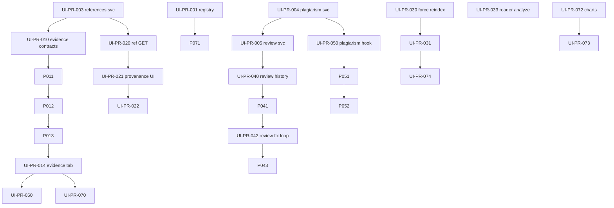

# UI 补全 PR 任务队列

> **目的**：把「后端有、前端缺/散」的改进拆成 **PR 粒度** 任务单，任意 AI/开发者可按编号连续接力。  
> **规范**：每个 PR 遵循 [Vibecoding 模板](../CLAUDE.md#vibecoding-规范)（contracts → services → hooks → components → page 接入）。  
> **关联文档**：
> - 查重/降重/审查后端细节 → [`docs/quality-module-plan.md`](./quality-module-plan.md)（Phase 1–3 与其 **并行或合并**，避免重复改同一文件）
> - 工程债全局 → [`CLAUDE.md`](../CLAUDE.md) 待处理技术债表  
> **最后更新**：2026-05-31

---

## 0. 接力协议（每次开新会话必读）

### 0.1 开干前

1. 读本文 **§1 总表**，找第一个 `status: todo` 且依赖已 `done` 的 PR。  
2. 读该 PR 的 **Vibecoding 任务单**（§3）。  
3. 执行 `rg` 扫描「影响范围」（任务单里会写关键词）。  
4. 分支命名：`ui/pr-XXX-短名`（例：`ui/pr-010-evidence-contracts`）。

### 0.2 完成后

1. 跑验证：`npx tsc --noEmit && npm run test`（或 `npm run check`）。  
2. 在 **§1 总表** 把该 PR 改为 `done`，填 `merged` 日期。  
3. 在 **§4 会话日志** 追加一行（谁/啥/备注）。  
4. 交付说明必须含 **数据流**：`UI → service → API → DB/AI → UI`。

### 0.3 禁止（所有 PR 通用）

- 不要改 `workbench/page.tsx` **大段逻辑**——仅允许 import + 一行 Tab 挂载 hook/组件  
- 组件层不要新增 `fetch('/api/...')`——走 `src/services/`  
- 不要全量 PATCH Project——sections 用增量 API  
- 不要使用 `any`  
- 不要改 `backup_*`  
- 不要与 `quality-module-plan` 中 **同一文件** 同时开两个 PR（先合并或串行）

---

## 1. PR 总表

状态：`todo` | `doing` | `done` | `blocked` | `cancelled`

| ID | 标题 | 依赖 | 估时 | 状态 | merged |
|----|------|------|------|------|--------|
| **Phase 0 — 基础** |
| UI-PR-001 | 模块注册表 + featureFlags 接入首页 | — | 3h | done | 2026-05-31 |
| UI-PR-002 | Dialog 尺寸规范 + 全局复用 | — | 1h | done | 2026-05-31 |
| UI-PR-003 | `services/references.ts` + 迁移 format 调用 | — | 2h | done | 2026-05-31 |
| UI-PR-004 | `services/plagiarism.ts` 骨架 + 类型 | — | 2h | done | 2026-05-31 |
| UI-PR-005 | `services/review.ts` + hook 改用 service | UI-PR-004 | 2h | done | 2026-05-31 |
| **Phase 1 — 证据与溯源** |
| UI-PR-010 | Evidence 契约 + project 解析 helper | UI-PR-003 | 2h | done | 2026-05-31 |
| UI-PR-011 | Evidence PATCH service API 封装 | UI-PR-010 | 2h | done | 2026-05-31 |
| UI-PR-012 | `use-evidence` hook | UI-PR-011 | 2h | done | 2026-05-31 |
| UI-PR-013 | `evidence-panel` 组件 | UI-PR-012 | 4h | done | 2026-05-31 |
| UI-PR-014 | 工作台接入 Evidence Tab | UI-PR-013 | 2h | done | 2026-05-31 |
| UI-PR-020 | ReferenceSource GET service | UI-PR-003 | 1h | done | 2026-05-31 |
| UI-PR-021 | 引用溯源 UI（ReferenceBrowser 增强） | UI-PR-020 | 4h | done | 2026-05-31 |
| UI-PR-022 | 扩写面板 refMapping 摘要条 | UI-PR-021 | 2h | done | 2026-05-31 |
| **Phase 1 — 文献** |
| UI-PR-030 | 单篇 force reindex API + 脚本透传 | — | 3h | done | 2026-05-31 |
| UI-PR-031 | 知识库：单篇重索引 + parseWarning 引导 | UI-PR-030 | 3h | done | 2026-05-31 |
| UI-PR-032 | `analyzeKnowledgeStream` service + hook | — | 3h | done | 2026-05-31 |
| UI-PR-033 | 阅读器「分析」Tab | UI-PR-032 | 4h | done | 2026-05-31 |
| UI-PR-034 | 知识库菜单「AI 精读」入口 | UI-PR-033 | 1h | done | 2026-05-31 |
| **Phase 2 — 审查（与 quality-module-plan Phase 3 对齐）** |
| UI-PR-040 | Review 历史 service + 列表组件 | UI-PR-005 | 3h | todo | |
| UI-PR-041 | 审查页/Tab：真实 IMRAD sections 输入 | UI-PR-040 | 4h | todo | |
| UI-PR-042 | fixIssue 传 section 内容 + apply 写回 | UI-PR-041 | 4h | todo | |
| UI-PR-043 | 查重页移除假 ReviewTab → 链审查中心 | UI-PR-041 | 1h | todo | |
| **Phase 2 — 查重（与 quality-module-plan Phase 1–2 对齐）** |
| UI-PR-050 | `use-plagiarism-check` 统一 v2 SSE | UI-PR-004 | 4h | todo | |
| UI-PR-051 | `/plagiarism` 阶段进度 UI | UI-PR-050 | 2h | todo | |
| UI-PR-052 | 工作台 PlagiarismPanel 复用同一 hook | UI-PR-050 | 2h | todo | |
| **Phase 2 — 一致性** |
| UI-PR-060 | 工作台顶栏一致性入口 + 保存前提示 | UI-PR-014 | 2h | todo | |
| **Phase 3 — 整合** |
| UI-PR-070 | Legacy 页 redirect（writing/outline/analysis） | UI-PR-014 | 2h | todo | |
| UI-PR-071 | 首页/registry 补齐 plot · xrd · reader | UI-PR-001 | 1h | todo | |
| UI-PR-072 | Project.charts 契约 + 资产列表 | — | 2h | todo | |
| UI-PR-073 | Plot 页「插入项目」写 section + charts | UI-PR-072 | 4h | todo | |
| UI-PR-074 | ReaderPanel 瘦身 + 链知识库/阅读器 | UI-PR-031 | 2h | todo | |
| UI-PR-075 | `guide/page.tsx` 与本文同步 | UI-PR-070 | 2h | todo | |
| **可选 P3** |
| UI-PR-080 | Admin usage 统计页（role=admin） | UI-PR-001 | 3h | todo | |

### 1.1 已完成（不计入 PR，勿重复做）

| 内容 | 说明 |
|------|------|
| 知识库 metadata 编辑 | `KnowledgeMetadataDialog` + PATCH |
| 索引增量进度 SSE | `index-pdfs.mjs` + `applyReindexEvent` + 跳过计数 |
| 知识库/查重布局加宽 | `max-w-7xl`、Dialog 放大 |
| `parseWarning` 契约 + 徽章 | `无文本层` 状态 |
| 实验数据 Tab 合并（方案 B） | `analysis`+`evidence` → `data`（`data-panel`）；上传一次，双出口 |
| 写作模式门控 | `review` 隐藏实验数据 Tab + 扩写无数据注入；`research` 全功能 |

---

## 2. 依赖关系图



**与 quality-module-plan 的合并规则**

| 若 quality 计划已合并 | 则 UI 队列 |
|---------------------|------------|
| Phase 1.5 SSE 查重进度 | UI-PR-050/051 改为「对齐已有实现 + 接 registry」|
| Phase 3.7–3.8 审查 Hook/页 | UI-PR-041–043 改为「补历史 + fix 写回 + 删假 Tab」|
| Phase 2 降重闭环 | 不在此队列重复，只在 UI-PR-052 确保 panel 一致 |

开 PR 前 **先读** `quality-module-plan.md` 对应 Phase 是否已在 main。

---

## 3. 分 PR 任务单（Vibecoding）

---

### UI-PR-001 — 模块注册表 + featureFlags 接入首页

```
目标：只实现「模块注册表 + 首页/导航按 featureFlags 渲染」，不碰业务面板。

禁止：
- 不要改 workbench/page.tsx 除侧边链接数据源以外
- 不要直接 fetch()
- 不要全量保存 Project
- 不要使用 any
- 不要改 backup_*

先做：rg "featureFlags|tools.map|workbench-tab-switcher" src/

实现顺序：
1. src/contracts/modules.ts — AppModule, ModulePlacement 类型
2. src/lib/module-registry.ts — 静态注册表（id/href/flag/placement/iconKey）
3. src/lib/feature-flags.ts — 导出 isModuleEnabled(id)
4. src/app/page.tsx — 从 registry 渲染 home 模块
5. src/components/shared/workbench-tab-switcher.tsx — 外链从 registry 读

验证：
  npx tsc --noEmit && npm run test

交付数据流：
  NEXT_PUBLIC_ENABLE_* → featureFlags → module-registry.filter → 首页 Card / 侧栏按钮
```

**验收**

- [x] 设 `NEXT_PUBLIC_ENABLE_CHART=false` 后首页无图表入口  
- [ ] registry 含：workbench, projects, knowledge, plagiarism, plot, xrd-lab, guide  

**建议注册模块**

| id | href | flag |
|----|------|------|
| workbench | /workbench | writing |
| projects | /projects | writing |
| knowledge | /knowledge | knowledge |
| plagiarism | /plagiarism | plagiarism |
| plot | /plot | chart |
| xrd-lab | /xrd-lab | xrd |
| guide | /guide | —（始终开） |

---

### UI-PR-002 — Dialog 尺寸规范

```
目标：只实现 Dialog 尺寸常量抽离，并替换知识库/审查/元数据弹窗引用。

禁止：（通用）

先做：rg "DialogContent className|KNOWLEDGE_DIALOG" src/

实现顺序：
1. src/components/ui/dialog-sizes.ts — DIALOG_FORM | DIALOG_WORK | DIALOG_FULL
2. 替换 src/app/knowledge/page.tsx 内联常量
3. 替换 knowledge-metadata-dialog、workbench-meta-dialog、workbench-consistency-dialog

验证：npx tsc --noEmit

交付：全站二级窗用同一套尺寸 token
```

---

### UI-PR-003 — services/references.ts

```
目标：只实现 references API 的 service 封装，并迁移 format 调用点。

禁止：组件层保留 fetch(/api/references

先做：rg "/api/references" src/

实现顺序：
1. src/contracts/references.ts — ReferenceSourceRecord, FormattedRefsResponse
2. src/services/references.ts — formatFilenames(), listByProject(), batchUpsert()
3. 迁移 reference-browser.tsx, use-docx-export.ts, previews/shared.tsx

验证：npx tsc --noEmit && npm run test

交付数据流：
  UI → formatFilenames → GET /api/references?format=true → UI 展示 GB/T 引文
```

---

### UI-PR-004 — services/plagiarism.ts 骨架

```
目标：只实现 plagiarism service 类型与 check/history/rewrite 函数签名（可先接现有 /check）。

禁止：不要在本 PR 改 v2 算法

先做：rg "plagiarism" src/app/api src/services

实现顺序：
1. src/contracts/plagiarism.ts — 从 page 类型提升到 contracts（CheckResult, MatchResult）
2. src/services/plagiarism.ts — checkPlagiarism(), listHistory(), getCheckDetail(), rewriteMatch()
3. 暂不改 UI（下一 PR 接 hook）

验证：npx tsc --noEmit；可选 vitest mock fetch

交付：后续 UI-PR-050 只改 hook 不改 API 形状
```

**与 quality-module-plan**：若已统一 `plagiarism-service.ts`，本 PR 改为 thin wrapper 导出 `runPlagiarismCheck` 结果类型。

---

### UI-PR-005 — services/review.ts

```
目标：只实现 review service，use-review.ts 改为调用 service。

依赖：UI-PR-004（共用 fetch 错误处理模式）

实现顺序：
1. src/contracts/review.ts — 对齐 types/review.ts 或 re-export
2. src/services/review.ts — runReview(), getHistory(), getDetail(), fixIssue()
3. src/hooks/use-review.ts — 去掉内部 fetch

验证：npx tsc --noEmit && npm run test

交付：UI → useReview → review service → /api/review → ReviewCheck 表
```

---

### UI-PR-010 — Evidence 契约

```
目标：只实现 dataClaims/dataSources 的类型与 safe parse helper。

实现顺序：
1. src/contracts/data-source.ts — EvidenceClaimEditor, DataSourceSummary 补全
2. src/contracts/project.ts — parseDataClaims(project), parseDataSources(project)
3. src/__tests__/contracts/evidence.test.ts — parse 边界

验证：npm run test

交付：后续 panel 不手写 JSON.parse
```

---

### UI-PR-011 — Evidence PATCH service

```
目标：只实现 project.dataClaims / dataSources 的 PATCH 封装。

实现顺序：
1. src/services/project.ts — patchProjectFields(id, { dataClaims?, dataSources? })
2. src/lib/validations.ts — 若有 zod 片段则复用

验证：tsc + test

交付：UI → patchProjectFields → PATCH /api/projects → SQLite
```

---

### UI-PR-012 — use-evidence hook

```
目标：只实现 evidence 读写 hook（load/save/add/remove claim）。

实现顺序：
1. src/hooks/use-evidence.ts

验证：tsc

交付：EvidencePanel 纯 presentation + hook
```

---

### UI-PR-013 — evidence-panel 组件

```
目标：只实现 Evidence Hub UI（列表/编辑/数据源摘要/注入预览）。

禁止：不要改 workbench/page.tsx

实现顺序：
1. src/components/shared/evidence-panel.tsx

验证：tsc；手动：上传 CSV 见列表

交付数据流：
  上传 → /api/data/analyze → claims → PATCH project → 扩写读取 dataClaims
```

---

### UI-PR-014 — 工作台接入 Evidence Tab

```
目标：只在 workbench 增加 Tab「数据」并挂载 EvidencePanel。

禁止：workbench/page.tsx 新增 ≤30 行（import + tab case + props）

先做：rg "WorkbenchTab|LazyAnalysisPanel" workbench/page.tsx

实现顺序：
1. src/components/shared/workbench-tab-switcher.tsx — 加 tab key `evidence`
2. workbench/page.tsx — dynamic import EvidencePanel
3. contracts: WorkbenchTab 类型扩展

验证：tsc + test；工作台能打开数据 Tab

交付：analysis-panel 仍可上传，但编辑在 Evidence Tab
```

---

### UI-PR-020 — ReferenceSource GET service

```
目标：只实现 GET /api/references?projectId= 的 service。

实现顺序：
1. src/contracts/references.ts — ReferenceSourceRecord[]
2. src/services/references.ts — listReferenceSources(projectId)

验证：tsc

交付：为 UI-PR-021 供数
```

---

### UI-PR-021 — 引用溯源 UI

```
目标：只实现 ReferenceBrowser 内「溯源」折叠区：表格 [n]→PDF→跳转 reader。

实现顺序：
1. src/components/shared/reference-provenance.tsx（新）
2. 嵌入 reference-browser.tsx 或 writing-panel 侧栏

验证：扩写后能看到 mapping；点击打开 /reader?file=

交付数据流：
  扩写 refMapping → POST batch → GET projectId → 表格 → reader
```

---

### UI-PR-022 — 扩写面板 refMapping 摘要

```
目标：只在 writing-panel 结果区增加「本次新增 N 条文献映射」可展开。

实现顺序：
1. writing-panel.tsx 小改（<40 行）

验证：扩写后摘要可见

交付：引导用户打开 ReferenceBrowser 溯源
```

---

### UI-PR-030 — 单篇 force reindex API

```
目标：只实现 reindex 请求体 { files?, forceStage1?, forceStage3? } + 脚本透传。

禁止：不要改 stage2 算法

先做：rg "reindex|forceStage" scripts/ src/app/api/knowledge

实现顺序：
1. src/contracts/reindex.ts — ReindexRequest
2. src/app/api/knowledge/reindex/route.ts — 解析 body，spawn 脚本加参
3. scripts/index-pdfs.mjs — 支持只处理 files 列表
4. src/services/knowledge.ts — reindexKnowledgeStream(options)

验证：tsc；手动：指定 1 个 pdf 仅它 processing

交付：UI-PR-031 接按钮
```

---

### UI-PR-031 — 知识库单篇运维 UI

```
目标：只实现文献菜单「强制重解析」「强制重嵌向量」+ parseWarning 说明弹窗。

实现顺序：
1. src/components/shared/knowledge/knowledge-index-actions.tsx
2. src/app/knowledge/page.tsx — DropdownMenu 接入

验证：无文本层文献点重解析；unchanged 文件仍跳过

交付：UI → reindexStream({ files, forceStage1 }) → index-pdfs → metadata
```

---

### UI-PR-032 — 文献 analyze service + hook

```
目标：只封装 POST /api/knowledge/analyze 流式响应。

实现顺序：
1. src/contracts/knowledge-analyze.ts — AnalyzeMode, AnalyzeProgress
2. src/services/knowledge.ts — analyzeKnowledgeStream({ filename, mode, chunkIndex })
3. src/hooks/use-knowledge-analyze.ts

验证：tsc；mock stream chunk

交付：UI-PR-033 接 UI
```

---

### UI-PR-033 — 阅读器「分析」Tab

```
目标：只在 /reader 增加 Tab「分析」，复用 hook 流式展示。

实现顺序：
1. src/components/shared/knowledge/knowledge-analyze-panel.tsx
2. src/app/reader/page.tsx — Tabs 增加 analyze

验证：已索引 PDF 可看摘要；no_text 有引导

交付：reader → analyzeStream → /api/knowledge/analyze → DeepSeek → UI
```

---

### UI-PR-034 — 知识库「AI 精读」入口

```
目标：知识库列表菜单打开 analyze（Sheet 或跳转 reader?tab=analyze）。

实现顺序：knowledge/page.tsx + 路由参数

验证：从知识库一键精读

交付：knowledge → reader/analyze 闭环
```

---

### UI-PR-040 — Review 历史

```
目标：只实现历史列表 + 详情加载（不做 fix）。

实现顺序：
1. src/services/review.ts — getHistory, getDetail（若 UI-PR-005 未做则本 PR 含 service）
2. src/components/shared/review/review-history-list.tsx
3. src/__tests__/services/review.test.ts（mock）

验证：审查完成后 history API 有记录；列表可点开

交付：GET /api/review/history → 列表 UI
```

---

### UI-PR-041 — 审查真实 sections

```
目标：实现审查入口使用 project.sections（IMRAD），取代查重页 slice 假章节。

方案 A：新页 `/review?id=`  
方案 B：workbench Tab `review`  

推荐 **方案 A**（少改 workbench/page.tsx），查重页只链接。

实现顺序：
1. src/app/review/page.tsx — 薄壳
2. src/components/shared/review/review-workspace.tsx
3. ReviewTab 重构搬入 workspace 或废弃 ReviewTab

验证：选 Introduction 等真实章节审查

交付：sections → POST /api/review → ReviewCheck
```

---

### UI-PR-042 — Review fix 写回闭环

```
目标：fixIssue 传真实 sectionContents；applyFix PATCH section API。

先做：读 review-tab fixIssue 当前 `{}` bug

实现顺序：
1. use-review.ts — fixIssue 参数修正
2. review-workspace — diff 预览 + 接受 → projectStore.save / PATCH sections
3. src/app/api/projects/[id]/sections/[key]/route.ts — 确认增量 API 够用

验证：修复一条 issue → 章节内容实际变化

交付：issue → fix API → diff UI → PATCH section → 编辑器刷新
```

---

### UI-PR-043 — 查重页去假 ReviewTab

```
目标：删除 plagiarism/page.tsx 内嵌 ReviewTab 假 sections；改为按钮链 /review。

实现顺序：plagiarism/page.tsx 小改

验证：查重页无审查 Tab 或仅保留跳转

交付：审查单一入口 /review
```

---

### UI-PR-050 — use-plagiarism-check（v2 SSE）

```
目标：统一查重 hook，优先 Accept: text/event-stream 调 /api/plagiarism/v2。

禁止：不要同时改 plagiarism-service 算法（交给 quality-module-plan）

实现顺序：
1. src/hooks/use-plagiarism-check.ts — stages, cancel, result
2. src/services/plagiarism.ts — checkPlagiarismStream()

验证：长文可见 progress 事件

交付：SSE → hook state → 进度条
```

---

### UI-PR-051 — /plagiarism 进度 UI

```
目标：查重页接 hook，展示阶段文案 + 取消。

实现顺序：plagiarism/page.tsx 改用 hook，删除直接 fetch check

验证：与 UI-PR-050 一起测

交付：同 UI-PR-050
```

---

### UI-PR-052 — PlagiarismPanel 复用 hook

```
目标：workbench 侧栏 panel 与独立页同一 hook/service。

实现顺序：plagiarism-panel.tsx

验证：两处结果一致

交付：单一查重 UX
```

---

### UI-PR-060 — 一致性入口增强

```
目标：工作台顶栏固定「一致性检查」；保存前可选 toast 提醒。

实现顺序：
1. workbench 顶栏 Button → 打开已有 WorkbenchConsistencyDialog
2. use-auto-save 或 save 前 hook：若有未跑 consistency 提示（localStorage 标记即可）

验证：新用户能找到 consistency

交付：顶栏 → dialog → /api/consistency → fix
```

---

### UI-PR-070 — Legacy redirect

```
目标：/writing /outline /analysis 重定向到 workbench?tab=。

实现顺序：
1. 各 page.tsx 改为 redirect() 或 useEffect router.replace
2. 保留 query id 参数

验证：旧书签仍可用

交付：减少双轨维护
```

---

### UI-PR-071 — 首页补链 plot/xrd/reader

```
目标：在 UI-PR-001 registry 中确保 placement=home 含 plot、xrd-lab；reader  immaterial 可链 knowledge。

依赖 UI-PR-001

验证：首页 8–9 张卡片完整

交付：模块可发现
```

---

### UI-PR-072 — Project.charts 契约

```
目标：定义 ChartAsset 类型 + parseProjectCharts + PATCH charts 字段。

实现顺序：
1. src/contracts/figure.ts — ProjectChartAsset
2. src/services/project.ts — appendChartAsset()

验证：tsc + test

交付：为 plot 插入做准备
```

---

### UI-PR-073 — Plot 插入项目

```
目标：plot 页「插入当前项目」→ PATCH charts + 可选写当前 section markdown。

实现顺序：
1. plot/page.tsx — 项目 selector + insert 按钮
2. 调用 appendChartAsset + clipboard fallback

验证：工作台编辑器出现 

交付：plot → save-chart → charts JSON + section content
```

---

### UI-PR-074 — ReaderPanel 瘦身

```
目标：工作台文献 Tab 不再 duplicate 全量 reindex；列表走 services/knowledge；操作为「管理」「阅读」。

实现顺序：reader-panel.tsx

验证：索引只在知识库触发

交付：三角：workbench 入口 → knowledge 管理 → reader 精读
```

---

### UI-PR-075 — 指南文档同步

```
目标：更新 guide/page.tsx 步骤：Evidence、Review、Plot 插入、单篇 reindex。

验证：指南链接有效

交付：用户文档与产品一致
```

---

### UI-PR-080 — Admin usage（可选）

```
目标：/admin/usage 只读展示 usageLog.stats() + recent()。

实现顺序：
1. src/app/api/admin/usage/route.ts — 校验 session role=admin
2. src/app/admin/usage/page.tsx

验证：非 admin 403

交付：运维可见 AI 调用分布
```

---

## 4. 会话日志（接力时追加）

| 日期 | PR | 操作者 | 摘要 |
|------|-----|--------|------|
| 2026-05-31 | UI-PR-034 | AI | 知识库菜单「AI 精读」→ reader?tab=analyze |
| 2026-05-31 | UI-PR-033 | AI | reader 分析 Tab + knowledge-analyze-panel；no_text 引导 |
| 2026-05-31 | UI-PR-032 | AI | knowledge-analyze 契约 + analyzeKnowledgeStream + use-knowledge-analyze |
| 2026-05-31 | UI-PR-031 | AI | 文献菜单：强制重解析/重嵌向量 + parseWarning 说明弹窗 |
| 2026-05-31 | UI-PR-030 | AI | ReindexRequest + --files 单篇索引 + API/service 透传 |
| 2026-05-31 | 方案B | AI | 合并 analysis/evidence → `data` Tab；`data-panel` + `evidence-hub-sections`；综述模式隐藏 Tab |
| 2026-05-31 | UI-PR-022 | AI | writing-panel 扩写后 refMapping 摘要条 + 引导溯源 |
| 2026-05-31 | UI-PR-021 | AI | reference-provenance 折叠表 + ReferenceBrowser 嵌入 |
| 2026-05-31 | UI-PR-020 | AI | listReferenceSources 别名 + 单测 |
| 2026-05-31 | UI-PR-014 | AI | workbench「数据」Tab + EvidencePanel 挂载；侧栏 Database 图标 |
| 2026-05-31 | UI-PR-013 | AI | evidence-panel：上传/摘要/编辑/注入预览；data-source service |
| 2026-05-31 | UI-PR-012 | AI | use-evidence：load/save/add/update/remove + uploadAndAnalyze |
| 2026-05-31 | UI-PR-011 | AI | PATCH /api/projects evidence + patchProjectFields service |
| 2026-05-31 | UI-PR-010 | AI | parseDataClaims/Sources + EvidenceClaimEditor + 单测 |
| 2026-05-31 | UI-PR-005 | AI | review 契约+client service；use-review 去 fetch；单测 4 条 |
| 2026-05-31 | UI-PR-003 | AI | references 契约+service；迁移 format/batch 4 处；单测 4 条 |
| 2026-05-31 | UI-PR-002 | AI | dialog-sizes.ts 抽离 DIALOG_FORM/WORK/FULL，4 处引用 |
| 2026-05-31 | UI-PR-001 | AI | module-registry + 首页/侧栏按 featureFlags 渲染；单测 5 条 |

---

## 5. 推荐执行顺序（给「下一次 AI」）

若只做一个 PR：**UI-PR-001**（registry）或 **UI-PR-010**（evidence 契约）——前者改导航，后者改写作闭环。

若做一批（同一分支仅 1 个 PR）：

```
Session A: UI-PR-001 → UI-PR-003 → UI-PR-010 → UI-PR-011
Session B: UI-PR-012 → UI-PR-013 → UI-PR-014
Session C: UI-PR-020 → UI-PR-021 → UI-PR-022
Session D: UI-PR-030 → UI-PR-031
Session E: UI-PR-032 → UI-PR-033 → UI-PR-034
Session F: UI-PR-005 → UI-PR-040 → UI-PR-041 → UI-PR-042 → UI-PR-043
Session G: UI-PR-004 → UI-PR-050 → UI-PR-051 → UI-PR-052
Session H: UI-PR-060 → UI-PR-070 → UI-PR-071 → UI-PR-075
Session I: UI-PR-072 → UI-PR-073 → UI-PR-074
```

---

## 6. 验收总清单（全队列完成后）

- [ ] 组件层无直接 `fetch('/api/...')`（`rg` 为零或仅 services/tests）  
- [ ] `featureFlags` 关闭模块后 UI 不可见  
- [ ] dataClaims 可查看、可编辑、扩写/con consistency 消费  
- [ ] ReferenceSource 扩写后可查 [N]→PDF  
- [ ] 文献 analyze 在阅读器可用  
- [ ] 单篇 force reindex 可用  
- [ ] 审查有独立入口 + 历史 + fix 写回  
- [ ] 查重 v2 SSE 进度在页与 panel 一致  
- [ ] legacy 写作/大纲/分析页 redirect  
- [ ] plot 可插入项目 section  
- [ ] guide 与功能一致  

---

## 7. 变更本文档的规则

- 新增 PR：用下一个三位编号，写 §3 任务单，更新 §1 总表与 §2 图  
- 取消 PR：标 `cancelled` 并写原因  
- 与 quality-module-plan 合并：在 §1 备注 `merged into quality Phase X`，避免重复开发  
