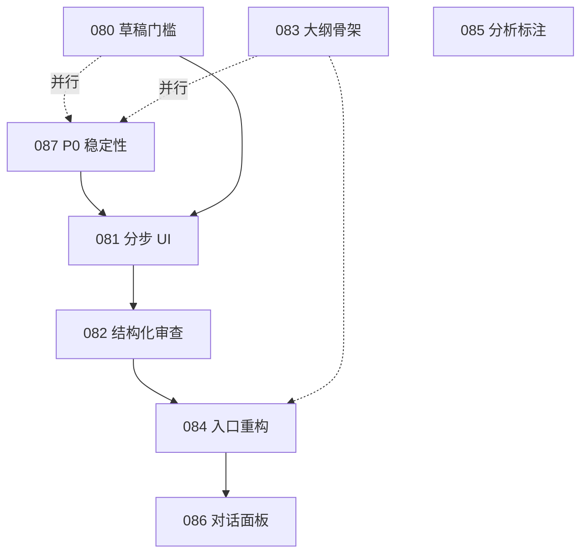

# ENG-PR-080 系列：从「自动出论文」到「辅助写作」— 人机协作

> **状态**：计划中（已拆子 PR）  
> **母文档**：本文件；**队列登记**：[`ENGINEERING_OPTIMIZATION_QUEUE.md`](../ENGINEERING_OPTIMIZATION_QUEUE.md) §1 Phase 6  
> **分支**：每个子 PR 独立分支，例 `eng/pr-080-draft-gate`  
> **关联**：`/roadmap` Phase 1 体验打磨；ENG-PR-070 双轨写作（内容层，可并行）

---

## 0. 子 PR 总览（执行顺序）

| 层级 | ID | 标题 | 依赖 | 估时 | 状态 | 说明 |
|------|-----|------|------|------|------|------|
| **P0** | **ENG-PR-087** | 扩写稳定性：全局限流 + 默认减负 + 韧性 | ENG-PR-031 | 1～2d | todo | **线上卡顿/多人并发优先**；081 前置 |
| P1 | **ENG-PR-080** | 扩写入口：草稿门槛 + 章节引导文案 | ENG-PR-031 | 4h | todo | 与 087、083 可并行 |
| P1 | **ENG-PR-081** | 写作分步 UI（生成 → 审查 → 修复） | 080, **087** | 1d | todo | 分步会增多请求，**必须在 087 之后** |
| P1 | **ENG-PR-082** | Verifier 结构化报告 + 选择性 Refiner | 081 | 2d | todo | 不新建 `/verify`、`/fix` 路由 |
| P1 | **ENG-PR-083** | 大纲骨架化（`userSkeleton`） | — | 1d | todo | 与 080/087 可并行 |
| P2 | **ENG-PR-084** | 入口重构：`/writing` 废弃 + 选区 AI 统一 | 082 | 2d | todo | Phase B 主体 |
| P2 | **ENG-PR-085** | 分析页 AI 结果免责标注 | — | 2h | todo | 可独立小 PR |
| P3 | **ENG-PR-086** | 编辑器对话面板（Phase C） | 084 | 2～4w | todo | backlog；可再拆 086a/b |
| — | **ENG-PR-088** | 批量扩写 + 人控审查队列（规划） | 082 | TBD | — | 见 §十一；非本系列首发 |

**推荐接力顺序（4 核 / 8GB VPS）**：

```text
第 1 周：087（P0）+ 080（并行）+ 083（并行）
第 2～3 周：081 → 082（087 已上线后再开 081）
第 4 周+：084 → 085 → 086
```



---

## 一、问题诊断（不变）

### 1.1 现象

PRD 定位是**辅助写作**，实际链路接近：

```text
上传数据 → AI 分析 → AI 大纲 → AI 逐章扩写(W→V→R) → 查重降重 → 导出
```

人侧多为：填题 → 选方向 → 点生成 → 等结果。

### 1.2 五个自动化信号

| 信号 | 现状 | 目标 |
|------|------|------|
| 大纲全量生成 | 题目+方向 → 完整 IMRaD | 人先给一级骨架，AI 只补子节 |
| 扩写无草稿 | `context` 可选 | 草稿或选区达到门槛才可生成 |
| V→R 黑盒 | `mode=full` 默认串联 | 审查为待办清单，修复需勾选 |
| 路线图语言 | 「批量扩写」「全流程跑通」 | 批量 = 多节 Writer + 审查摘要队列 |
| 无异议入口 | 单向输出 | 分步 + 可选对话（086） |

### 1.3 交互模型

```text
错误：人设参数 → AI 全自动 → 人接收
正确：人表达意图 → AI 草稿/建议 → 人审阅 → AI 按反馈迭代 → 人定稿
```

### 1.4 生产环境症状（与产品改造正交）

| 症状 | 根因（代码/部署） | 由谁解决 |
|------|-------------------|----------|
| 多人同时扩写整机卡 | 无全站管道并发上限；`full` 模式串行 3 次 LLM + Verifier `getFullText` | **087** |
| 偶发 429 | `proxy.ts` 每用户 60s/10 次 AI 请求（非扩写专用） | 087 可区分 `/api/writing` |
| 扩写中途断流/空白 | 上游超时（300s idle）、检索 25s、SSE 无友好恢复 | **087** |
| PM2 重启 | `max_memory_restart: 3000M`（8GB 机子上 Node 尖峰） | 087 文档 + 降级；运维调参 |
| 文档写 2 实例 cluster | `ecosystem.config.cjs` 实际 **`instances: 1` fork** | 087 对齐 DEPLOY 说明 |

**结论**：080～086 改善「一键出论文」体感；**不替代 087**。081 会增加每人请求次数，**禁止在 087 前默认推广分步流程**。

---

## 二、原则与代码基线

### 2.1 产品原则

| 原则 | 检验标准 |
|------|----------|
| 人先机后 | 无实质输入不生成（草稿/骨架/选区） |
| 可见可控 | 审查为待办，非自动 Refiner 全覆盖 |
| 增量迭代 | 可编辑初稿后再审查；可二次审查 |
| 透明有据 | 问题带原文锚点；引用可溯源 |

### 2.2 已有代码（实施前必读）

**勿重复造轮子。**

| 能力 | 位置 | 本系列用法 |
|------|------|------------|
| `mode: fast \| full \| audit_only \| fix_only` | `run-pipeline.ts`、`validations.ts` | 081/082 扩展 UI 与 JSON，**不先拆新路由** |
| `audit_only` / `fix_only` | `pipeline/modes.ts` | 081 默认分步调用；082 结构化 `verificationFeedback` |
| 段落 expand/audit/fix | `use-ai-paragraph.ts` | 084 与编辑器选区对齐 |
| 审查问题模型 | `src/types/review.ts`、`review-tab.tsx` | 082 UI 复用展示模式（非 `review-issue-item.tsx`） |
| Verifier 流式文本 | `pipeline/verifier.ts` → SSE `verification` | 082 增加 JSON 终态 + `review_report` 事件 |
| 快速/完整切换 | `writing-panel.tsx` `fastMode` | 081 改为「标准（人控）」/「快速预览」 |

文档真相：`docs/domain/writing-pipeline.md`、`src/contracts/sse.ts`。

### 2.3 部署基线（8GB / 4 核参考）

| 项 | 当前仓库真相 | 087 建议 |
|----|--------------|----------|
| PM2 | `ecosystem.config.cjs`：`instances: 1`，`max_memory_restart: 3000M` | 8GB 上**维持单实例**优先于双实例（避免双份 RAG 热数据） |
| 限流 | `proxy.ts` 进程内 `Map`，按 userId/IP | 扩写管道另加**全站信号量**（与 per-user 限流叠加） |
| 单次 `full` | RAG ≤25s + Writer 300s + Verifier 180s + Refiner 180s | 默认引导 `fast`；高负载 Verifier 跳过/减少全文加载 |

---

## 三、ENG-PR-087 — Phase 0：扩写稳定性与并发（P0）

> **目标**：在 4 核 / 8GB VPS 上，2～3 人同时使用扩写时不拖垮整机；单次扩写失败可理解、可重试。  
> **分支**：`eng/pr-087-writing-stability`

### 3.1 目标

- 全站同时执行的 `runWritingPipeline` 数量有硬上限（默认 **2**，可 `env` 配置）。
- 超限时返回 **503** + 明确文案（「系统繁忙，请稍后再试」），非空响应或挂死。
- UI **默认**「快速预览」（`mode: fast`）；「深度核查（慢）」显式二次确认后走 `full`。
- 高负载时 Verifier **降级**：减少或跳过 `getFullText`（`MAX_FULL_SOURCES` 可配置，默认高负载=2、正常=5）。
- SSE/前端：管道错误、客户端断开时保留已生成片段 + 可重试提示。
- 文档：`DEPLOY.md` / `DEPLOY_SETUP_CHECKLIST.md` 与 `ecosystem.config.cjs` 一致；补充 8GB 内存分配建议。

### 3.2 范围

| # | 任务 | 文件/模块 |
|---|------|-----------|
| S1 | 进程内扩写信号量 `acquireWritingSlot` / `release` | 新建 `src/lib/writing-concurrency.ts` |
| S2 | `POST /api/writing` 入口 acquire；`finishStream` / `catch` / `abort` 释放 | `src/app/api/writing/route.ts` |
| S3 | 可选：`run-pipeline` 最外层 `try/finally` 双保险 | `run-pipeline.ts` |
| S4 | 环境变量 | `.env.example`：`WRITING_MAX_CONCURRENT=2`，`WRITING_VERIFIER_MAX_FULL_SOURCES=5`，`WRITING_DEFAULT_MODE=fast` |
| S5 | Verifier 读取 `WRITING_VERIFIER_MAX_FULL_SOURCES`；负载高时可用固定值 2 | `pipeline/verifier.ts` |
| S6 | WritingPanel 默认 `fastMode=true`；`full` 按钮加确认 Dialog | `writing-panel.tsx`、`use-writing-panel-generate.ts` |
| S7 | `use-writing-stream`：error 事件 toast + 保留 `delta` 已收内容 | `use-writing-stream.ts` |
| S8 | 部署文档修正 PM2 实例数；8GB 调优备忘 | `docs/DEPLOY.md`、`docs/DEPLOY_SETUP_CHECKLIST.md` |

### 3.3 不做（本 PR）

- Redis / 多机分布式锁（单实例 VPS 不需要；多实例时再开 ENG-PR-089 类 PR）。
- 改写 RAG 索引格式。
- 081/082 产品流程（仅 UI 默认与 env 为后续铺路）。

### 3.4 验收（含 SLO）

- [ ] 并发发起第 `N+1` 个扩写（`N=WRITING_MAX_CONCURRENT`）返回 503 JSON，且前一请求仍能完成。
- [ ] 新用户首次打开 WritingPanel 默认为「快速预览」；选「深度核查」有确认框。
- [ ] 模拟 Verifier 阶段：配置 `WRITING_VERIFIER_MAX_FULL_SOURCES=0` 时不调用 `getFullText`（或跳过循环）。
- [ ] 人为断开 SSE 后，已流式文本仍留在编辑器/结果区，并提示可重试。
- [ ] `npx tsc --noEmit`；`vitest` 覆盖 semaphore  acquire/release（至少单测）。
- [ ] **压测备忘**（手工即可）：本机或 VPS 上 2 客户端同时 `full` 扩写，PM2 内存不连续 restart（记录 `pm2 monit` 截图到 PR 说明）。

| SLO（建议写入 PR 描述） | 目标 |
|-------------------------|------|
| 同时活跃扩写管道 | ≤ `WRITING_MAX_CONCURRENT`（默认 2） |
| 超限响应 | 503，p99 < 100ms（不进管道） |
| PM2 restart | 扩写高峰 30min 内 0 次（8GB 单机） |

### 3.5 影响功能一览

| 功能 | 变更 |
|------|------|
| `POST /api/writing` | 入口限流；503 |
| 扩写 UI 默认模式 | fast 默认 |
| Verifier 全文加载 | 可配置上限 |
| 部署文档 | PM2/内存说明 |
| 其他 AI API | 不变（仍走 proxy 10/min） |

---

## 四、ENG-PR-080 — 扩写入口：草稿门槛

### 目标

用户不能在不提供实质思路的情况下点击「生成」。

### 范围

| 层 | 改动 |
|----|------|
| UI | `writing-panel.tsx`：`context` 改文案；字数统计；按 `targetSectionKey` 动态 placeholder |
| 逻辑 | 「生成」disabled 条件：已选章节 **且**（`context` ≥ N 字 **或** 编辑器选区 ≥ N 字，若 084 前仅 context） |
| 配置 | `contracts/writing.ts` 或常量：`MIN_DRAFT_CHARS`（默认 50）；摘要/关键词可降为 20 |

### 不做

- 不改 Writer/Verifier prompt  
- 不改管道 `mode` 默认值（**087** 负责 UI 默认 `fast`；**081** 负责标准人控流程）

### 验收

- [ ] 字数不足时按钮置灰 + tooltip  
- [ ] 各章节 placeholder 与 AGENTS 写作原则一致  
- [ ] `tsc` + 相关 vitest  

### 影响文件

- `src/components/shared/writing-panel.tsx`  
- `src/hooks/use-writing-panel-generate.ts`（若校验在 hook）  
- `src/contracts/writing.ts`（可选常量）

---

## 五、ENG-PR-081 — 写作分步 UI

> **硬依赖 ENG-PR-087**：分步会增加同时占用的 SSE 连接；须在全局限流与默认 `fast` 落地后再改默认交互。

### 目标

默认流程：**Writer 结束即停** → 用户编辑 → **提交审查**（`audit_only`）→ 用户确认意见 → **修复**（`fix_only`）。  
过渡期保留「快速预览」= 现有 `fast`（仅 Writer）；087 已将 UI 默认设为 fast，本 PR 在此基础上改「标准（人控）」为主流程。

### 范围

| 层 | 改动 |
|----|------|
| UI 状态机 | `idle → writing → draft_ready → reviewing → fixing → done`（hook：`use-writing-panel-generate` 或新建 `use-writing-manual-flow.ts`） |
| 默认 mode | 标准流程：`write` 阶段用 `fast` 或新 `mode: write_only`（若需显式语义，在 `schemas.ts` 增加 `write_only`，编排层 Writer 后 `finishStream`） |
| 审查 | 按钮触发 `audit_only`，展示流式 `verification`（文本报告，082 再结构化） |
| 修复 | 用户编辑审查摘要或勾选后，带 `verificationFeedback` 调 `fix_only` |
| 文案 | 「完整模式（自动核查并修正）」降为高级/实验，标注非推荐 |

**实现偏好**：优先在 **单路由 `POST /api/writing`** 上扩展 `mode`，避免 `verify/route.ts`、`fix/route.ts`（082 仍同路由）。

### 不做

- 结构化 issue 列表（082）  
- 新建独立 API 路由  

### 验收

- [ ] 标准流程下 Writer 完成后不自动 Verifier/Refiner  
- [ ] 用户可编辑初稿后再点「提交审查」  
- [ ] `audit_only` / `fix_only` 与现有集成测试仍通过  
- [ ] `fast` 仍可用且 UI 标为「快速预览」  

### 影响文件

- `src/components/shared/writing-panel.tsx`  
- `src/hooks/use-writing-panel-generate.ts`  
- `src/components/shared/writing/*`（必要时拆 `WritingReviewView` 壳，先展示 Markdown/文本报告）  
- `src/app/api/writing/run-pipeline.ts`（可选 `write_only`）  
- `src/lib/validations.ts`、`src/app/api/writing/schemas.ts`  
- `docs/domain/writing-pipeline.md`  

---

## 六、ENG-PR-082 — Verifier 结构化 + 选择性 Refiner

### 目标

审查报告为 **可勾选待办**；Refiner **仅**处理采纳项。

### 范围

| 层 | 改动 |
|----|------|
| contracts | 新建 `src/contracts/writing-verification.ts`（或扩 `contracts/writing.ts`）：`VerificationIssue`、`VerificationReport`；字段对齐 `ReviewIssue`（`id, severity, evidence, suggestion, originalText`），提供 `toReviewIssueAdapter` 可选 |
| Prompt | `buildVerifierSystemPrompt` 增加 `structured` 变体：要求严格 JSON；复用 `review-service` 的 `parseAIJson` 容错 |
| 管道 | `runVerifierPhase`：流式结束后 parse JSON → `emit({ type: "review_report", report })`；保留 `verification` 文本兼容旧 UI |
| Refiner | `fix_only` / `runRefinerPhase`：入参 `selectedIssueIds: string[]` + `issues[]`，prompt 只含选中项 |
| SSE | `contracts/sse.ts` 增加 `review_report`；前端守卫更新 |
| UI | `writing-review-report.tsx`（新建）：分组展示；checkbox；复用 `review-tab` 交互模式 |
| 测试 | `writing.test.ts` / integration：mock 结构化 JSON |

### 不做

- 新建 `/api/writing/verify`、`/api/writing/fix`  
- Phase C 对话面板  

### 验收

- [ ] SSE 终态含 `review_report` 且可解析  
- [ ] 未勾选 issue 不进入 Refiner prompt  
- [ ] parse 失败时降级为文本报告 + 前端提示（不 500）  
- [ ] `npm run docs:api-index`（若仅扩展 body 字段可只更 domain  doc）  

### 影响文件

- `src/contracts/sse.ts`、`src/contracts/writing-verification.ts`（新）  
- `src/lib/prompts/writing.ts`  
- `src/app/api/writing/pipeline/verifier.ts`、`refiner.ts`、`modes.ts`  
- `src/lib/validations.ts`（`selectedIssueIds` 等）  
- `src/components/shared/writing-review-report.tsx`（新）  
- `src/hooks/use-writing-review.ts`（新）  
- `src/__tests__/api/writing*.ts`  

---

## 七、ENG-PR-083 — 大纲骨架化

### 目标

人先写一级章节骨架，AI 只补子节与要点，不擅自增加一级章节。

### 范围

| 层 | 改动 |
|----|------|
| API | `outlineSchema` + `userSkeleton: string[]`（`review` ≥3 条；`research` ≥3 条 IMRaD 一级标题，可配置） |
| Prompt | `buildOutlinePrompt`：注入骨架约束 |
| UI | `outline/page.tsx`、`outline-panel.tsx`：步骤 1 题目/方向 → 2 骨架输入 → 3 AI 补全 → 4 审阅保存 |
| Service | `services/outline.ts` 传 `userSkeleton` |

### 不做

- 写作管道改动  

### 验收

- [ ] 无骨架时 API 400  
- [ ] 生成结果不含用户未提供的一级章节  
- [ ] 工作台内 `OutlinePanel` 与独立页行为一致  

### 影响文件

- `src/lib/prompts/outline.ts`  
- `src/app/api/outline/route.ts`  
- `src/services/outline.ts`  
- `src/app/outline/page.tsx`  
- `src/components/shared/outline-panel.tsx`  
- `src/lib/validations.ts`  

---

## 八、ENG-PR-084 — 入口重构（Phase B 主体）

### 目标

写作只在项目工作台发生；编辑器选区 AI 与 WritingPanel 能力一致。

### 子任务

| # | 任务 | 说明 |
|---|------|------|
| B-1 | `/writing` 废弃 | `writing/page.tsx` → 重定向 `/workbench` + deprecation 提示（至少 1 版本） |
| B-2 | 草稿优先 | 章节 TipTap 为主；选区工具栏：扩写/润色/引用/检查/精简（映射 `use-ai-paragraph` + 082 审查） |
| B-3 | 与 080 联动 | 生成门槛支持「选区字数」 |

### 不做

- 对话面板（086）  

### 验收

- [ ] 无独立扩写主路径（或仅重定向）  
- [ ] 选区「检查」走 `audit_only` 或结构化审查  
- [ ] `DOMAIN_INDEX.md` 更新入口  

### 影响文件

- `src/app/writing/page.tsx`  
- `src/app/workbench/page.tsx`（仅挂载，少逻辑）  
- 编辑器相关组件 + `use-ai-paragraph.ts`  
- `docs/DOMAIN_INDEX.md`  

---

## 九、ENG-PR-085 — 分析页 AI 标注

### 目标

分析结果明确「AI 生成、仅供参考」；可选导出 Excel 验证。

### 范围

- `knowledge-analyze-panel` 或 `/analysis` 页：banner + 置信度/来源标注  
- 若有现成导出，在 UI 暴露；无则仅文案（导出另开 PR）

### 验收

- [ ] 生成结果区域有固定免责文案  
- [ ] 不改动分析算法  

---

## 十、ENG-PR-086 — 对话式协作（Phase C， backlog）

> **不在 080～085 同 PR 交付**；立项后再拆 `086a` 意图路由、`086b` UI、`086c` RAG 整合。

### 目标

工作台编辑器侧栏：上下文感知对话；建议需手动采纳。

### 技术要点（摘要）

- `POST /api/chat/assist`（SSE，`ChatAssistEvent`）  
- `chat-service.ts` 意图路由 → 复用 Verifier / RAG / Refiner 润色  
- 组件：`chat-panel.tsx`、`chat-action-suggestion.tsx`  
- Token：当前章节 + 选区 + 滑动窗口消息  

### 与现有功能映射

| 现有 | 对话入口 |
|------|----------|
| WritingPanel 扩写 | 「展开这段」 |
| `/review` | 「这章有没有 overclaim」 |
| RAG | 「找 3 篇支撑文献」 |

详细场景表见原 Phase C 设计（本节不重复展开）。

---

## 十一、批量扩写与 Roadmap 对齐

Phase 1「批量扩写」在人控模型下定义为：

```text
多节排队 Writer（fast/write_only）
  → 每节审查报告入队（可摘要）
  → 用户在队列中批量采纳/忽略
  → 仅对采纳项 fix
```

**不在 080～082 实现**；依赖 082 与 **087** 完成后单独立项（规划编号 **ENG-PR-088**）。

---

## 十二、风险与应对

| 风险 | 应对 |
|------|------|
| 用户抵触多步骤 | 新项目默认人控；`fast` 标「快速预览」；Admin 可选默认 mode（后续） |
| 结构化 JSON 不稳定 | `parseAIJson` + 降级文本报告 |
| 双轨维护 `auto`/`manual` | **不**长期保留 `PipelineMode auto`；仅保留 `full` 作高级选项 1～2 版本 |
| 删 `/writing` 断习惯 | 重定向 + changelog |
| 082/086 token 爆炸 | 审查仅当前章；对话滑动窗口 |
| **081 在 087 前上线** | 分步流程放大并发连接数 | **081 硬依赖 087** |
| 8GB 内存顶满 | `full` + 多人 Verifier 读全文 | 087 默认 fast + 全局限流 + Verifier 上限 |

---

## 十三、成功指标（按子 PR）

| PR | 关键指标 |
|----|----------|
| **087** | 第 N+1 并发扩写 503；默认 fast；高峰 PM2 无连续 restart |
| 080 | 无草稿时生成点击率 = 0 |
| 081 | 标准流程下 ≥1 次手动「提交审查」才进入 Refiner |
| 082 | 结构化报告解析成功率；采纳率可埋点（可选） |
| 083 | 100% 新大纲请求带 `userSkeleton` |
| 084 | `/writing` 访问量降至 0（重定向） |
| 085 | 分析结果页有免责 UI |
| 086 | 5+ 对话场景可用 + 采纳动作可用 |

**行为埋点（可选）**：`writing_submit_review`、`issue_accept`、`issue_ignore`、`mode_fast_used`。

---

## 十四、与其他 PR

| PR | 关系 |
|----|------|
| ENG-PR-070 | 并行；083 校验需区分 `review` / `research` 骨架 |
| ENG-PR-031 | 080～087 的前置（panel 已拆） |
| ENG-PR-030 | 管道已拆；082 改 verifier/refiner 子模块 |
| **ENG-PR-087** | **P0**；081 前置；与 080/083 可并行 |
| 审查/查重 | 082 与 `review-service` 解析与 UI 对齐 |
| UI 批量扩写 | 见 §十一，规划 **088** |

---

## 十五、附录：类型（082/086）

```typescript
// src/contracts/writing-verification.ts

export interface VerificationIssue {
  id: string;
  type:
    | "overclaim"
    | "citation_error"
    | "citation_fake"
    | "results_discussion_mix"
    | "data_claim_mismatch"
    | "terminology"
    | "vague_expression";
  severity: "high" | "medium" | "low";
  location: { offset: number; length: number };
  originalText: string;
  suggestion: string;
}

export interface VerificationReport {
  issues: VerificationIssue[];
  summary: string;
}

// SSE — src/contracts/sse.ts
export interface WritingReviewReportEvent {
  type: "review_report";
  report: VerificationReport;
}
```

```typescript
// ENG-PR-086 — src/contracts/chat.ts（届时新建）

export type AssistIntent =
  | "logic_check"
  | "find_references"
  | "improve_wording"
  | "overclaim_scan"
  | "check_structure"
  | "explain_term"
  | "compare_studies"
  | "general_chat";
// ChatContext / ChatMessage / ChatAction — 见原附录，086 实施时落盘
```

---

## 十六、文档与队列维护

每子 PR 合并后：

1. 更新本文 §0 表 `status` / `merged`  
2. 更新 [`ENGINEERING_OPTIMIZATION_QUEUE.md`](../ENGINEERING_OPTIMIZATION_QUEUE.md) §1 Phase 6  
3. §4 会话日志追加一行  
4. 命中 S0：`writing-pipeline.md`、`API_INDEX.md`（`npm run docs:api-index`）、`DOMAIN_INDEX.md`（084）；087 改部署文档  
5. 087 合并后：在 VPS 记录一次 2 客户端并发扩写压测结论（PR 描述即可）

---

*修订说明*

- **2026-06-04**：拆分为 080～086；取消新建 verify/fix 路由；083 并行；086 独立。  
- **2026-06-04（二）**：新增 **ENG-PR-087（P0 稳定性）**；081 依赖 087；补充 §1.4 生产症状与 §2.3 8GB 部署基线；批量扩写改编号 **088**。
