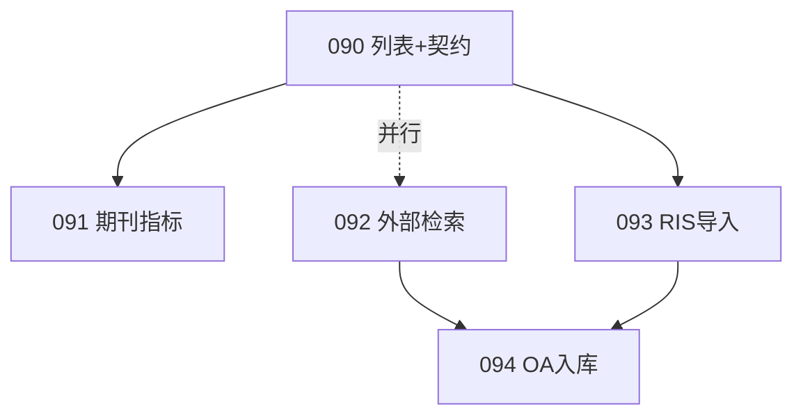

# ENG-PR-090 系列：文献库书目增强 + 外部文献发现

> **状态**：计划中（已拆子 PR）  
> **母文档**：本文件；**队列登记**：[`ENGINEERING_OPTIMIZATION_QUEUE.md`](../ENGINEERING_OPTIMIZATION_QUEUE.md) §1 Phase 7  
> **分支**：每个子 PR 独立分支，例 `eng/pr-090-knowledge-list-columns`  
> **关联**：用户反馈「列表需期刊/影响因子」「需接入更多外部文献库」；现有 Crossref 索引补全见 [`docs/domain/rag-and-knowledge.md`](../domain/rag-and-knowledge.md)

---

## 0. 子 PR 总览（执行顺序）

| 层级 | ID | 标题 | 依赖 | 估时 | 状态 | 说明 |
|------|-----|------|------|------|------|------|
| **P1** | **ENG-PR-090** | 文献库列表：书目列 + 筛选 + 契约扩展 | ENG-PR-027 | 1～2d | done | 2026-06-06 |
| P1 | **ENG-PR-091** | 期刊指标 enrichment（CSV + OpenAlex） | 090 | 2～3d | done | 导入批次 UI 待二期 |
| P1 | **ENG-PR-092** | 外部文献检索 Tab + 加入参考文献 | — | 3～5d | done | 2026-06-06 |
| P2 | **ENG-PR-093** | RIS / BibTeX 批量导入 | 090 | 2d | doing | 代码就绪，待 commit |
| P3 | **ENG-PR-094** | OA 全文自动入库（可选） | 092, 093 | 1～2w | todo | backlog；有 OA 链则进 RAG |

**推荐接力顺序**：

```text
第 1 周：090（列表立刻变「信息更全」）
第 2 周：091（实验室 CSV + OpenAlex 批处理）与 092（外部检索）可并行
第 3 周：093（RIS 导入）→ 094 立项评估
```



---

## 一、问题诊断

### 1.1 用户反馈

| 反馈 | 现状 | 目标 |
|------|------|------|
| 列表信息太简略 | `KnowledgeBibSummary` 仅一行：作者 · 年 · 期刊 | 表格列展示期刊、卷期、DOI、分区/IF（有则显示） |
| 需要影响因子 | 契约与 DB **无** IF/分区字段；Crossref **不提供** JCR IF | 实验室期刊表 + ISSN 匹配；UI 标注数据年份 |
| 接入更多外部库 | `academic-search.ts` 仅查重路径使用 | 文献库「外部检索」+ 一键加入项目参考文献 |

### 1.2 架构约束（不变）

| 层级 | 规则 |
|------|------|
| 本地知识库 | 必须有 PDF + RAG 索引才可扩写检索；元数据权威源 **Prisma `KnowledgeFile`** |
| 外部检索 | **发现层**：元数据 + 引用进项目；全文入库需 PDF 或 OA 抓取 |
| 合规 | **不**做知网/万方爬虫；仅机构 API 或用户导出文件（RIS/BibTeX） |

### 1.3 已有代码（勿重复造轮子）

| 能力 | 位置 | 本系列用法 |
|------|------|------------|
| `KnowledgeBib` | `contracts/knowledge.ts` | 090 扩展展示字段；091 增 `metrics` |
| 列表 UI | `knowledge-file-table.tsx`、`knowledge-bib-summary.tsx` | 090 改表格列 |
| Crossref 补全 | `scripts/extractors/crossref.mjs` | 索引链保留；091 补 ISSN |
| 外部搜索 | `src/lib/academic-search.ts` | 092 统一出口并扩展 OpenAlex/PubMed |
| 书目编辑 | `knowledge-metadata-dialog.tsx` | 090 补 DOI/ISSN 等字段 |
| 写作引用行 | `services/writing-context.ts` | 092 加入参考文献时复用 `ref-format` |

---

## 二、ENG-PR-090 — 文献库列表书目展示增强

> **分支**：`eng/pr-090-knowledge-list-columns`

### 目标

用户在文献库列表**无需点开弹窗**即可看到期刊、年份、卷期页、DOI；支持按期刊/索引状态筛选；为 IF/分区列预留展示位（数据由 091 填充）。

### 范围

| # | 任务 | 文件/模块 |
|---|------|-----------|
| L1 | 扩展 `KnowledgeBib`：`issn?`、`eissn?`（091 写入；090 先定义契约） | `contracts/knowledge.ts` |
| L2 | 新增 `JournalMetrics` 类型 + `getKnowledgeMetricsLine()` 展示 helper | `contracts/knowledge.ts` |
| L3 | 列表改表格列：标题、期刊、年、卷期、DOI（链接）、指标（IF/分区或「—」）、索引状态、操作 | `knowledge-file-table.tsx` |
| L4 | 筛选：期刊名 contains、索引状态、有/无 DOI | `use-knowledge-list.ts` + GET query 或客户端 filter |
| L5 | 元数据弹窗补 ISSN、DOI 显式字段 | `knowledge-metadata-dialog.tsx` |
| L6 | 响应式：窄屏保留卡片，宽屏表格 | 同上 |

### 不做

- 不实现 IF 数据来源（091）
- 不改 RAG 索引格式
- 不接外部 API

### 验收

- [ ] 列表可见期刊列；有 `bib.journal` 时非空
- [ ] DOI 可点击跳转 `https://doi.org/...`
- [ ] IF/分区列存在；无数据时显示「—」+ tooltip「待指标导入」
- [ ] `npx tsc --noEmit`；相关 vitest（契约 helper）

### 影响文件

- `src/contracts/knowledge.ts`
- `src/components/shared/knowledge/knowledge-file-table.tsx`
- `src/components/shared/knowledge/knowledge-bib-summary.tsx`（可瘦身为列单元格）
- `src/components/shared/knowledge/knowledge-metadata-dialog.tsx`
- `src/hooks/use-knowledge-list.ts`

---

## 三、ENG-PR-091 — 期刊指标 enrichment

> **分支**：`eng/pr-091-journal-metrics`

### 目标

按 **ISSN** 为文献附加影响因子、JCR 分区、中科院分区（来自实验室维护表）；用 **OpenAlex** 补 ISSN、被引次数、OA 链接（非 JCR IF）。

### 范围

| # | 任务 | 说明 |
|---|------|------|
| M1 | `JournalMetrics` 存 `KnowledgeFile.metrics` JSON 新列 **或** 扩 `bib` 内嵌 `metrics` 对象 | 优先 **独立 `metrics` 列**（Prisma migration） |
| M2 | `scripts/import-journal-metrics.mjs` | CSV：`issn,impactFactor,impactFactorYear,jcrQuartile,casPartition,isCoreJournal` |
| M3 | Admin 上传 CSV + 显示导入批次 | `admin/knowledge` 或新 `admin/journal-metrics` |
| M4 | `scripts/enrich-knowledge-openalex.mjs` | 按 DOI/标题查 OpenAlex → 写 `issn`、`citedByCount`、`openAccessUrl` |
| M5 | 索引后 hook：Stage 2 结束可选触发单篇 OpenAlex（限流） | `index-pdfs.mjs` 或独立 cron |
| M6 | 列表 IF/分区列读 `metrics`；角标显示 `metricsYear` | 依赖 090 列 |

### 数据策略

| 字段 | 来源 | 备注 |
|------|------|------|
| IF、JCR Q、中科院分区 | 实验室 CSV | 每年更新；列表标注「IF 数据：2024」 |
| ISSN、citedByCount、OA URL | OpenAlex API | 免费；无 IF |
| 期刊名、DOI | 现有 Crossref + PDF 解析 | 不变 |

环境变量：`.env.example` 增 `OPENALEX_MAILTO`、`JOURNAL_METRICS_CSV_PATH`（可选默认路径）。

### 不做

- 不接 JCR / 知网商用 API
- 不保证 100% 中文刊 ISSN 命中（无 ISSN 显示待补）

### 验收

- [ ] 导入 50 条 ISSN 测试 CSV 后，列表 ≥1 条显示 IF/分区
- [ ] OpenAlex enrichment 对含 DOI 文献写入 `issn` 或 `citedByCount`
- [ ] `prisma migrate` + 更新 `docs/DATA_MODEL.md`
- [ ] 脚本可 `--dry-run`

### 影响文件

- `prisma/schema.prisma`、`docs/DATA_MODEL.md`
- `scripts/import-journal-metrics.mjs`、`scripts/enrich-knowledge-openalex.mjs`（新）
- `src/lib/knowledge-metadata.ts`
- `src/app/api/admin/**`（上传 CSV）
- `docs/domain/rag-and-knowledge.md` § 书目元数据

---

## 四、ENG-PR-092 — 外部文献检索 + 加入参考文献

> **分支**：`eng/pr-092-external-literature-search`

### 目标

文献库增加 **「外部检索」** Tab：聚合 OpenAlex、Semantic Scholar、CrossRef、PubMed；用户可将结果 **加入当前项目参考文献**（不必入库 RAG）。

### 范围

| 层 | 改动 |
|----|------|
| contracts | `ExternalLiteratureHit`、`LiteratureSource` 枚举 |
| lib | 重构 `academic-search.ts` → `literature-search.ts`（或扩展现文件）；增 OpenAlex、PubMed |
| service | `services/external-literature.ts` |
| API | `POST /api/literature/search`（JSON）；`POST /api/projects/[id]/references/import-external` |
| UI | `knowledge/page` Tab：本地库 \| 外部检索；结果卡 + 「加入参考文献」 |
| 写作 | 导入走现有 `Reference` + `ReferenceSource` PATCH |

### 用户流程

```text
输入关键词 / 粘贴 DOI
  → POST /api/literature/search（服务端聚合，避免组件 fetch）
  → 结果：标题、作者、期刊、年、DOI、被引、OA 标签、来源徽标
  → [加入项目参考文献]（需 workbench 上下文或选项目）
  → [复制 GB/T 引用]（复用 ref-format.ts）
```

### 不做

- 本 PR 不自动下载 PDF（094）
- 不接知网 API

### 验收

- [ ] 搜索返回 ≥2 源结果（mock 单测 + 手工 DOI 查询）
- [ ] 加入参考文献后工作台 references 可见
- [ ] `npm run docs:api-index`；`validations.ts` zod
- [ ] 限流：每用户 10 req/min（复用 proxy 或路由内）

### 影响文件

- `src/lib/academic-search.ts` 或 `src/lib/literature-search.ts`
- `src/app/api/literature/search/route.ts`（新）
- `src/app/api/projects/[id]/references/import-external/route.ts`（新）
- `src/services/external-literature.ts`（新）
- `src/components/shared/knowledge/knowledge-external-search.tsx`（新）
- `src/app/knowledge/page.tsx` 或 `knowledge/*` 子组件
- `docs/API_INDEX.md`、`docs/DOMAIN_INDEX.md`

---

## 五、ENG-PR-093 — RIS / BibTeX 批量导入

> **分支**：`eng/pr-093-bibliography-import`

### 目标

支持从 EndNote / Zotero / 知网导出 **RIS、BibTeX** 批量导入书目；有 DOI 的自动 Crossref/OpenAlex 补全；可选关联已有 PDF 文件名。

### 范围

| # | 任务 |
|---|------|
| I1 | `src/lib/bib-import/parse-ris.ts`、`parse-bibtex.ts` + vitest fixture |
| I2 | `POST /api/knowledge/import-bibliography`（multipart 或 text） |
| I3 | UI：知识库「导入书目」向导：上传 → 预览表 → 确认写入 Prisma |
| I4 | 与 PDF 匹配：按标题模糊或用户选手动关联（不做 AI 匹配） |
| I5 | `bibEdited=true` 保护用户已校正记录 |

### 不做

- 不解析 CNKI 专有加密格式
- 导入记录默认 **无 chunk**（未索引）；提示用户上传 PDF 后 reindex

### 验收

- [ ] 样例 `.ris` / `.bib` 各 1 个 vitest 通过
- [ ] 导入 10 条后 Prisma `KnowledgeFile` 可见；`chunkCount=0` 标「待上传 PDF」
- [ ] 有 DOI 条目触发 Crossref 补全（可异步）

---

## 六、ENG-PR-094 — OA 全文自动入库（backlog）

> **状态**：P3 backlog，092/093 完成后再立项。

### 目标

外部检索结果若带开放获取 PDF 链接，用户确认后：下载 → `papers/<分类>/` → 触发 `index-pdfs.mjs --files=...`。

### 范围（摘要）

- `src/lib/oa-download.ts`（合法性检查、大小上限、MIME）
- 队列任务或同步小文件；失败可重试
- Admin 开关 `ENABLE_OA_AUTO_IMPORT`

### 风险

- 出版社 TOC 限制；农业中文 OA 比例低 → 设为**可选**能力

---

## 七、风险与应对

| 风险 | 应对 |
|------|------|
| 用户以为 IF 是实时 JCR | UI 强制显示 `metricsYear`；Admin 文档说明年度导入 |
| 中文刊无 ISSN | 列表「待补」；元数据弹窗强调；091 支持标题→ISSN 人工映射表（可选二期） |
| 外部 API 限流 | 服务端聚合 + 缓存 24h + 用户限流 |
| 外部文献无全文 | 文案区分「参考文献」vs「知识库全文」 |
| 093 导入无 PDF | 索引状态「仅有书目」；引导上传 PDF |

---

## 八、成功指标

| PR | 关键指标 |
|----|----------|
| 090 | 列表期刊列非空率 ↑；用户无需点开即可见 DOI |
| 091 | ≥60% 英文期刊 ISSN 命中实验室表（视 CSV 覆盖） |
| 092 | 外部检索周活；加入参考文献次数 |
| 093 | 单次导入 ≥20 条成功率 |
| 094 | OA 入库成功率（立项后定） |

---

## 九、与其他 PR

| PR | 关系 |
|----|------|
| ENG-PR-027/028 | 090～093 依赖 Prisma 主源元数据 |
| ENG-PR-032 | 知识库页已拆；090/092 在 `knowledge/*` 子组件扩展 |
| ENG-PR-080 系列 | 并行；无硬依赖 |
| RAG-PR-001～005 | 094 入库仍走现有索引管道 |

---

## 十、文档维护

每子 PR 合并后：

1. 更新本文 §0 表 `status` / `merged`
2. 更新 [`ENGINEERING_OPTIMIZATION_QUEUE.md`](../ENGINEERING_OPTIMIZATION_QUEUE.md) §1 Phase 7 + §4 会话日志
3. 091 改 `schema.prisma` 时更新 `docs/DATA_MODEL.md`
4. 092 新 API：`npm run docs:api-index` + `docs/domain/rag-and-knowledge.md`
5. 090/092 改知识库 UI：`docs/DOMAIN_INDEX.md`

---

*创建：2026-06-06 — 用户反馈文献库需期刊/IF 与外部文献库接入。*
