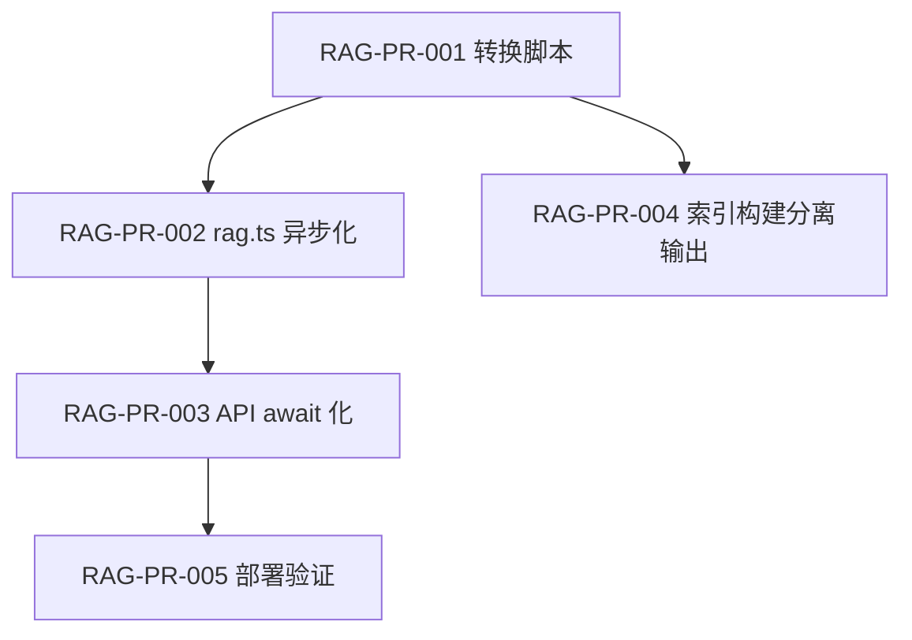

# RAG 索引存储重构 — 二进制嵌入分离 + 异步加载

> **目的**：把 1.88GB 的巨型 JSON 索引拆成轻量文本 JSON + 二进制向量文件，并将所有同步 I/O 改为异步，彻底解决"卡"和"对话不可用"问题。
> **关联文档**：
> - 工程总队列（§1 状态与 RAG-PR 同步）→ [`docs/ENGINEERING_OPTIMIZATION_QUEUE.md`](./ENGINEERING_OPTIMIZATION_QUEUE.md)
> - RAG 引擎源码 → `src/lib/rag.ts`
> - 索引构建脚本 → `scripts/index-pdfs.mjs`
> - AI 调用核心 → `src/lib/ai.ts`
> - 受影响 API → `src/app/api/chat/route.ts`、`knowledge/source/route.ts`、`knowledge/analyze/route.ts`、`writing/route.ts`
> **最后更新**：2026-06-01

**范围说明**：本计划只重构 **磁盘** `data/index_*.json` + `.emb` 与 `src/lib/rag.ts` 加载方式；**不**改动 Prisma `KnowledgeChunk.embedding`（DB 内向量与文件索引是两套存储，统一需另开 PR）。

---

## 0. 问题诊断

### 0.1 现状

| 指标 | 数值 |
|------|------|
| 索引文件数 | 5 个 (`index_*.json`) |
| 总 chunks | 47,399 |
| 总大小 | **1,877 MB** |
| 每 chunk embedding | 2048 维 float（Zhipu embedding-3） |
| 嵌入覆盖率 | 100% (47,399/47,399) |
| 单文件最大 | index_茶学.json **487 MB** |

### 0.2 体积分解

```
每个 chunk ≈ 20KB JSON
├── content:  ~900 字符  (~1KB)
├── embedding: [2048×float] → JSON 数组  ~18KB   ← 85% 体积
└── metadata:            (~500B)
```

### 0.3 卡顿路径

```
用户点击「基于文献对话」
  → POST /api/chat
  → localRAG.getFullText(filename)          ← 同步调用
    → ensureCategoryLoaded(cat)             ← 同步调用
      → fs.readFileSync(487MB)              ← 阻塞事件循环 5-10s
      → JSON.parse(487MB → ~2GB 内存)       ← 再次阻塞 5-15s
  → 进程 OOM 或被 PM2 重启
  → 客户端 HTTP 000 (Empty reply)
```

---

## 1. 总表

状态：`todo` | `doing` | `done` | `blocked`

| ID | 标题 | 依赖 | 估时 | 状态 |
|----|------|------|------|------|
| RAG-PR-001 | 转换脚本：JSON → content.json + embedding.bin | — | 1h | done |
| RAG-PR-002 | rag.ts 异步加载 + 二进制嵌入读取 | RAG-PR-001 | 3h | done |
| RAG-PR-003 | 所有 API 调用方 await 化 | RAG-PR-002 | 2h | done |
| RAG-PR-004 | index-pdfs.mjs 直接输出分离格式 | RAG-PR-001 | 2h | todo |
| RAG-PR-005 | 部署 + 端到端验证 | RAG-PR-003 | 1h | todo |

---

## 2. 依赖关系图



---

## 3. 分 PR 任务单

---

### RAG-PR-001 — 转换脚本：JSON → content.json + embedding.bin

```
目标：写一个 Node.js 脚本，把现有 5 个巨型 index_*.json 拆成轻量 JSON + 二进制向量文件。
不改变 rag.ts 任何代码，仅做格式转换。

输出格式：
  data/
    index_茶学.json       → data/index_茶学.json      （只含 content + metadata，不含 embedding）
                             data/index_茶学.emb       （float32 二进制，按 chunk 顺序平铺）
    index_烟花.json       → data/index_烟花.json
                             data/index_烟花.emb
    ...（5 类同理）

.emb 文件格式：
  - 小端序 float32
  - 每个 chunk 的 embedding 按 chunk 索引顺序依次写入
  - 文件头 8 字节：[version:uint32=1, dim:uint32=2048]
  - 大小 = 8 + chunkCount × 2048 × 4 字节

实现顺序：
1. scripts/convert-index-to-binary.mjs
   - 读取 index_*.json
   - 对每个 chunk：提取 embedding 写入 .emb，从 JSON 中删除 embedding 字段
   - 写入新的 index_*.json（无 embedding）
   - 写入 .emb 二进制文件（header + float32 数组）

2. 数据校验：
   - 转换后 .emb 文件大小 = 8 + chunks × 2048 × 4
   - 随机抽样 5 个 chunk 验证 embedding 还原一致
   - 转换前后 chunk 数量一致

3. 备份原文件：
   - data/.backup/ 下保存原始 index_*.json（仅首次运行）

验证：
  运行 npm run check-index-convert（临时脚本）
  - 所有 .emb 文件大小 = 8 + chunks × 8192
  - JSON 体积从 ~1,877MB 降至 ~50MB（content + metadata 部分）
```

---

### RAG-PR-002 — rag.ts 异步加载 + 二进制嵌入读取

```
目标：重构 LocalRAG 类的文件 I/O 层，所有读写改为异步，embedding 从 .emb 二进制文件 mmap 读取。

禁止：
- 不要改检索算法（BM25/RRF/余弦相似度）
- 不要改 embedding API 调用（getEmbedding）
- 不要改 search 的对外签名（返回类型不变）

改动范围：
  src/lib/rag.ts — LocalRAG 类约 150 行改动

实现顺序：

1. 新增 EmbeddingStore 内部类：
   ```
   class EmbeddingStore {
     private buffers: Map<string, Buffer>     // 分类 → mmap'd buffer
     private dims: Map<string, number>         // 分类 → 维度
     private offsets: Map<string, number[]>    // 分类 → 每个 chunk 的起始偏移

     async load(category: string): Promise<void>     // mmap .emb 文件
     getEmbedding(category: string, index: number): number[] | null  // O(1) 读取
     get size(category: string): number
   }
   ```
   - `load()` 用 `fs.promises.open` + `Buffer.alloc` 把 .emb 读入内存（非 mmap，但一次性异步读取）
   - `getEmbedding()` 从 Buffer 中按 offset 读 float32 并转成 JS number[]

2. 修改 ensureCategoryLoaded → async：
   ```
   private async ensureCategoryLoaded(category: string): Promise<void> {
     if (this.categoryChunks.has(category)) return;
     const catPath = this.getCategoryIndexPath(category);
     if (fs.existsSync(catPath)) {
       const raw = await fs.promises.readFile(catPath, "utf-8");   // 异步读，JSON 现在 ~50MB
       const chunks = JSON.parse(raw) as RagChunk[];
       await this.embeddingStore.load(category);                    // 异步读 .emb
       // 按需把 embedding 注入到 chunk（仅在 search 用到时）
       this.categoryChunks.set(category, chunks);
       return;
     }
     ...
   }
   ```

3. 修改 ensureLoaded → async（同理）

4. 修改 getFullText → async getFullText：
   ```
   async getFullText(fileName: string): Promise<string>
   ```
   - 内部 await ensureCategoryLoaded() 或 ensureLoaded()

5. 修改 search → 内联 await：
   - `await this.ensureCategoryLoaded(category)`
   - `await this.ensureLoaded()`

6. 修改 getCategories → async：
   - 使用 `await fs.promises.readFile` 读 metadata.json

7. 修改 ensureAllLoaded → async

8. 修改 reload → async reload

9. 删除旧的同步方法，确保无 fs.readFileSync 残留

10. 新增 getChunkEmbeddings 方法（仅在语义搜索需要时按 batch 读取向量）：
    ```
    async getChunkEmbeddings(category: string, indices: number[]): Promise<number[][]>
    ```

验证：
  npx tsc --noEmit && npm run test
  - rag-search.test.ts（需更新为 await，4 条测试）

交付数据流：
  请求 → async getFullText → await ensureCategoryLoaded → await fs.readFile(~40MB JSON) + await loadEmb(~96MB binary)
  → 总加载时间 < 500ms（vs 原来 15-20s 同步阻塞）
```

---

### RAG-PR-003 — 所有 API 调用方 await 化

```
目标：将 RAG-PR-002 的 async 签名传递到所有调用方。

影响文件：
  src/app/api/chat/route.ts:25          localRAG.getFullText() → await
  src/app/api/knowledge/source/route.ts:21  同上
  src/app/api/knowledge/analyze/route.ts:19 同上
  src/app/api/writing/route.ts:268         同上
  src/lib/citation-validator.ts            若有引用

每处改动 ≤ 1 行（加 await）。

验证：
  npx tsc --noEmit
  curl 测试每个受影响的 API endpoint
```

---

### RAG-PR-004 — index-pdfs.mjs 直接输出分离格式

```
目标：修改索引构建脚本，Stage 2 输出时直接写入分离格式（不再生成巨型单体 JSON）。

实现顺序：

1. scripts/index-pdfs.mjs — stage2_filterAndWrite 函数修改：
   - 写入 index_猫.json（content + metadata，不含 embedding）
   - 写入 index_猫.emb（float32 二进制）
   - 在 metadata.json 中记录 embOffset

2. 追加写入（增量重索引时）：
   - 读取已有 index_猫.json → 合并 → 写回
   - 读取已有 index_猫.emb → 追加新 chunk 的 embedding → 写回
   - 更新 metadata 中 embOffset

验证：
  运行 node scripts/index-pdfs.mjs --skip-stage3（不含 embedding）
  → 生成 < 50MB 的 index_*.json
  运行 node scripts/index-pdfs.mjs（含 embedding）
  → 生成 index_*.json + index_*.emb，体积 = 旧版 28%
```

---

### RAG-PR-005 — 部署 + 端到端验证

```
目标：在服务器上执行转换、部署新代码、验证所有 AI 功能恢复。

步骤：
1. 服务器上运行转换脚本
2. 部署新 rag.ts + API routes
3. 重启 PM2
4. 端到端测试：
   - 文献库列表 → 正常显示
   - 语义搜索 → 返回相关结果
   - 基于文献对话 → 返回 AI 回复（非 000）
   - AI 写作 → 正常生成
   - 文献分析 → 正常分析
5. 监控：PM2 内存 < 500MB/实例，无 restart 飙升

验证清单：
- [ ] /api/chat 返回 200 + SSE 流
- [ ] /api/knowledge?type=semantic 返回结果
- [ ] /api/writing 正常工作
- [ ] PM2 实例内存稳定
- [ ] 无 fs.readFileSync 残留（rg 确认）
```

---

## 4. 会话日志

| 日期 | PR | 操作者 | 摘要 |
|------|-----|--------|------|
| 2026-06-01 | 诊断 | Claude | 发现 487MB/文件索引 + sync I/O 阻塞根因 |
| | | | |
